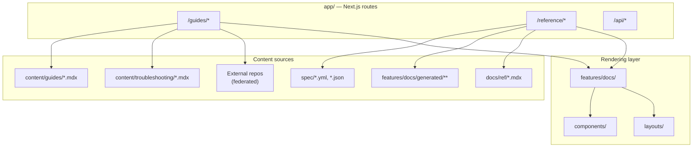

# `apps/docs` architecture map

What lives where, and what depends on what. **Verify against the live tree
before acting** — paths drift. Cross-references the per-topic deep dives in
this folder.

## High-level architecture

`apps/docs` is a **Next.js 15 App Router** site served at **`/docs`**
(`basePath` in `next.config.mjs`). It combines hand-written MDX guides,
machine-generated reference docs, troubleshooting content, federated content
from external repos, and shared monorepo packages (`ui`, `common`,
`ui-patterns`, etc.).



## Top-level directory layout

| Path                                   | Purpose                                                                                | Notes                                                                                        |
| -------------------------------------- | -------------------------------------------------------------------------------------- | -------------------------------------------------------------------------------------------- |
| `app/`                                 | Next.js App Router — thin route files that delegate to feature modules                 | Slug-based catch-alls per section, e.g. `guides/auth/[[...slug]]/page.tsx`                   |
| `apps/docs/content/guides/`            | Source MDX for `/docs/guides/...` pages                                                | One file per page; `_partials/` for shared blocks                                            |
| `apps/docs/content/_partials/`         | Reusable MDX snippets included via `<$Partial path="..." />`                           | Recursion supported                                                                          |
| `apps/docs/content/troubleshooting/`   | Troubleshooting articles                                                               | Some synced from GitHub issues via `Troubleshooting.script.mjs`                              |
| `apps/docs/components/`                | React components used inside MDX                                                       | One folder per component or component family                                                 |
| `apps/docs/data/`                      | Typed data modules consumed by components                                              | `.data.ts` suffix; lookup helpers live in `.utils.ts`, not here                              |
| `apps/docs/lib/`                       | Pure library code shared across pipelines                                              | Schemas (zod), helpers (`.utils.ts`), tests                                                  |
| `apps/docs/features/docs/`             | Page-level skeletons and the MDX renderer (`MdxBase`)                                  | Shared `<Heading>` lives in `MdxBase.shared.tsx`                                             |
| `apps/docs/features/`                  | Domain logic — docs rendering, auth, search/command menu, telemetry, app providers     | `app.providers.tsx` wires React Query, theme, dev toolbar, command menu                      |
| `apps/docs/spec/`                      | Source-of-truth specs for reference generation                                         | OpenAPI, SDK YAML, CLI config                                                                |
| `apps/docs/generator/`                 | Codegen templates for reference docs                                                   |                                                                                              |
| `apps/docs/resources/`                 | GraphQL endpoint (`/api/graphql`): per-query schema, model, resolver                   | See [`graphql-endpoint.md`](./graphql-endpoint.md)                                           |
| `apps/docs/internals/`                 | Build-time markdown generation                                                         | **Do not import from runtime/client code**                                                   |
| `apps/docs/internals/markdown-schema/` | Per-component handlers: JSX → markdown string                                          | File name matches the component name                                                         |
| `apps/docs/public/markdown/guides/`    | Generated `.md` output; served via `/docs/guides/<path>.md` or `Accept: text/markdown` | Built by `generate-guides-markdown.ts`; see [`llm-agent-surface.md`](./llm-agent-surface.md) |
| `apps/docs/public/markdown/reference/` | Generated reference `.md` files                                                        | Built by `generate-reference-markdown.ts`                                                    |
| `apps/docs/middleware.ts`              | Content negotiation for guides; bot rewrite for reference deep links                   | Uses `packages/common/markdown-negotiation.ts`                                               |
| `apps/docs/app/api/guides-md/`         | Serves pre-generated guide markdown to agents                                          | Rewritten from `/docs/guides/<path>.md`                                                      |
| `apps/docs/examples/`                  | Copied from repo root `examples/` at build time                                        | `codegen:examples`                                                                           |
| `apps/docs/scripts/`                   | Build-time scripts (sitemap, markdown export, embeddings)                              |                                                                                              |

Published guide sections: `ai`, `api`, `auth`, `cron`, `database`, `deployment`,
`functions`, `getting-started`, `integrations`, `local-development`, `platform`,
`queues`, `realtime`, `resources`, `security`, `self-hosting`, `storage`,
`telemetry`. Each has its own `layout.tsx` for sidebar navigation.

## Content types

| Type                   | Location                                              | Notes                                                                                                                                                                                                                                                                    |
| ---------------------- | ----------------------------------------------------- | ------------------------------------------------------------------------------------------------------------------------------------------------------------------------------------------------------------------------------------------------------------------------ |
| **Guides / tutorials** | `content/guides/`                                     | Hand-written MDX; goal-oriented                                                                                                                                                                                                                                          |
| **Troubleshooting**    | `content/troubleshooting/`                            | Partly synced from GitHub issues                                                                                                                                                                                                                                         |
| **Reference**          | Generated from `spec/` → `features/docs/generated/**` | Spec-driven (OpenAPI, SDKSpec, ConfigSpec, CLISpec). Reference pages do **not** use the standard MDX path — see [`docs-app-direction.md`](./docs-app-direction.md) for why. Management API OpenAPI path: [`management-api-reference.md`](./management-api-reference.md). |
| **Federated**          | External repos at build time                          | Pulled via GitHub App. See [`federated-docs.md`](./federated-docs.md)                                                                                                                                                                                                    |

## Routing model

Routes stay **thin**; rendering lives in **`features/docs/`**.

```tsx
// app/guides/getting-started/[[...slug]]/page.tsx
const slug = ['getting-started', ...(params.slug ?? [])]
const data = await getGuidesMarkdown(slug)
return <GuideTemplate {...data!} />
```

`getGuidesMarkdown()` (in `features/docs/GuidesMdx.utils.tsx`) loads the file,
validates frontmatter, checks navigation enablement, and returns data for
`GuideTemplate`.

`slug` is just the Next.js param name. `[[...slug]]` is an optional catch-all
(can match zero or more segments); `[...slug]` is required. The page handler
prepends the section name and joins segments to find content on disk.

For reference, `parseReferencePath(slug)` in `features/docs/Reference.utils.ts`
interprets segments like `javascript`, `v2`, `auth-signin` to pick SDK,
version, and section.

## The two pipelines (and why they share data)

The same content has to render twice:

1. **MDX runtime** — React components render `<MyComponent id="..." />`,
   read data via a data registry, output HTML.
2. **Markdown export** — `internals/markdown-schema/<MyComponent>.ts`
   handlers convert the same JSX into plain markdown for
   `public/markdown/guides/`.

**Load-bearing rule:** both pipelines dereference the _same_ data
registry (typically `apps/docs/data/<topic>/index.ts` exporting an
ID-keyed map and a `getById` lookup). The component reads it; the
handler reads it. The JSX prop is just an `id`. This keeps the two
outputs in sync without a parallel data shape.

**Reference implementation: `ContentListings`** — the ID-keyed two-pipeline
pattern in production:

| Layer             | Path                                                                   |
| ----------------- | ---------------------------------------------------------------------- |
| Data registry     | `apps/docs/data/content-listings/` (`.data.ts` per topic + `index.ts`) |
| Runtime component | `apps/docs/components/ContentListings/`                                |
| Markdown handler  | `apps/docs/internals/markdown-schema/ContentListings.ts`               |
| MDX registration  | `apps/docs/features/docs/MdxBase.shared.tsx`                           |

MDX usage: `<ContentListings id="storage-get-started" />`. For batch
overview-page migration, see the `audit-content-listings` skill in
[`docs-agent-skills`](https://github.com/supabase/docs-agent-skills).

When adding a new component that has a markdown representation:

1. Write the React component under `apps/docs/components/`.
2. Add a handler under `apps/docs/internals/markdown-schema/<SameName>.ts`.
3. Register the handler in `apps/docs/internals/generate-guides-markdown.ts`
   (the `SCHEMA` object).
4. If a component is purely visual and should be **dropped** from markdown,
   omit the handler — `generate-guides-markdown.ts` unwraps unknown JSX to its
   children automatically.

For the full build flow (Turbo + pnpm lifecycle), see
[`build-pipeline.md`](./build-pipeline.md).

For how agents and LLMs consume exported markdown (negotiation, bulk
downloads, `llms.txt`), see [`llm-agent-surface.md`](./llm-agent-surface.md).

## The markdown export in 30 seconds

`generate-guides-markdown.ts` walks `content/guides/**/*.mdx`:

1. Parse MDX → mdast (mdx + gfm extensions).
2. Inline `<$Partial path="..." />` recursively.
3. `addBaseUrlPrefix(tree)` — prefixes internal links with `/docs/`.
4. `applySchema(tree, SCHEMA)` — bottom-up: serializes children first, then
   replaces each JSX node with the result of its handler (or unwraps it).
5. Serialize mdast back to markdown.
6. Prepend front-matter-derived header (`# title`, subtitle, description).
7. Write to `public/markdown/guides/<same-path>.md`.

Each `SCHEMA` entry receives `{ props, children, node }` and returns the
markdown string to substitute.

## `<Heading>` and the prose typography contract

- `<Heading>` from `MdxBase.shared.tsx` is the canonical heading component
  for MDX. It handles tag-from-level mapping and anchor IDs.
- The MDX wrapper applies prose styles to everything inside `.prose` (default
  for guide pages). Inside `.not-prose` blocks, typography is opt-in.
- Pattern for new components with headings: render `<Heading>` _outside_
  `not-prose`, render the structured layout _inside_ `not-prose`. The heading
  inherits prose styles; the layout owns its own classes.

## Telemetry conventions

- Event names live in `packages/common/telemetry-constants.ts` (snake*case,
  `docs*\*` prefix for docs events).
- Components call `useSendTelemetryEvent()` from `~/lib/telemetry`.
- Properties: prefer flat, ID-prefixed keys. Avoid optional spread tricks
  unless a property is genuinely optional in the schema.

## Linting and verification entry points

See [`ci-and-lint.md`](./ci-and-lint.md) for the full CI surface. Local
commands:

| Tool                                                | Where       | What it catches                                                                                                |
| --------------------------------------------------- | ----------- | -------------------------------------------------------------------------------------------------------------- |
| `pnpm test:local:unwatch <path>` (from `apps/docs`) | per-test    | Vitest suite for `lib/` and `data/` schemas; needs local Supabase + DB reset first — see `apps/docs/AGENTS.md` |
| `pnpm format`                                       | repo root   | Prettier — run before opening a PR                                                                             |
| `pnpm lint --filter=docs`                           | repo root   | ESLint over `apps/docs`                                                                                        |
| `pnpm typecheck`                                    | repo root   | TS across packages                                                                                             |
| `pnpm build --filter=docs`                          | repo root   | Includes markdown generation; failures here block release                                                      |
| `pnpm lint:mdx`                                     | `apps/docs` | MDX content lint (whole `content/` tree)                                                                       |
| Typos check (`.github/workflows/avoid-typos.yml`)   | CI only     | `runner / misspell` job at error severity — no local command; fix flagged words before merge                   |

Before adding a custom lint job, check whether the existing one can absorb
the check (see [`adding-features.md`](./adding-features.md) "Reuse
pipelines").

## Providers (`features/app.providers.tsx`)

Wraps the app with:

- `QueryClientProvider` (React Query)
- `FeatureFlagProvider`, `ThemeProvider` from `common`
- `TooltipProvider` from `ui`
- `DevToolbar` from `dev-tools`
- `DocsCommandProvider` / `DocsCommandMenu`
- `SiteLayout` from `layouts/`

## Troubleshooting page subtree

- `features/docs/Troubleshooting.page.tsx` — entry-level page renderer.
- `features/docs/Troubleshooting.utils.ts` — TS utils.
- `features/docs/Troubleshooting.utils.common.mjs` — `.mjs` because it's
  consumed by both the Next.js build _and_ a Node sync script with import
  resolution quirks. **Don't convert to `.ts`** without checking the sync
  script.
- Topics enum in `TroubleshootingSchema` (the `topics` field) is the source
  of truth for product tag values.

## Known integrations

- **Studio** (`apps/studio`) links to docs URLs — check link consistency when
  changing URL shapes.
- **www** (`apps/www`) sometimes embeds docs sections.
- **PostHog** receives `docs_*` events for analytics.
- **`docs-agent-skills`** repo (https://github.com/supabase/docs-agent-skills)
  holds batch audit/conversion skills that drive multi-PR docs migrations.
- **Federated upstream repos** — see [`federated-docs.md`](./federated-docs.md)
  for the full list (pg_graphql, vecs, wrappers, terraform-provider, setup-cli,
  splinter, agent-skills).
