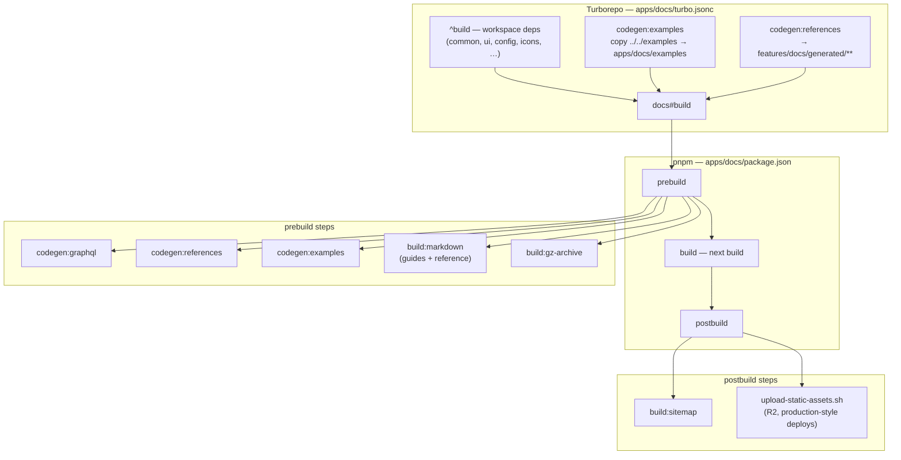

# Docs build pipeline

How `apps/docs` is built through Turborepo and pnpm lifecycle hooks.
Verify against the current `apps/docs/turbo.jsonc` and
`apps/docs/package.json` if behavior surprises you.

## Build flow



## Commands

From the repo root:

- **Full graph:** `pnpm build` → `turbo run build` (builds every package/app
  in dependency order).
- **Docs only:** `pnpm build:docs` → `turbo run build --filter=docs`.

```json
"build:docs": "turbo run build --filter=docs"
```

## What Turbo does

Root `turbo.jsonc` defines `build` with `dependsOn: ["^build"]`, so
**workspace dependencies** of `docs` (e.g. `common`, `ui`, `config`, …) are
built before `docs`.

`apps/docs/turbo.jsonc` **extends** that and tightens the docs task:

- **`build` also depends on** `codegen:examples` and `codegen:references`
  (with explicit inputs/outputs so Turbo can cache them).
- It lists **env vars** that affect caching for the docs app.
- **`codegen:examples`** copies `../../examples` into `apps/docs/examples`;
  **`codegen:references`** writes under `features/docs/generated/**`.

Pipeline Turbo orchestrates for docs: **dependency packages → example /
reference codegen → Next build**.

## What the `docs` package runs (pnpm lifecycle)

```json
"prebuild": "pnpm run codegen:graphql && pnpm run codegen:references && pnpm run codegen:examples && pnpm run build:markdown && pnpm run build:gz-archive",
"postbuild": "pnpm run build:sitemap && ./../../scripts/upload-static-assets.sh"
```

1. **`prebuild`** — GraphQL codegen, reference codegen, copy examples,
   generate guides + reference markdown (`build:markdown`), then tarball
   (`build:gz-archive`).
2. **`build`** — `next build`.
3. **`postbuild`** — sitemap, then `upload-static-assets.sh` (R2 CDN
   upload on production-style deploys).

Same monorepo pattern as Studio / www (pnpm workspaces + Turbo `^build`),
with **extra codegen** wired as Turbo tasks and npm `pre`/`post` hooks around
`next build`.

## Codegen scripts

- **`codegen:graphql`** — generates GraphQL types from schema.
- **`codegen:examples`** — copies `examples/` from monorepo root into
  `apps/docs/examples` for `$CodeSample` directive resolution.
- **`codegen:references:legacy`** — `features/docs/Reference.generated.script.ts`
  (includes Management API: merge OpenAPI v1+v2 → `api.latest.*` JSON).
  Spec download/bundle lives in `apps/docs/spec/Makefile` (Redocly);
  see [`management-api-reference.md`](./management-api-reference.md).
- **`codegen:references:new`** — `scripts/build-reference-content.ts` (from
  TSDoc JSON under `spec/reference/`). Output lands in
  `features/docs/generated/**`.
- **`build:guides-markdown`** — runs `internals/generate-guides-markdown.ts`
  over `content/guides/**/*.mdx`. Produces `public/markdown/guides/**.md`.
- **`build:reference-markdown`** — runs `internals/generate-reference-markdown.ts`.
  Produces `public/markdown/reference/**.md`.
- **`build:markdown`** — shorthand for guides + reference markdown.
- **`build:gz-archive`** — runs `internals/generate-gz-archive.ts`.
  Produces `public/docs.tar.gz` (tarball of all `public/markdown/`).

For how agents consume these outputs, see
[`llm-agent-surface.md`](./llm-agent-surface.md).

## Deploy vs CI

- **Production build** for the site is **Vercel**; `apps/docs/vercel.json`
  sets `buildCommand` to `pnpm build` (the docs app's script chain above).
- **GitHub Actions** mostly run **tests** (`test:docs` → Turbo), **lint**,
  **sync** jobs, and **smoke** tests — not a separate full production build
  graph in the way Turbo does locally. See [`ci-and-lint.md`](./ci-and-lint.md).

## Local development

From `apps/docs`:

```bash
pnpm dev   # http://localhost:3001/docs
```

- **`predev`** runs GraphQL and reference codegen plus example copy.
- A concurrent watcher syncs troubleshooting content
  (`dev:watch:troubleshooting`).
- Community contributors: set `NEXT_PUBLIC_IS_PLATFORM=false` in `.env`.
- Supabase employees: `pnpm run dev:secrets:pull` for internal env vars
  (AWS profile + `scripts/getSecrets.js`).
- In dev mode, the app **only builds routes upon request** rather than
  pre-rendering — preview and production environments statically generate
  routes during build for speed.

## Why this shape matters for changes

- Adding a new build step? See [`adding-features.md`](./adding-features.md)
  "Reuse pipelines, don't fork them" and check if `prebuild` or `postbuild`
  already has a hook that fits.
- New env var? Add it to `apps/docs/turbo.jsonc`'s `env` so Turbo doesn't
  cache stale.
- Touching the markdown export? Read [`app-map.md`](./app-map.md) "The two
  pipelines" first — runtime and export share data, not code paths.

## Related

- [`app-map.md`](./app-map.md) — directory layout and runtime / export split.
- [`ci-and-lint.md`](./ci-and-lint.md) — GitHub Actions workflow surface.
- [`federated-docs.md`](./federated-docs.md) — external content fetched
  during build.
