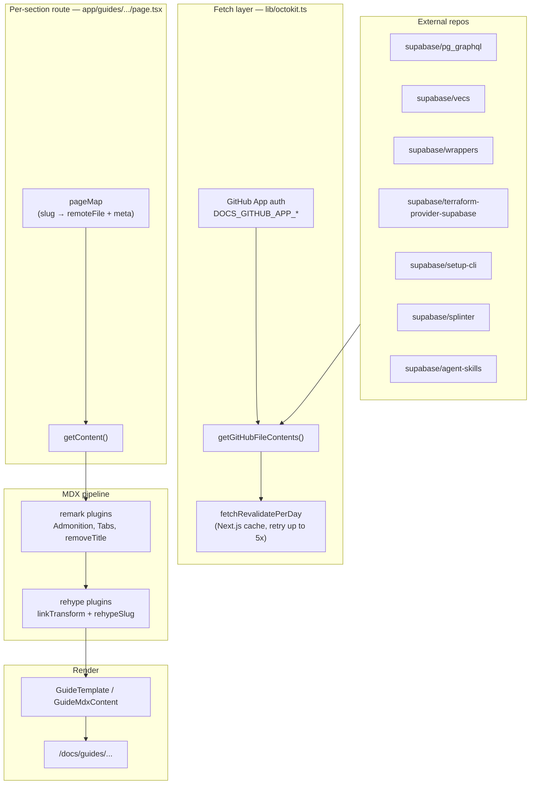

# Federated docs

`apps/docs` can pull **markdown (and other files) from external GitHub repos**
at **build or request time**, then render them inside the normal docs shell.
Content lives in ecosystem repos (client libs, extensions, tooling) without
duplicating into `apps/docs/content`.

Documented upstream in root **`DEVELOPERS.md`** → "Federated docs."

> **The maintainers treat this as a known liability.** See
> [`docs-app-direction.md`](./docs-app-direction.md) for the full context
> (lack of editorial oversight, brittle builds, quality drift). Treat
> federated content as a liability when reviewing or debugging.

## Why federate

- **No duplication** — e.g. `supabase/vecs` docs stay in the vecs repo.
- **Automatic sync** — fetched during the docs build (or on cached
  revalidation), not hand-copied.
- **Native feel** — same `GuideTemplate`, nav, typography, and search surface
  as first-party guides.
- **Flexible placement** — can embed external docs at nearly any path under
  `/guides/`.

Trade-off: **integration is manual and brittle**. Each federated section
needs its own route file, `pageMap`, link transform, and often custom remark
plugins.

## Build-time flow

### Step-by-step

1. **Route file** defines `org`, `repo`, `branch` (or tag), `docsDir`, and a
   **`pageMap`** — each entry maps a local slug to a remote markdown file
   plus page metadata.
2. **`getGitHubFileContents()`** fetches file content via a **GitHub App**
   (`DOCS_GITHUB_APP_ID`, `DOCS_GITHUB_APP_INSTALLATION_ID`,
   `DOCS_GITHUB_APP_PRIVATE_KEY`). Uses **once-per-day revalidation** by
   default (`fetchRevalidatePerDay`).
3. Raw markdown is passed through **remark/rehype plugins** to bridge dialect
   gaps.
4. **`linkTransform` + custom `urlTransform`** rewrite relative links from
   the source repo into `/docs/guides/...` paths (or fall back to the upstream
   docs site / GitHub).
5. Output is rendered with **`GuideTemplate`** so federated pages look like
   native guides. **Edit on GitHub** links point at the source repo file.

> Note: `DEVELOPERS.md` still mentions `getStaticProps()` — the current App
> Router implementation uses async server components + `generateStaticParams`
> instead, but the idea is the same: fetch remote markdown at build time.

## Federated sources (inventory)

| Local path                               | Source repo                            | Ref / branch                   | Pattern                                           |
| ---------------------------------------- | -------------------------------------- | ------------------------------ | ------------------------------------------------- |
| `/guides/graphql/*`                      | `supabase/pg_graphql`                  | `master`                       | Fully federated; `pageMap` per page               |
| `/guides/ai/python/*`                    | `supabase/vecs`                        | `main`                         | Fully federated                                   |
| `/guides/deployment/ci/*`                | `supabase/setup-cli`                   | `gh-pages`                     | Fully federated                                   |
| `/guides/deployment/terraform/*`         | `supabase/terraform-provider-supabase` | branch in `terraformConstants` | Federated prose pages                             |
| `/guides/deployment/terraform/reference` | same                                   | same                           | Federated **JSON schema** (not MDX)               |
| `/guides/database/extensions/wrappers/*` | `supabase/wrappers`                    | **release tag** `docs_v*.*.*`  | **Hybrid** — local MDX + federated catalog        |
| `/guides/database/database-advisors`     | `supabase/splinter`                    | `main`                         | **Dynamic listing** — all `docs/*.md` files       |
| AI Skills index                          | `supabase/agent-skills`                | `main`                         | Lists `skills/*/SKILL.md` at runtime              |
| `$CodeSample` directive                  | various                                | commit SHA only                | Snippets via `getGitHubFileContentsImmutableOnly` |

### Related patterns (not quite "federated docs")

| Pattern              | Source                    | Mechanism                                                                                              |
| -------------------- | ------------------------- | ------------------------------------------------------------------------------------------------------ |
| **AI prompts**       | `examples/prompts/*.md`   | Copied into `apps/docs/examples` at build (`codegen:examples`); nav injected in getting-started layout |
| **Integrations nav** | Supabase `partners` table | `integrations/layout.tsx` fetches approved partners (external URLs)                                    |
| **Reference docs**   | `apps/docs/spec/`         | Generated locally, not fetched from GitHub — see [`build-pipeline.md`](./build-pipeline.md)            |

## How to spot a federated page in the repo

- Look for a **dynamic route** (`[[...slug]]/page.tsx`, `[slug]/page.tsx`)
  instead of content-only routing.
- Search for **`// We fetch these docs at build time from an external repo`**
  or **`getGitHubFileContents`**.
- Check for a local **`pageMap`** array mapping slugs to `remoteFile` names.
- GraphQL is listed in `PUBLISHED_SECTIONS` comments as _"technically
  published, but completely federated"_ — no MDX under `content/guides/graphql/`.

Canonical starter example:
`apps/docs/app/guides/ai/python/[slug]/page.tsx` (vecs).

## Link and markdown transforms

External repos often use **MkDocs Material** or similar dialects. Supabase
docs do not understand those natively.

### Remark plugins (`lib/mdx/plugins/`)

| Plugin              | Purpose                                         |
| ------------------- | ----------------------------------------------- |
| `remarkAdmonition`  | `!!! note` / `!!! warning` → `<Admonition>`     |
| `remarkTabs`        | pymdownx tab syntax → Supabase tabs             |
| `remarkRemoveTitle` | Strip duplicate H1 when title comes from `meta` |

New upstream syntax may need a **new remark plugin** — called out explicitly
in `DEVELOPERS.md`.

### Link transform (`rehypeLinkTransform.ts`)

Each federated route defines its own **`urlTransform`** function:

- **Relative `.md` links** → mapped via `pageMap` to `/docs/guides/...` (or
  section-relative slug).
- **Unmapped relative links** → fall back to upstream site (e.g.
  `https://supabase.github.io/vecs/...`) or raw GitHub blob URL (terraform).
- **Absolute URLs** → passed through unchanged.

Wrappers additionally rewrites **`../assets/`** image paths to
`raw.githubusercontent.com` URLs tied to the docs release tag.

## Known failure modes

Federated docs are a frequent source of **content quality issues** and
**broken links**.

### Broken or wrong links

- **`pageMap` is manual** — upstream rename/remove → broken link until
  someone updates the route file in `supabase/supabase`.
- **`urlTransform` is per-section** — logic differs between graphql, vecs,
  terraform, wrappers, etc.
- **Unmapped pages fall back externally** — users leave the docs site or land
  on a GitHub pages URL that may not match the embedded path structure.
- **Absolute links in upstream** pass through untouched — may point at old
  domains or anchors that moved.
- **Cross-links between federated and native guides** are not automatic;
  upstream authors don't know Supabase URL shapes.

### Content quality

- **No editorial gate in `apps/docs/content`** — upstream tone, structure,
  and freshness vary.
- **Dialect mismatches** — unsupported mkdocs extensions render as raw text
  or fail MDX compile until a plugin is added.
- **Duplicate titles** — mitigated by `removeTitle` / `removeRedundantH1`,
  but layout can still look off.
- **Stale content** — daily GitHub cache means upstream fixes may not appear
  until revalidation; wrappers pin to **release tags** which can lag further.

### Operational / dev failures

- **GitHub App credentials required** — without `DOCS_GITHUB_APP_*`, fetches
  fail. `$CodeSample` with external repos shows a **local dev warning** and
  does not render real content.
- **GitHub API timeouts** — `database-advisors` catches fetch errors and
  shows a degraded view with a link to GitHub; build may still succeed with
  partial content.
- **Wrappers tag resolution** — `getLatestDocsTag()` queries `docs_v*.*.*`
  tags; if tagging breaks, federated wrapper pages throw at build time.
- **Dev mode gaps** — some federated routes return **empty
  `generateStaticParams` in dev** (`IS_DEV`), so pages may 404 locally unless
  you hit them via production build or adjust params.

### Navigation drift

- Sidebar entries for federated sections are often **hard-coded** in
  `NavigationMenu.constants.ts` plus optional **`additionalNavItems`**
  injection (prompts, integrations).
- New upstream pages do not appear in nav until a maintainer adds them to
  `pageMap` **and** navigation config.

## When to federate vs copy into `content/`

Federate when:

- The canonical docs live in another repo and change frequently.
- Maintainers of that repo own the content lifecycle.

Prefer `content/guides/` when:

- Editorial control, consistent voice, and link stability matter.
- Content is tightly coupled to Supabase product UI and cross-links.

## Related

- [`app-map.md`](./app-map.md) — runtime + markdown export pipelines.
- [`build-pipeline.md`](./build-pipeline.md) — where federated fetches sit
  in the overall build.
- [`docs-app-direction.md`](./docs-app-direction.md) — context on the
  federated-docs liability and long-term direction.
