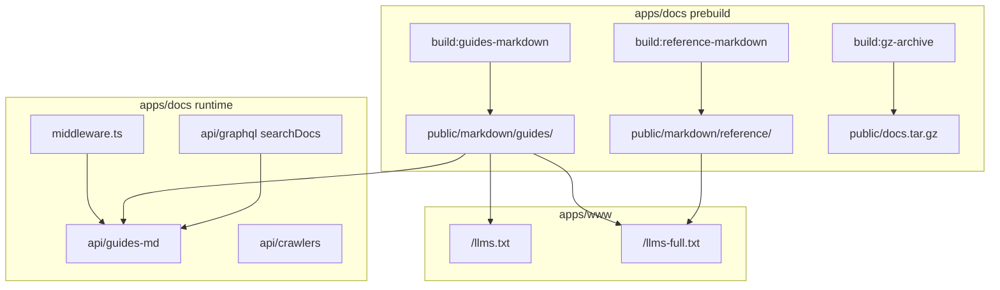
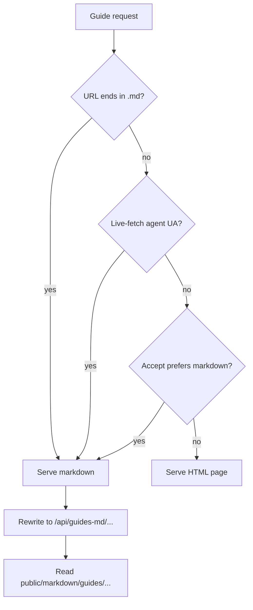

# LLM and agent consumption surface

How `apps/docs` exposes machine-readable content and how that relates to
`apps/www`. For the markdown export pipeline itself, see
[`app-map.md`](./app-map.md) "The two pipelines."

**Verify against live code** — several pieces here span two apps and
change independently.

## Scope boundary

| App             | Role                                                                                                               |
| --------------- | ------------------------------------------------------------------------------------------------------------------ |
| **`apps/docs`** | Produces markdown exports, serves per-guide `.md`, reference static files, GraphQL search, agent onboarding guides |
| **`apps/www`**  | Serves discovery indexes (`/llms.txt`, `/llms-full.txt`) and product-page `.md` negotiation                        |

`llms.txt` is **not** a route in `apps/docs`. It is assembled at runtime
by `apps/www/app/llms.txt/route.ts`, reading guide directory names from
`apps/docs/content/guides/` and linking to docs + reference exports.
There is no static `llms.txt` file in the repo — the www route handler
builds it on each request.

### Key source files

| What                  | Monorepo path                                    | Public URL (prod)                                 |
| --------------------- | ------------------------------------------------ | ------------------------------------------------- |
| `llms.txt` route      | `apps/www/app/llms.txt/route.ts`                 | `https://supabase.com/llms.txt`                   |
| `llms-full.txt` route | `apps/www/app/llms-full.txt/route.ts`            | `https://supabase.com/llms-full.txt`              |
| Guide middleware      | `apps/docs/middleware.ts`                        | — (lines ~16–38: negotiate, rewrite to guides-md) |
| WWW middleware        | `apps/www/middleware.ts`                         | Product-page markdown negotiation                 |
| Negotiation logic     | `packages/common/markdown-negotiation.ts`        | Shared by both middleware files                   |
| Guides markdown API   | `apps/docs/app/api/guides-md/[...slug]/route.ts` | Reads `public/markdown/guides/` at runtime        |
| Markdown manifest     | `apps/docs/public/markdown/manifest.json`        | Slugs eligible for `.md` negotiation              |

## Build outputs → serving paths



## Entry points

| URL                                      | Owner       | Source                                                                              |
| ---------------------------------------- | ----------- | ----------------------------------------------------------------------------------- |
| `/llms.txt`                              | `apps/www`  | `app/llms.txt/route.ts` — index of guide sections + reference links                 |
| `/llms-full.txt`                         | `apps/www`  | `app/llms-full.txt/route.ts` — concatenated guides + reference + product overviews  |
| `/docs/guides/<path>.md`                 | `apps/docs` | Middleware → `app/api/guides-md/[...slug]/route.ts` reads `public/markdown/guides/` |
| `/docs/markdown/reference/<lib>.md`      | `apps/docs` | Static file from `public/markdown/reference/` (build output)                        |
| `/docs/docs.tar.gz`                      | `apps/docs` | `internals/generate-gz-archive.ts` tarballs all of `public/markdown/`               |
| `/docs/api/graphql` (`searchDocs`)       | `apps/docs` | Vector search over embedded doc sections — see caveat below                         |
| `/docs/reference/<sdk>/<section>` (bots) | `apps/docs` | `isbot()` → `app/api/crawlers/route.ts` (simplified HTML, not markdown)             |

Homepage alternate link points agents at the full dump:
`https://supabase.com/llms-full.txt` (`apps/docs/app/page.tsx`).

## Audience routing (humans vs agents vs crawlers)

Every guide exists in two forms from the same MDX source:

| Form         | Produced by                                                          | Served to                            |
| ------------ | -------------------------------------------------------------------- | ------------------------------------ |
| **HTML**     | Live MDX render (`partialsRemark`, React components)                 | Humans in a browser                  |
| **Markdown** | Prebuild (`generate-guides-markdown.ts` → `public/markdown/guides/`) | Live-fetch agents and bulk downloads |

`apps/docs/middleware.ts` is the bouncer for guide requests. It calls
`negotiateMarkdown()` from `packages/common/markdown-negotiation.ts` and
checks `public/markdown/manifest.json` before serving markdown.



### Who gets what

| Audience                                 | Typical request                                                                  | Format   | Notes                                                                                |
| ---------------------------------------- | -------------------------------------------------------------------------------- | -------- | ------------------------------------------------------------------------------------ |
| **Human (browser)**                      | `/docs/guides/.../nextjs`                                                        | HTML     | Default — no special headers                                                         |
| **Live-fetch agent**                     | Same URL with `Claude-User`, `ChatGPT-User`, `PerplexityBot`, or `Claude-Web` UA | Markdown | Auto-negotiated even without `.md` suffix                                            |
| **Live-fetch agent**                     | `/docs/guides/.../nextjs.md` or `Accept: text/markdown`                          | Markdown | Explicit request                                                                     |
| **SEO bot** (Googlebot)                  | Guide URL                                                                        | HTML     | Same page humans see; `isbot()` markdown rewrite applies only to **reference** pages |
| **Training crawler** (GPTBot, ClaudeBot) | Guide URL                                                                        | HTML     | Allowed by `robots.txt` but **not** given alternate markdown — avoids cloaking       |
| **Bulk ingest**                          | `/llms-full.txt`, `/docs/docs.tar.gz`                                            | Markdown | Reads prebuilt `public/markdown/` files                                              |

Humans see interactive UI (copy buttons, styled panels). Agents and bulk
tools read the pre-generated `.md` transcript — not the live HTML DOM.

### Agent discovery

Agents that don't know a specific URL can start from:

- `/llms.txt` — section index with links to `.md` paths
- `/llms-full.txt` — concatenated guides + reference + product overviews
- `rel="alternate" type="text/markdown"` on each guide page
  (`GuidesMdx.utils.tsx` → `${BASE_PATH}${pathname}.md`)
- Docs homepage alternate → `https://supabase.com/llms-full.txt`

## Content negotiation

Shared logic lives in `packages/common/markdown-negotiation.ts`, used by
both `apps/docs/middleware.ts` and `apps/www/middleware.ts`.

Markdown is served when:

- The URL ends in `.md`
- `Accept: text/markdown` wins over HTML (q-value comparison)
- The user-agent matches **live-fetch agents**: `Claude-User`,
  `Claude-Web`, `ChatGPT-User`, `PerplexityBot`

Training crawlers (`GPTBot`, `ClaudeBot`, etc.) are **not** given
alternate markdown — they are governed by `robots.txt` to avoid
cloaking penalties.

On guides, negotiated requests rewrite to `/api/guides-md/<slug>`.
Each guide page advertises its markdown alternate in metadata via
`GuidesMdx.utils.tsx` (`text/markdown` → `${BASE_PATH}${pathname}.md`).

404 responses from `guides-md` are also markdown and include
`searchDocs` suggestions — useful when an agent fetches a stale URL.

## Two-pipeline parity for embedded content

Content that renders on the HTML page is **not** automatically present
in the `.md` export. Both pipelines must implement the same semantics.

Example: framework quickstart **AI prompt blocks** (see
supabase/supabase#47543). Each quickstart includes a bare partial:

```mdx
<$Partial path="ai/quickstart_prompt_nextjs.mdx" />
```

The partial is a self-closing `<AiPrompt>` with the prompt as a **prop**
(not children — expression children are skipped by the guides markdown
pipeline):

```mdx
<AiPrompt
  prompt={
    'Help me add Supabase to my Next.js project. Create a Supabase project at\ndatabase.new and run the instruments table SQL. Then:\n1. …'
  }
/>
```

| Pipeline     | Path                                                         |
| ------------ | ------------------------------------------------------------ |
| **HTML**     | `features/ui/AiPrompt.tsx` → `PromptPanel` (copy + expand)   |
| **Markdown** | `internals/markdown-schema/AiPrompt.ts` reads `props.prompt` |

`propsFrom()` stores the raw JS expression source. Prettier formats the
prop as a multiline **single-quoted** string; the schema handler must
decode that literal (trim + escapes), not only `JSON.parse` double-quoted
JSON. Symptom if decoding is wrong: generated `.md` keeps surrounding
quotes and literal `\n`.

`$Partial` variable substitution (`lib/partials.utils.ts`, wired in both
`partialsRemark` and `inlinePartials`) remains required for other nested
partials — it is no longer the AI-prompt path.

When adding content aimed at both humans and agents, always verify:

```bash
cd apps/docs && pnpm build:guides-markdown
# then inspect public/markdown/guides/<same-path>.md for **AI Prompt**
```

## Bulk vs per-page retrieval

| Strategy                            | Best for                                          |
| ----------------------------------- | ------------------------------------------------- |
| `/llms.txt`                         | Discovering available sections and reference libs |
| `/llms-full.txt`                    | One-shot full ingest                              |
| `/docs/docs.tar.gz`                 | Offline/batch ingest of all generated markdown    |
| `/docs/guides/<path>.md`            | Single guide page                                 |
| `/docs/markdown/reference/<lib>.md` | Single reference lib export                       |

Reference pages do **not** use the same `Accept: text/markdown`
negotiation as guides. Reference markdown comes from the static export
and `llms-full.txt`, not from middleware negotiation.

## Programmatic search

`/docs/api/graphql` exposes `searchDocs`, backed by embeddings generated
offline via `scripts/search/generate-embeddings.ts`. Agents can request
full `content` in results.

**Caveat:** search infrastructure is decoupled from the markdown export
pipeline and is considered fragile. See
[`known-issues.md`](./known-issues.md) "Search infrastructure is
decoupled and considered broken" before building features on top of it.

## Agent onboarding content

First-party guides under `content/guides/ai-tools/`:

| Page             | Purpose                           |
| ---------------- | --------------------------------- |
| `mcp.mdx`        | Supabase MCP server setup         |
| `plugins.mdx`    | One-click MCP + skills bundle     |
| `byo-mcp.mdx`    | Build your own MCP server         |
| `ai-skills.mdx`  | Index of installable agent skills |
| `ai-prompts.mdx` | Curated IDE prompts               |

The skills index is **federated** from `supabase/agent-skills` at
runtime (`AiSkills.utils.ts`). See [`federated-docs.md`](./federated-docs.md).

## In-flux / stale wiring

- `apps/docs/.gitignore` lists `public/llms/` as generated by
  `build:llms`, but **`build:llms` is not in `package.json`** today.
  Per-source `llms/*.txt` links in `/llms.txt` may point at assets whose
  generation path is unclear — verify before depending on them.
- `llms-full.txt` fetches reference markdown from
  `${NEXT_PUBLIC_DOCS_URL}/markdown/reference/<slug>.md` at runtime.

## Related

- [`app-map.md`](./app-map.md) — two-pipeline model, directory layout.
- [`build-pipeline.md`](./build-pipeline.md) — prebuild steps that
  produce markdown exports and the tarball.
- [`docs-app-direction.md`](./docs-app-direction.md) — one-to-one
  markdown fidelity goal.
- [`known-issues.md`](./known-issues.md) — reference page length,
  search fragility.
