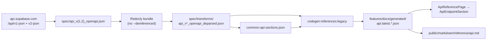

# Management API reference generation

How `/docs/reference/api/*` is built from the live Management API OpenAPI
spec. Verify against `apps/docs/spec/Makefile` and
`features/docs/Reference.generated.script.ts` before acting — paths drift.

## Pipeline

1. **Download** — `make download.api.v1` in `apps/docs/spec/` curls the
   live OpenAPI into `api_v1_openapi.json` / `api_v2_openapi.json`.
2. **Bundle** — `make dereference.api.v1` runs Redocly CLI
   (`@redocly/cli`) `bundle` into `transforms/*_deparsed.json`.
   Management API deliberately omits `--dereferenced` (circular `$ref` in
   `APIErrorObject.issues`). `$refs` are resolved later in codegen with a
   cycle guard.
3. **Nav sections** — `sections/generateMgmtApiSections.cts` walks
   operations/tags into `common-api-sections.json`.
4. **Codegen** — `codegen:references:legacy`
   (`Reference.generated.script.ts`) merges v1+v2, resolves refs, writes
   `api.latest.endpointsById.json`, `sections.json`, `flat.json`,
   `bySlug.json` under `features/docs/generated/`.
5. **Runtime** — `/reference/api/[operation]` via `ApiReferencePage` →
   `SectionSwitch` → `ApiEndpointSection` (custom React, not MDX). One
   endpoint per page (DOCS-1268). Hand-written intro MDX lives under
   `docs/ref/api/`.
6. **Agents** — `generate-reference-markdown.ts` exports the same data to
   `public/markdown/reference/api.md`.

Legacy EJS (`generator/api.ts` + `ApiTemplate.ts`) is not the live path.

## Redocly today (bundle / lint)

| Job    | Where                                                                      | Notes                                                               |
| ------ | -------------------------------------------------------------------------- | ------------------------------------------------------------------- |
| Bundle | `make dereference.api.v1` (and sibling targets for auth/storage/analytics) | Invoked via `npx --package=@redocly/cli redocly bundle`             |
| Lint   | `make validate.analytics.v0` only                                          | `redocly lint --extends=minimal`. Management API has no lint target |

Redocly is the OpenAPI **toolchain** (bundle/lint), not the page renderer.

## Rendering: keep the custom path

Pages render via custom React (`ApiEndpointSection`), not Scalar / Redoc /
Stoplight Elements. Reasons (see also [`adding-features.md`](./adding-features.md)
and [`known-issues.md`](./known-issues.md)):

- **Two pipelines** — HTML + markdown export + GraphQL search share one
  `IApiEndPoint` / generated-JSON shape. A third-party viewer forks that.
- **Custom extensions** — `x-oauth-scope`, `x-allowed-plans`,
  `x-fga-permissions` need first-class rendering.
- **Modular pages** — DOCS-1268 already split the monolithic API page;
  embedding a full-spec viewer would reverse that.
- **Surface** — new dep + theming + parity work fights docs-app direction
  (reduce surface, don't add parallel renderers).

Prefer improving `ApiEndpointSection` / schema helpers, or deepening
Redocly lint on download/transform. Do not propose swapping the renderer
for an OpenAPI UI kit without addressing markdown/search/`x-*` parity.

Closest CLI substitutes if Redocly were unavailable: `@apidevtools/swagger-parser`
or `swagger-cli` for bundle; Spectral for lint. Switching buys little while
the custom cycle-safe resolve remains required.

## Key files

| Path                                                    | Role                                         |
| ------------------------------------------------------- | -------------------------------------------- |
| `apps/docs/spec/Makefile`                               | download / Redocly bundle / section generate |
| `apps/docs/spec/sections/generateMgmtApiSections.cts`   | OpenAPI → `common-api-sections.json`         |
| `apps/docs/features/docs/Reference.generated.script.ts` | merge, resolve refs, write `api.latest.*`    |
| `apps/docs/features/docs/Reference.api.utils.ts`        | `IApiEndPoint` + schema display helpers      |
| `apps/docs/features/docs/Reference.apiPage.tsx`         | route → one operation page                   |
| `apps/docs/features/docs/Reference.sections.tsx`        | `ApiEndpointSection` UI                      |
| `apps/docs/internals/generate-reference-markdown.ts`    | agent markdown export                        |

## Scoped personal access token permission tables

The "Personal Access Tokens" guide's permission and MCP tables are generated
from the Management API specs, MCP permission map, and the same shared catalog
Studio uses. Regenerate `content/_partials/access-control/scoped_pat_*.mdx` with
`make -C apps/docs/spec generate.partials.access-control`. Docs Tests runs this
on relevant pull requests and fails if the partials drift; the weekly Management
API update also runs it after refreshing the live inputs.

## Related

- [`build-pipeline.md`](./build-pipeline.md) — where `codegen:references`
  sits in prebuild.
- [`app-map.md`](./app-map.md) — reference vs guides routing.
- [`known-issues.md`](./known-issues.md) — reference pages avoid standard
  MDX; length / modularization direction.
- [`llm-agent-surface.md`](./llm-agent-surface.md) — markdown export
  consumption.
