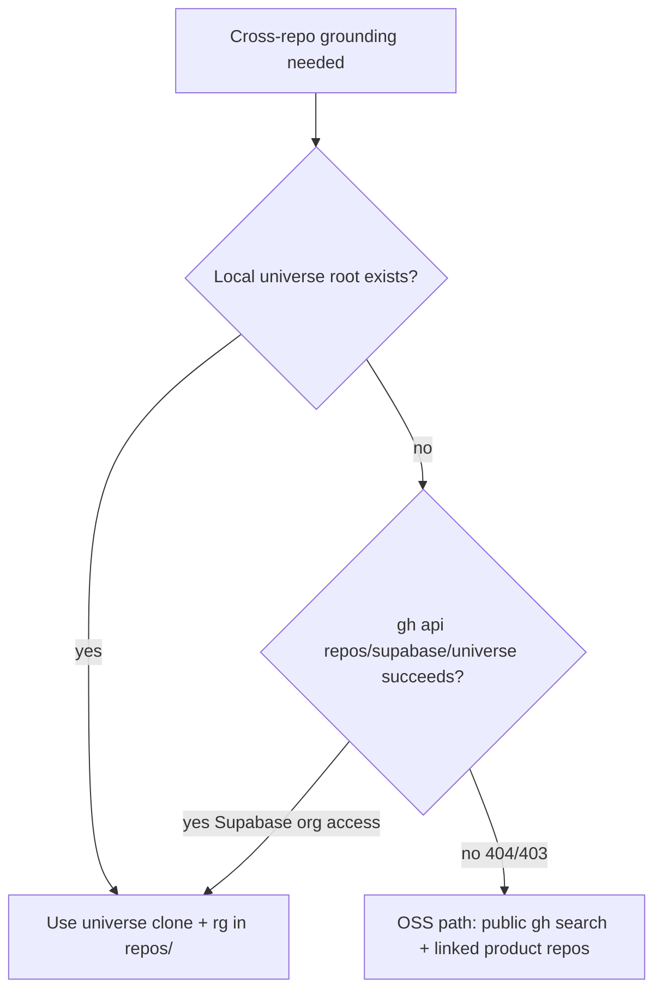

# Cross-repo product lookup

Cross-repo product search for Frame/Shape when a feature may span services. Use during `/pm-the-docs`, not `/ask-the-docs` (`ask-the-docs` stays on `apps/docs` architecture).

**Cross-repo confirmation is required for everyone.** [`supabase/universe`](https://github.com/supabase/universe) is an optional accelerator when you have Supabase org access to that private meta-repo (and ideally a local clone). Contributors without that access use the OSS path below — that is a successful outcome, not a failure.

## Capability gate

Run this gate before any universe clone or submodule command.



### 1. Local clone?

Resolve the universe root in order (do not hardcode machine-specific absolute paths in committed files):

1. `$SUPABASE_UNIVERSE_ROOT` (if set)
2. `$HOME/GitHub/supabase/universe`

```bash
UNIVERSE_ROOT="${SUPABASE_UNIVERSE_ROOT:-$HOME/GitHub/supabase/universe}"
[[ -d "$UNIVERSE_ROOT/.git" || -f "$UNIVERSE_ROOT/.git" ]] && echo "local universe ok"
```

If that checkout exists → **accelerator path** (skip the `gh api` probe).

### 2. Else probe org access (read-only, no clone)

```bash
gh api repos/supabase/universe -q .full_name
```

| Result | Next step |
| ------ | --------- |
| Success (`supabase/universe`) | Accelerator path: you **may** clone with `--recurse-submodules` (or ask the user to), then search |
| 404, 403, or other failure | **OSS path only** — do **not** run `git clone` or `git submodule update` against universe |

## OSS path (always valid)

When the gate says universe is unavailable:

- Search public code: `gh search code --owner supabase '<query>'` (plus other public owners named in the ticket)
- Read any product repo already checked out or linked from Linear / the PR
- Prefer `supabase/supabase` in-tree sources when that is enough
- In the Frame/Shape summary, record `universe: unavailable (OSS)` and list the public sources used

Never treat missing universe access as a blocker or an incomplete Frame/Shape.

## Accelerator: universe (when accessible)

Prefer an existing local clone. Only init or update submodules after the gate succeeds:

```bash
cd "$UNIVERSE_ROOT"
git submodule update --init --recursive
```

Private submodules (`platform`, `branching`) may need a PAT. If those fail, note the gap and continue with public submodules plus the OSS search path.

### Where to look

Start from the universe README "Finding your way around" table, then `rg` inside the relevant submodule:

| Looking for… | Start in |
| ------------ | -------- |
| Schema, extensions, RLS | `repos/postgres/`, `repos/postgrest/`, `repos/pg-toolbelt/` |
| Auth flows | `repos/auth/`, `auth-js` under `repos/supabase-js/` |
| Realtime / Storage / Edge Functions | `repos/realtime/`, `repos/storage/`, `repos/edge-runtime/` |
| Dashboard / Studio | `repos/supabase/apps/studio` |
| Management API / hosted infra | `repos/platform/` (private) |
| CLI, local dev, `config.toml` | `repos/cli/` |
| Docs & self-hosting Compose | `repos/supabase/` (`apps/docs`, `docker/`) |

When scope is unknown, search initialized `repos/**` with a tight pattern rather than reading entire trees.

## How to use in Frame / Shape

1. Name the product surfaces the launch might touch (CLI, Auth, migrations, Dashboard, …).
2. Run the **capability gate**.
3. Resolve surfaces to repos (universe submodules **or** public search / linked checkouts).
4. Confirm with a short search whether behavior lives in one repo or several.
5. Record in the Frame/Shape summary: gate result (`universe: available` or `universe: unavailable (OSS)`), repos consulted, cross-cutting vs single-repo, and any gaps.

Always distinguish confirmed fact from inference.
