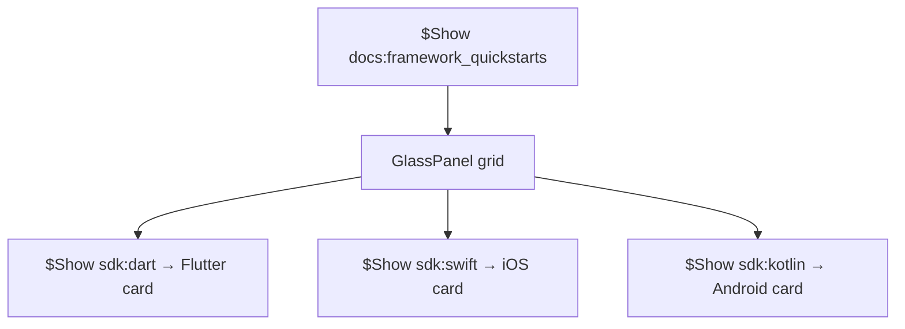

# Content listings — reference

## Naming conventions

| Section type | Export                      | Component                           |
| ------------ | --------------------------- | ----------------------------------- |
| Get started  | `{topic}GetStarted`         | `{Topic}GetStartedListings`         |
| Next steps   | `{topic}NextSteps`          | `{Topic}NextStepsListings`          |
| Examples     | `{topic}Examples`           | `{Topic}ExamplesListings`           |
| Resources    | `{topic}Resources`          | `{Topic}ResourcesListings`          |
| Sub-group    | `{topic}Examples{Subgroup}` | `{Topic}Examples{Subgroup}Listings` |

Topic = camelCase file stem (`getting-started` → `gettingStarted`, `ai` → `ai`).

## Valid hrefs

From `apps/docs/lib/content-listings.schema.ts`:

- `/guides/...`
- `/docs/guides/...`
- `/dashboard/...`
- `https://...`

## Known limitations

- Titles must be plain strings — no `<Badge>`, `<span>`, or JSX
- Icons: optional `icon: '/docs/img/icons/...'` string path only
- `$Show` per-item SDK gates (Flutter, Swift, Kotlin) are **not** supported inside a single listing — keep outer `$Show` in MDX; include all items in data or split into gated partials (getting-started decision required at re-audit)

---

## Storage — canonical before/after

**Before (manual grid):**

```mdx
## Examples

<div className="grid md:grid-cols-12 gap-4 not-prose">
  <Link href="https://github.com/.../resumable-upload-uppy">
    <GlassPanel title="Resumable Uploads with Uppy" icon="/docs/img/icons/github-icon">
      Upload large files with pause-and-resume support...
    </GlassPanel>
  </Link>
</div>
```

**After:**

```mdx
<StorageExamplesListings />
```

**Data (`storage.data.ts`):**

```typescript
export const storageExamples: ContentListingGroup = {
  id: 'examples',
  heading: 'Examples',
  description: 'Working sample projects for common Storage integration patterns:',
  type: 'grid',
  columns: 2,
  items: [
    {
      title: 'Resumable Uploads with Uppy',
      href: 'https://github.com/supabase/supabase/tree/master/examples/storage/resumable-upload-uppy',
      icon: '/docs/img/icons/github-icon',
      description:
        'Upload large files with pause-and-resume support using Uppy and the TUS protocol.',
    },
  ],
}
```

---

## Auth — `$Show` wrapper

Keep billing gate in MDX; listing data stays ungated:

```mdx
<$Show if="billing:all">

<AuthPricingListings />
</$Show>
```

---

## Functions — multi-subgrid

Multiple listing components under one `## Examples` prose block:

```mdx
<FunctionsExamplesSupabaseListings />
<FunctionsExamplesWebhooksPaymentsListings />
<FunctionsExamplesAiMediaListings />
```

Each subgroup has its own `heading` (often `###`) in data.

---

## Getting started — partial conversion case study

### Section map

| Section               | Status      | MDX / data                                                                      |
| --------------------- | ----------- | ------------------------------------------------------------------------------- |
| Get started           | converted   | `<GettingStartedGetStartedListings />` — no `heading` in data (consider adding) |
| Next steps            | unconverted | planned — not yet in registry or MDX                                            |
| Use cases             | unconverted | `### Use cases` + 3 GlassPanel cards                                            |
| Framework quickstarts | unconverted | `$Show if="docs:framework_quickstarts"` + ~12 cards, nested `sdk:*` gates       |
| Nimbus                | skipped     | `$Partial path="quickstart_nimbus.mdx"`                                         |
| Web app demos         | unconverted | `$Show if="docs:web_apps"` + 9 cards                                            |
| Mobile tutorials      | unconverted | `$Show if="docs:mobile_tutorials"` + 7+ cards, nested `sdk:*` gates             |

### Proposed exports (Batch A)

| Section               | Export                               | Component                                    |
| --------------------- | ------------------------------------ | -------------------------------------------- |
| Use cases             | `gettingStartedUseCases`             | `GettingStartedUseCasesListings`             |
| Framework quickstarts | `gettingStartedFrameworkQuickstarts` | `GettingStartedFrameworkQuickstartsListings` |
| Web app demos         | `gettingStartedWebAppDemos`          | `GettingStartedWebAppDemosListings`          |
| Mobile tutorials      | `gettingStartedMobileTutorials`      | `GettingStartedMobileTutorialsListings`      |

Use `headingLevel: '###'` for all four (replacing `###` headings).

### `$Show` nesting (framework quickstarts)



**Re-audit decision:** Either (a) keep outer `$Show` + listing with all framework items (SDK-specific items always in data), or (b) defer SDK-gated items until listing supports conditional items. Document choice in manifest `notes`.

### Page hygiene

- Remove blank lines between listings and `### Use cases` when converting
- Check overlap: Next steps links to Database/Auth — ensure no duplicate hrefs in Framework quickstarts or demos

---

## Self-hosting — defer JSX titles

Cards use JSX titles with `<Badge variant="success">Official</Badge>`. Content listings require plain string titles.

**Action:** `deferred` in manifest until titles are simplified (e.g. `"Docker (Official)"`) or product approves dropping the badge.

---

## AI assistant prompt (single section)

From CONTRIBUTING — use when adding one block:

> Add a content listing block for [TOPIC] / [SECTION].
> Follow CONTRIBUTING § Overview pages and content listings in apps/docs.
>
> - Add data to apps/docs/components/listings/[topic].data.ts
> - Register in listings-markdown-registry.ts
> - Place inline in guide MDX
> - Copy structure from storageGetStarted / StorageGetStartedListings
> - Run `pnpm vitest content-listings --run` from apps/docs
> - Update conversion-manifest.yaml
