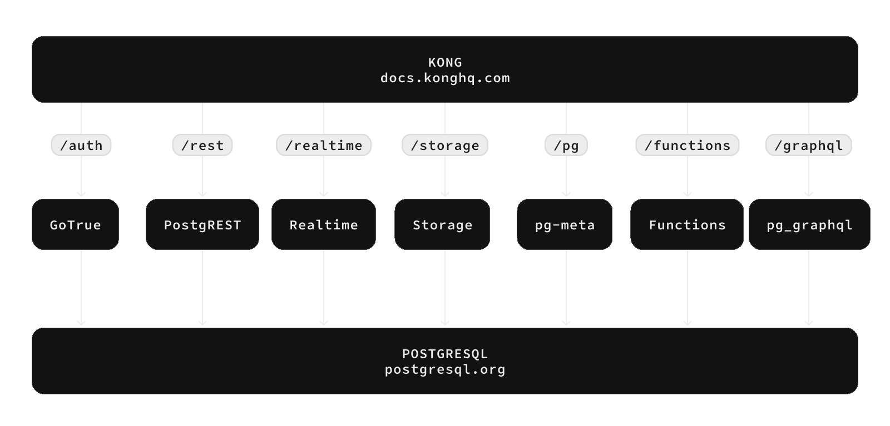

<p align="center">


</p>

# Supabase

[Supabase](https://supabase.com) is the Postgres development platform. We're building the features of Firebase using enterprise-grade open source tools.

- [x] Hosted Postgres Database. [Docs](https://supabase.com/docs/guides/database)
- [x] Authentication and Authorization. [Docs](https://supabase.com/docs/guides/auth)
- [x] Auto-generated APIs.
  - [x] REST. [Docs](https://supabase.com/docs/guides/api)
  - [x] GraphQL. [Docs](https://supabase.com/docs/guides/graphql)
  - [x] Realtime subscriptions. [Docs](https://supabase.com/docs/guides/realtime)
- [x] Functions.
  - [x] Database Functions. [Docs](https://supabase.com/docs/guides/database/functions)
  - [x] Edge Functions [Docs](https://supabase.com/docs/guides/functions)
- [x] File Storage. [Docs](https://supabase.com/docs/guides/storage)
- [x] AI + Vector/Embeddings Toolkit. [Docs](https://supabase.com/docs/guides/ai)
- [x] Dashboard


Watch "releases" of this repo to get notified of major updates.

<kbd></kbd>

## Documentation

For full documentation, visit [supabase.com/docs](https://supabase.com/docs)

To see how to Contribute, visit [Getting Started](./DEVELOPERS.md)

## Community & Support

- [Community Forum](https://github.com/supabase/supabase/discussions). Best for: help with building, discussion about database best practices.
- [GitHub Issues](https://github.com/supabase/supabase/issues). Best for: bugs and errors you encounter using Supabase.
- [Email Support](https://supabase.com/docs/support#business-support). Best for: problems with your database or infrastructure.
- [Discord](https://discord.supabase.com). Best for: sharing your applications and hanging out with the community.

## How it works

Supabase is a combination of open source tools. We’re building the features of Firebase using enterprise-grade, open source products. If the tools and communities exist, with an MIT, Apache 2, or equivalent open license, we will use and support that tool. If the tool doesn't exist, we build and open source it ourselves. Supabase is not a 1-to-1 mapping of Firebase. Our aim is to give developers a Firebase-like developer experience using open source tools.

**Architecture**

Supabase is a [hosted platform](https://supabase.com/dashboard). You can sign up and start using Supabase without installing anything.
You can also [self-host](https://supabase.com/docs/guides/hosting/overview) and [develop locally](https://supabase.com/docs/guides/local-development).



- [Postgres](https://www.postgresql.org/) is an object-relational database system with over 30 years of active development that has earned it a strong reputation for reliability, feature robustness, and performance.
- [Realtime](https://github.com/supabase/realtime) is an Elixir server that allows you to listen to PostgreSQL inserts, updates, and deletes using websockets. Realtime polls Postgres' built-in replication functionality for database changes, converts changes to JSON, then broadcasts the JSON over websockets to authorized clients.
- [PostgREST](http://postgrest.org/) is a web server that turns your PostgreSQL database directly into a RESTful API.
- [GoTrue](https://github.com/supabase/gotrue) is a JWT-based authentication API that simplifies user sign-ups, logins, and session management in your applications.
- [Storage](https://github.com/supabase/storage-api) a RESTful API for managing files in S3, with Postgres handling permissions.
- [pg_graphql](http://github.com/supabase/pg_graphql/) a PostgreSQL extension that exposes a GraphQL API.
- [postgres-meta](https://github.com/supabase/postgres-meta) is a RESTful API for managing your Postgres, allowing you to fetch tables, add roles, and run queries, etc.
- [Kong](https://github.com/Kong/kong) is a cloud-native API gateway.

#### Client libraries

Our approach for client libraries is modular. Each sub-library is a standalone implementation for a single external system. This is one of the ways we support existing tools.

<table style="table-layout:fixed; white-space: nowrap;">
  <tr>
    <th>Language</th>
    <th>Client</th>
    <th colspan="5">Feature-Clients (bundled in Supabase client)</th>
  </tr>
  <!-- notranslate -->
  <tr>
    <th></th>
    <th>Supabase</th>
    <th><a href="https://github.com/postgrest/postgrest" target="_blank" rel="noopener noreferrer">PostgREST</a></th>
    <th><a href="https://github.com/supabase/gotrue" target="_blank" rel="noopener noreferrer">GoTrue</a></th>
    <th><a href="https://github.com/supabase/realtime" target="_blank" rel="noopener noreferrer">Realtime</a></th>
    <th><a href="https://github.com/supabase/storage-api" target="_blank" rel="noopener noreferrer">Storage</a></th>
    <th>Functions</th>
  </tr>
  <!-- TEMPLATE FOR NEW ROW -->
  <!-- START ROW
  <tr>
    <td>lang</td>
    <td><a href="https://github.com/supabase-community/supabase-lang" target="_blank" rel="noopener noreferrer">supabase-lang</a></td>
    <td><a href="https://github.com/supabase-community/postgrest-lang" target="_blank" rel="noopener noreferrer">postgrest-lang</a></td>
    <td><a href="https://github.com/supabase-community/gotrue-lang" target="_blank" rel="noopener noreferrer">gotrue-lang</a></td>
    <td><a href="https://github.com/supabase-community/realtime-lang" target="_blank" rel="noopener noreferrer">realtime-lang</a></td>
    <td><a href="https://github.com/supabase-community/storage-lang" target="_blank" rel="noopener noreferrer">storage-lang</a></td>
  </tr>
  END ROW -->
  <!-- /notranslate -->
  <th colspan="7">⚡️ Official ⚡️</th>
  <!-- notranslate -->
  <tr>
    <td>JavaScript (TypeScript)</td>
    <td><a href="https://github.com/supabase/supabase-js" target="_blank" rel="noopener noreferrer">supabase-js</a></td>
    <td><a href="https://github.com/supabase/postgrest-js" target="_blank" rel="noopener noreferrer">postgrest-js</a></td>
    <td><a href="https://github.com/supabase/gotrue-js" target="_blank" rel="noopener noreferrer">gotrue-js</a></td>
    <td><a href="https://github.com/supabase/realtime-js" target="_blank" rel="noopener noreferrer">realtime-js</a></td>
    <td><a href="https://github.com/supabase/storage-js" target="_blank" rel="noopener noreferrer">storage-js</a></td>
    <td><a href="https://github.com/supabase/functions-js" target="_blank" rel="noopener noreferrer">functions-js</a></td>
  </tr>
    <tr>
    <td>Flutter</td>
    <td><a href="https://github.com/supabase/supabase-flutter" target="_blank" rel="noopener noreferrer">supabase-flutter</a></td>
    <td><a href="https://github.com/supabase/postgrest-dart" target="_blank" rel="noopener noreferrer">postgrest-dart</a></td>
    <td><a href="https://github.com/supabase/gotrue-dart" target="_blank" rel="noopener noreferrer">gotrue-dart</a></td>
    <td><a href="https://github.com/supabase/realtime-dart" target="_blank" rel="noopener noreferrer">realtime-dart</a></td>
    <td><a href="https://github.com/supabase/storage-dart" target="_blank" rel="noopener noreferrer">storage-dart</a></td>
    <td><a href="https://github.com/supabase/functions-dart" target="_blank" rel="noopener noreferrer">functions-dart</a></td>
  </tr>
  <tr>
    <td>Swift</td>
    <td><a href="https://github.com/supabase/supabase-swift" target="_blank" rel="noopener noreferrer">supabase-swift</a></td>
    <td><a href="https://github.com/supabase/supabase-swift/tree/main/Sources/PostgREST" target="_blank" rel="noopener noreferrer">postgrest-swift</a></td>
    <td><a href="https://github.com/supabase/supabase-swift/tree/main/Sources/Auth" target="_blank" rel="noopener noreferrer">auth-swift</a></td>
    <td><a href="https://github.com/supabase/supabase-swift/tree/main/Sources/Realtime" target="_blank" rel="noopener noreferrer">realtime-swift</a></td>
    <td><a href="https://github.com/supabase/supabase-swift/tree/main/Sources/Storage" target="_blank" rel="noopener noreferrer">storage-swift</a></td>
    <td><a href="https://github.com/supabase/supabase-swift/tree/main/Sources/Functions" target="_blank" rel="noopener noreferrer">functions-swift</a></td>
  </tr>
  <tr>
    <td>Python</td>
    <td><a href="https://github.com/supabase/supabase-py" target="_blank" rel="noopener noreferrer">supabase-py</a></td>
    <td><a href="https://github.com/supabase/postgrest-py" target="_blank" rel="noopener noreferrer">postgrest-py</a></td>
    <td><a href="https://github.com/supabase/gotrue-py" target="_blank" rel="noopener noreferrer">gotrue-py</a></td>
    <td><a href="https://github.com/supabase/realtime-py" target="_blank" rel="noopener noreferrer">realtime-py</a></td>
    <td><a href="https://github.com/supabase/storage-py" target="_blank" rel="noopener noreferrer">storage-py</a></td>
    <td><a href="https://github.com/supabase/functions-py" target="_blank" rel="noopener noreferrer">functions-py</a></td>
  </tr>
  <!-- /notranslate -->
  <th colspan="7">💚 Community 💚</th>
  <!-- notranslate -->
  <tr>
    <td>C#</td>
    <td><a href="https://github.com/supabase-community/supabase-csharp" target="_blank" rel="noopener noreferrer">supabase-csharp</a></td>
    <td><a href="https://github.com/supabase-community/postgrest-csharp" target="_blank" rel="noopener noreferrer">postgrest-csharp</a></td>
    <td><a href="https://github.com/supabase-community/gotrue-csharp" target="_blank" rel="noopener noreferrer">gotrue-csharp</a></td>
    <td><a href="https://github.com/supabase-community/realtime-csharp" target="_blank" rel="noopener noreferrer">realtime-csharp</a></td>
    <td><a href="https://github.com/supabase-community/storage-csharp" target="_blank" rel="noopener noreferrer">storage-csharp</a></td>
    <td><a href="https://github.com/supabase-community/functions-csharp" target="_blank" rel="noopener noreferrer">functions-csharp</a></td>
  </tr>
  <tr>
    <td>Go</td>
    <td>-</td>
    <td><a href="https://github.com/supabase-community/postgrest-go" target="_blank" rel="noopener noreferrer">postgrest-go</a></td>
    <td><a href="https://github.com/supabase-community/gotrue-go" target="_blank" rel="noopener noreferrer">gotrue-go</a></td>
    <td>-</td>
    <td><a href="https://github.com/supabase-community/storage-go" target="_blank" rel="noopener noreferrer">storage-go</a></td>
    <td><a href="https://github.com/supabase-community/functions-go" target="_blank" rel="noopener noreferrer">functions-go</a></td>
  </tr>
  <tr>
    <td>Java</td>
    <td>-</td>
    <td>-</td>
    <td><a href="https://github.com/supabase-community/gotrue-java" target="_blank" rel="noopener noreferrer">gotrue-java</a></td>
    <td>-</td>
    <td><a href="https://github.com/supabase-community/storage-java" target="_blank" rel="noopener noreferrer">storage-java</a></td>
    <td>-</td>
  </tr>
  <tr>
    <td>Kotlin</td>
    <td><a href="https://github.com/supabase-community/supabase-kt" target="_blank" rel="noopener noreferrer">supabase-kt</a></td>
    <td><a href="https://github.com/supabase-community/supabase-kt/tree/master/Postgrest" target="_blank" rel="noopener noreferrer">postgrest-kt</a></td>
    <td><a href="https://github.com/supabase-community/supabase-kt/tree/master/Auth" target="_blank" rel="noopener noreferrer">auth-kt</a></td>
    <td><a href="https://github.com/supabase-community/supabase-kt/tree/master/Realtime" target="_blank" rel="noopener noreferrer">realtime-kt</a></td>
    <td><a href="https://github.com/supabase-community/supabase-kt/tree/master/Storage" target="_blank" rel="noopener noreferrer">storage-kt</a></td>
    <td><a href="https://github.com/supabase-community/supabase-kt/tree/master/Functions" target="_blank" rel="noopener noreferrer">functions-kt</a></td>
  </tr>
  <tr>
    <td>Ruby</td>
    <td><a href="https://github.com/supabase-community/supabase-rb" target="_blank" rel="noopener noreferrer">supabase-rb</a></td>
    <td><a href="https://github.com/supabase-community/postgrest-rb" target="_blank" rel="noopener noreferrer">postgrest-rb</a></td>
    <td>-</td>
    <td>-</td>
    <td>-</td>
    <td>-</td>
  </tr>
  <tr>
    <td>Rust</td>
    <td>-</td>
    <td><a href="https://github.com/supabase-community/postgrest-rs" target="_blank" rel="noopener noreferrer">postgrest-rs</a></td>
    <td>-</td>
    <td>-</td>
    <td>-</td>
    <td>-</td>
  </tr>
  <tr>
    <td>Godot Engine (GDScript)</td>
    <td><a href="https://github.com/supabase-community/godot-engine.supabase" target="_blank" rel="noopener noreferrer">supabase-gdscript</a></td>
    <td><a href="https://github.com/supabase-community/postgrest-gdscript" target="_blank" rel="noopener noreferrer">postgrest-gdscript</a></td>
    <td><a href="https://github.com/supabase-community/gotrue-gdscript" target="_blank" rel="noopener noreferrer">gotrue-gdscript</a></td>
    <td><a href="https://github.com/supabase-community/realtime-gdscript" target="_blank" rel="noopener noreferrer">realtime-gdscript</a></td>
    <td><a href="https://github.com/supabase-community/storage-gdscript" target="_blank" rel="noopener noreferrer">storage-gdscript</a></td>
    <td><a href="https://github.com/supabase-community/functions-gdscript" target="_blank" rel="noopener noreferrer">functions-gdscript</a></td>
  </tr>
  <!-- /notranslate -->
</table>

<!--- Remove this list if you're translating to another language, it's hard to keep updated across multiple files-->
<!--- Keep only the link to the list of translation files-->

## Badges


```md
[](https://supabase.com)
```

```html
<a href="https://supabase.com">
  
</a>
```


```md
[](https://supabase.com)
```

```html
<a href="https://supabase.com">
  
</a>
```

## Translations

- [Arabic | العربية](/i18n/README.ar.md)
- [Albanian / Shqip](/i18n/README.sq.md)
- [Bangla / বাংলা](/i18n/README.bn.md)
- [Bulgarian / Български](/i18n/README.bg.md)
- [Catalan / Català](/i18n/README.ca.md)
- [Croatian / Hrvatski](/i18n/README.hr.md)
- [Czech / čeština](/i18n/README.cs.md)
- [Danish / Dansk](/i18n/README.da.md)
- [Dutch / Nederlands](/i18n/README.nl.md)
- [English](https://github.com/supabase/supabase)
- [Estonian / eesti keel](/i18n/README.et.md)
- [Finnish / Suomalainen](/i18n/README.fi.md)
- [French / Français](/i18n/README.fr.md)
- [German / Deutsch](/i18n/README.de.md)
- [Greek / Ελληνικά](/i18n/README.el.md)
- [Gujarati / ગુજરાતી](/i18n/README.gu.md)
- [Hebrew / עברית](/i18n/README.he.md)
- [Hindi / हिंदी](/i18n/README.hi.md)
- [Hungarian / Magyar](/i18n/README.hu.md)
- [Nepali / नेपाली](/i18n/README.ne.md)
- [Indonesian / Bahasa Indonesia](/i18n/README.id.md)
- [Italiano / Italian](/i18n/README.it.md)
- [Japanese / 日本語](/i18n/README.jp.md)
- [Korean / 한국어](/i18n/README.ko.md)
- [Lithuanian / lietuvių](/i18n/README.lt.md)
- [Latvian / latviski](/i18n/README.lv.md)
- [Malay / Bahasa Malaysia](/i18n/README.ms.md)
- [Norwegian (Bokmål) / Norsk (Bokmål)](/i18n/README.nb.md)
- [Persian / فارسی](/i18n/README.fa.md)
- [Polish / Polski](/i18n/README.pl.md)
- [Portuguese / Português](/i18n/README.pt.md)
- [Portuguese (Brazilian) / Português Brasileiro](/i18n/README.pt-br.md)
- [Romanian / Română](/i18n/README.ro.md)
- [Russian / Pусский](/i18n/README.ru.md)
- [Serbian / Srpski](/i18n/README.sr.md)
- [Sinhala / සිංහල](/i18n/README.si.md)
- [Slovak / slovenský](/i18n/README.sk.md)
- [Slovenian / Slovenščina](/i18n/README.sl.md)
- [Spanish / Español](/i18n/README.es.md)
- [Simplified Chinese / 简体中文](/i18n/README.zh-cn.md)
- [Swedish / Svenska](/i18n/README.sv.md)
- [Thai / ไทย](/i18n/README.th.md)
- [Traditional Chinese / 繁體中文](/i18n/README.zh-tw.md)
- [Turkish / Türkçe](/i18n/README.tr.md)
- [Ukrainian / Українська](/i18n/README.uk.md)
- [Vietnamese / Tiếng Việt](/i18n/README.vi-vn.md)
- [List of translations](/i18n/languages.md) <!--- Keep only this -->
