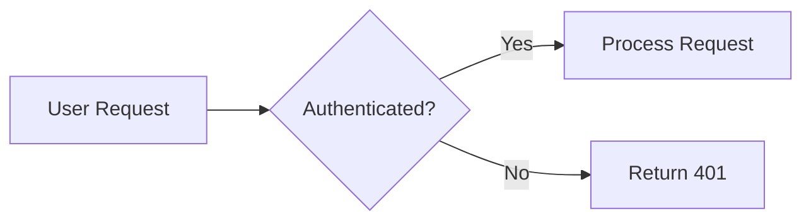

<ComponentPreview name="mermaid-basic" peekCode wide />

## Usage

### In MDX (Blog Posts)

The simplest way to add diagrams in blog posts is with a fenced code block using the `mermaid` language tag:

````mdx

````

This is automatically rendered as a diagram. No imports needed.

### As a Component

For more control, import and use the component directly:

```tsx
import { Mermaid } from 'ui'

export function MyDiagram() {
  return (
    <Mermaid
      chart={`
flowchart LR
    A[User Request] --> B{Authenticated?}
    B -->|Yes| C[Process Request]
    B -->|No| D[Return 401]
`}
    />
  )
}
```

Use the component when you need to pass props like `className`, conditionally render, or integrate with React logic.

## Flowcharts

Use `flowchart` or `graph` to create flowcharts with nodes and edges. Supports decision diamonds, different node shapes, and directional layouts (TD, LR, etc).
[View Mermaid flowchart docs](https://mermaid.js.org/syntax/flowchart.html)

A basic request flow showing conditional branching with a decision node (`{}`), demonstrating how to visualize auth checks and data flow.

<ComponentPreview name="mermaid-flowchart" />

### With Subgraphs

Group related nodes into labeled subgraphs to show system boundaries. Useful for depicting frontend/backend separation or microservice architecture.

<ComponentPreview name="mermaid-flowchart-subgraph" />

### Supabase Architecture

Shows how client requests flow through the API Gateway to core services (Auth, PostgREST, Realtime) which all connect to PostgreSQL.

<ComponentPreview name="mermaid-demo" />

### OAuth Authorization Flow

Illustrates the OAuth 2.0 authorization code flow, showing the handoff between a third-party app, your authorization endpoint, and Supabase Auth for token exchange.

<ComponentPreview name="mermaid-oauth-flow" />

## ER Diagrams

Use `erDiagram` to create entity-relationship diagrams showing database schemas. Great for documenting table relationships and foreign keys.
[View Mermaid ER diagram docs](https://mermaid.js.org/syntax/entityRelationshipDiagram.html)

A simple e-commerce schema showing cardinality between customers, orders, products, and line items using crow's foot notation.

<ComponentPreview name="mermaid-er-simple" />

### With Attributes

Include column definitions with types and constraints (PK, FK) to create more detailed schema documentation.

<ComponentPreview name="mermaid-er-diagram" />

## Sequence Diagrams

Use `sequenceDiagram` to show interactions between participants over time. Ideal for documenting API flows, authentication handshakes, or any request/response patterns.
[View Mermaid sequence diagram docs](https://mermaid.js.org/syntax/sequenceDiagram.html)

A typical authenticated API request showing JWT validation, database insert, and response flow between Client, API, Auth, and DB participants.

<ComponentPreview name="mermaid-sequence-api" />

### Async Streaming (FDW)

Shows how Foreign Data Wrappers can stream data asynchronously using bounded channels, with parallel execution indicated by the `par` block.

<ComponentPreview name="mermaid-sequence-async" />

### Sync Blocking (FDW)

Contrasts with async by showing traditional blocking FDW behavior where all rows are fetched and buffered before processing.

<ComponentPreview name="mermaid-sequence-sync" />

## Props

| Prop        | Type     | Description                          |
| ----------- | -------- | ------------------------------------ |
| `chart`     | `string` | The Mermaid diagram definition       |
| `className` | `string` | Optional CSS class for the container |

## Learn More

See the [Mermaid documentation](https://mermaid.js.org/intro/) for full syntax reference and additional diagram types.
