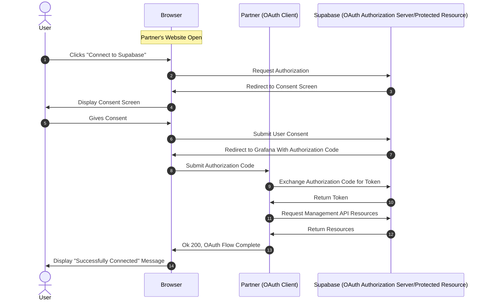
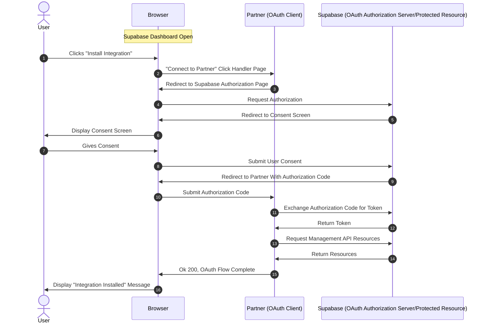
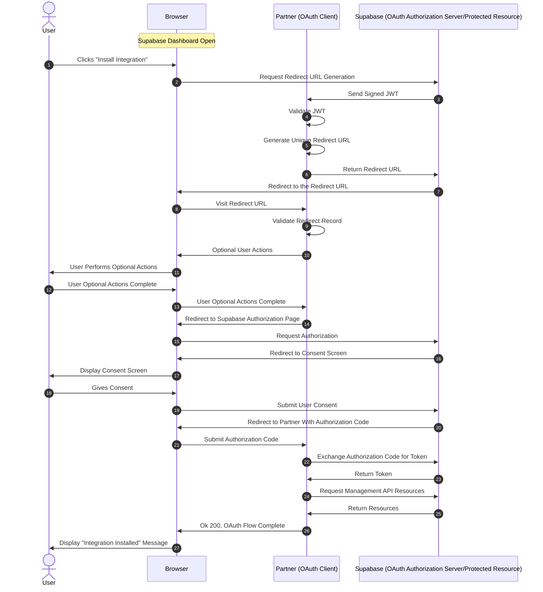

This guide describes how a Supabase partner can integrate with the Supabase platform via OAuth. It details the flow a user goes through when they click the **Install Integration** button on the [**Integration**](https://supabase.com/dashboard/project/_/integrations) section of the Dashboard. It also shows what a partner needs to implement in their system to make such a flow work.

This guide assumes that the reader is familiar with how OAuth works. The purpose of this guide is not to explain OAuth, but to show how we extend OAuth to make it possible to start the OAuth flow from the Supabase dashboard's Integrations page.

# Problem

We want users to be able to start the OAuth flow from Supabase dashboard's Integrations page. In standard OAuth authorization code flow, the user starts on the partner's webpage and clicks a button like **Connect to Supabase** to start the flow. In a sequence diagram, it looks like the following:



The OAuth standard doesn't talk about how to start the OAuth flow if the user is already present on the Authorization Server/Protected Resources's website (Supabase in this case). So we need to extend the protocol to make this possible.

# Solution

We have two options for extending the protocol.

## Simple Redirect

The first is that the **Install Integration** button can redirect the user to a Partner webpage which kicks off the OAuth flow. It looks like the following:



This works but the partner's system doesn't know if the incoming redirect is coming really from Supabase or not. To provide a guarantee that it is indeed Supabase who sent the user, we can alter the flow as explained next.

## Signed Redirect

A one time setup is required to make this flow possible. Supabase generates a key-pair, keeps the private key in it's system and shares the public key with the partner. The partner saves the public key in their system for later use.

Before redirecting the user, Supabase signs a Json Web Token (JWT) with the private key, makes a POST call to a partner API endpoint. This API endpoint validates the JWT with the public key, creates a unique redirect page record in the partner's system and returns that to Supabase. Supabase will then redirect the user to that unique page, mitigating the risk of partners receiving redirect requests from sources other than Supabase.

The flow looks like this:



The part where user performs optional actions will be different to each partner but usually contains:

- Asking the user to sign-up if they are not signed up.
- Asking the user to sign-in if they are not signed in.
- Asking the user to configure the partner system which is required for the integration to work.

Although a partner is free to implement this section as they see fit, it is strongly recommended that the user is taken through a wizard like experience upon completing which they are redirected to the Supabase authorization endpoint to kick off the OAuth flow. This is to avoid having the user getting distracted, clicking around to another section of a partner's website and forgetting to complete the OAuth flow. The UX should be designed to minimize such abandoning of the OAuth flow.

# Implementation

This section explains what a partner needs to do to implement the two integration options discussed above. A partner can pick either option. The benefit of simple redirect is that it is easier to implement. The signed redirect is more work but has better security.

The following sections assume that the partner have already followed the [Build a Supabase Integration](https://supabase.com/docs/guides/integrations/build-a-supabase-oauth-integration) guide and have a working OAuth client.

## Simple Redirect

In this method, the partner implements a `GET` endpoint to which Supabase will redirect when the **Install Integration** button is clicked by a user.

#### Endpoint

```json
GET https://<partner-url-which-kicks-off-oauth/<optional-path>?project_id=<supabase-project_ref>&organization_slug=<supabase-org-slug>
```

This endpoint can ask the user to optionally sign-up or sign-in, or perform other required tasks on the partner's website but once the user has performed all those tasks it should immediately kick off a [redirect to the Supabase authotization URL](https://supabase.com/docs/guides/integrations/build-a-supabase-oauth-integration#redirecting-to-the-authorize-url) without further user interaction. This will start the OAuth flow.

When redirecting to the endpoint, supabase will send the following query parameters in the URL:

| **Param** | **Description** |
| --- | --- |
| `project_id` | Supabase project ref of the project where the **Install Integration** button was clicked. |
| `organization_slug` | Supabase organization slug where the **Install Integration** button was clicked. |

The endpoint handler can save these params in their system and use them to fetch details about the project or organization or use them in the UI to pre-select a project or an organization once the OAuth flow is complete.

#### Details Shared With Supabase

This endpoint should be shared with Supabase so that we can configure the **Install Integration** button to be redirected to this endpoint.

## Signed Redirect

In this method, the partner implements two endpoints:

1. A `POST` API endpoint to generate a redirect record.
2. A `GET` endpoint to handle redirected users.

When the user clicks the **Install Integration** button, Supabase will call the first endpoint to get a redirect URL, to which the user is redirected.

For the signed redirect method to work, there's a one time setup required for the cryptographic algorithm work correctly.

#### Key Pairs

Supabase will generate two key-pairs, one each for a staging and a production environment. Get public keys and their key ids for those environments from Supabase and save them in your system. The key-pair will be in PEM encoded EC P-256 format. An example of the key-pairs is as follows:

```json
===============Staging==================

Key ID: pik_3038669348a3ea75dbaf0655
Public Key:
-----BEGIN PUBLIC KEY-----
MFkwEwYHKoZIzj0CAQYIKoZIzj0DAQcDQgAEnj3NmwrLPPH/3isvpS601ndQP9Mk
zqppdLDV9YfmoF4wavTyb9UTVE5pJ0fukpo5aOoNb4fBZgESsedIUoEn8Q==
-----END PUBLIC KEY-----

==============Production================

Key ID: pik_89e80ddbca9df41b97e28986
Public Key:
-----BEGIN PUBLIC KEY-----
MFkwEwYHKoZIzj0CAQYIKoZIzj0DAQcDQgAEWCGhwtFWn4jpWZNeyZpTlaAdq/tD
/yBaN0gFPpS8LTFiCPFgnWKbVe3RfExXh7bEhcrEUdWycmYvwrNklWWHRA==
-----END PUBLIC KEY-----
```

The key ids are used to identify the correct public key to use when validating the signed JWT. They also help in zero-downtime key rotation. To rotate keys, Supabase will share a new set of key-pairs which the partner saves in their system. No code changes should be required in the partner system as the key identity is established by the key id. When the new keys are used by Supabase to sign the JWT, it will send new key ids as well, making it possible for the partner to lookup the correct key to use for validating the JWT signature.

<aside>
💡

In future we plan to fully automate sharing the keys with partners and key rotation by publishing them on a `.../.well-known/jwks.json` URL. For now this is done manually.

</aside>

### Endpoint to Generate Redirect Record

This endpoint is called by Supabase to get a redirect record. A redirect record is a uuid uniquely identifying a specific redirect that a user initiated when they clicked the **Install Integration** button. Each click on the **Install Integration** button should generate a new redirect record. 

#### Endpoint

The endpoint can be hosted anywhere with whatever path the partner likes. This endpoint should not require any authentication. It is recommended to add rate limiting to this endpoint to prevent abuse.

```json
POST https://<partner-api-host>/<partner-api-path>
Content-Type: application/json
```

#### Request Body

The endpoint needs to a accept a JSON body in the following format:

```json
{
	"token": "<signed-jwt>"
}
```

Upon receiving a request, the handler for this endpoint should extract the key id from the `kid` field of the JWT header, read the public key associated with this key id and use the public key to verify the signature on the JWT. If the signature is invalid it should return a 401 status code error. If the signature is valid, it should generate a uuid to identify a unique redirect record (aka integration record) and save this uuid in their system. The redirect record should have an expiry (usually 1 hour) to avoid them accumulating in the partner's system and to also prevent malicious users from calling the redirect endpoint in case the record is leaked.

#### JWT Fields

The token is a JWT signed with the ES256 private key. It contains the following fields

**Protected Header (JOSE Header)**

| **Field** | **Required** | **Description** |
| --- | --- | --- |
| `alg` | Yes | It will always be “ES256”, because that's the only signing algorithm currently supported. |
| `kid` | Yes | A key id, uniquely identifying the keypair. This will be used to pick the correct public key when verifying the signature. |

**Payload (Claims)**

| **Claim** | **Required** | **Description** |
| --- | --- | --- |
| `iss` | Yes | It will always be “supabase”. |
| `aud` | Yes | A unique string to identify the audience of this JWT. Usually a URL. |
| `iat` | Yes | Issued-at timestamp (seconds since epoch). |
| `exp` | Yes | Expiry timestamp — must be at most 5 minutes after `iat`. |
| `organization_slug` | No | The Supabase organization the user is connecting from. Used to pre-select the org during the OAuth consent screen. |
| `project_id` | No | The Supabase project ref the user wants to connect. Can be used by the partner to pre-select a Supabase project in their UI. |

**Signature**

The header and claims are signed by the EC P-256 private key.

**Validation**

The following should be validated in the JWT:

1. That the `alg` is `ES256`.
2. That the `iss` claim is equal to `supabase`.
3. That the `aud` claim value is the one you agreed with Supabase.
4. That the current time is within the `iat` and `exp` claims.

If the JWT is invalid a 401 status code should be returned to the client.

#### Response Body

The response body must be in the following format:

```json
{
  "integrationId": "<a unique uuid>",
  "redirectUrl": "https://<partner-api-host>/<partner-api-path>/<integration-id>",
  "expiresAt": "<timestamp>"
}
```

| **Field** | **Description** |
| --- | --- |
| `integrationId` | A UUID uniquely identifying the redirect record (aka an integration record). |
| `redirectUrl` | The URL the user will be redirected to. It must contain the `integrationId` in its path somewhere to retrieve the record when the user is redirected. |
| `expiresAt`  | The time when the redirect record will expire (usually 1 hour from creation). The user must begin the flow before this time. |

### Endpoint to Handle Redirects

The redirect URL must have the redirect record in its path. The handler should extract the redirect record from the URL and look it up in its system. If the redirect record doesn't exist it should return a 401 error to the client.

#### Details Shared With  Supabase

Please share the following with Supabase so that we can configure the **Install Integration** button to correctly get a redirect URL and redirect the user there.

- Ask Supabase for the public keys and their key ids for staging and prod environments.
- Share the redirect record generation endpoint and the redirect handling endpoints with Supabase.
- Share the `aud` claim value you'd like Supabase to send in the signed JWT.