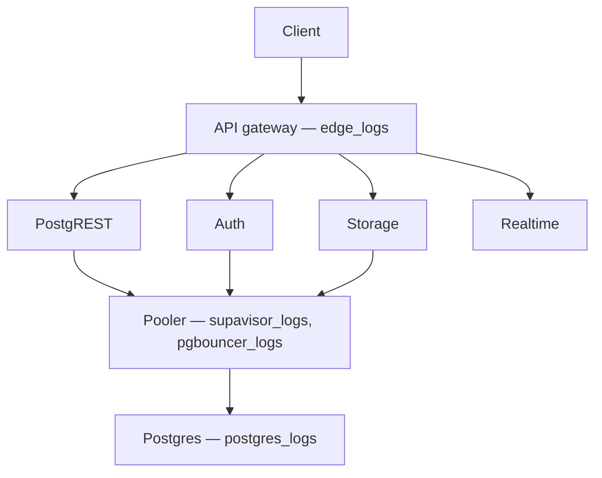

This guide explains how to query project logs and how to record extra events. The same ClickHouse SQL runs in the [Logs Explorer](/dashboard/project/_/logs/explorer), the MCP [`query_logs`](/docs/guides/ai-tools/mcp) tool, and the [Management API](/docs/reference/api/v1-get-project-logs). Filter events without SQL in [Logs](/docs/guides/monitoring-and-debugging/logs) in Studio. From a terminal, call the Management API; the CLI inspects the database rather than ClickHouse logs.

Use this page to:

- Query logs from [Studio](#studio), [MCP](#mcp), the [API](#api), or a [script](#cli)
- Pick a [`source`](#logs-explorer) for the layer that reported the error
- Record extra [API](#working-with-api-logs), [Postgres](#logging-postgres-queries), and [Realtime](#logging-realtime-connections) events
- Write [ClickHouse SQL](#querying-with-the-logs-explorer)

Every log line is one row in a single `logs` table, tagged by a `source` column. Structured fields live in a `log_attributes` map, and the raw line is in `event_message`. Filter by `source` to scope a query to one service.

<Admonition type="note">

ClickHouse has been the default engine since June 2026. Projects created before this date use BigQuery, whose `cross join unnest(metadata)` syntax is deprecated. We recommend rewriting those queries in the ClickHouse syntax shown in this guide.

</Admonition>

On hosted projects, prefer `query_logs` over `get_logs`. `get_logs` returns a service's recent logs without SQL; it remains the option for local and self-hosted projects.

## Query from Studio, MCP, the API, or the CLI

### Studio [#studio]

Open [Logs](/dashboard/project/_/logs) to filter and inspect events. Open the [Logs Explorer](/dashboard/project/_/logs/explorer) to run ClickHouse SQL. See [Logs](/docs/guides/monitoring-and-debugging/logs) for the unified Logs interface.

### MCP [#mcp]

On hosted projects, call [`query_logs`](/docs/guides/ai-tools/mcp) with the same SQL as this guide. Keep the connection project-scoped and read-only. See [Observe the data](/docs/guides/monitoring-and-debugging/access-data#mcp).

### API [#api]

Pass ClickHouse SQL in the `sql` parameter of the [Management API logs endpoint](/docs/reference/api/v1-get-project-logs). Unless you pass `sql`, that endpoint queries `edge_logs` only. Supply `iso_timestamp_start` and `iso_timestamp_end`; the range must be 24 hours or less.

### CLI [#cli]

The Supabase CLI does not query ClickHouse logs. Call the [Management API](/docs/reference/api/v1-get-project-logs) from a script, or use [`supabase inspect db`](/docs/guides/monitoring-and-debugging/inspect) for database diagnostics. See [Observe the data](/docs/guides/monitoring-and-debugging/access-data#cli).

## Sources [#logs-explorer]

Filter by `source` to query one service. The Logs Explorer **Sources** drop-down lists these values.

Pick the source for the layer that reported the error. A request hits the API gateway first, then one service, then the pooler and Postgres. The layer that _reports_ an error is often not the layer that _caused_ it. When two sources could fit, start closer to the database.



Edge Functions sit outside that path: `function_edge_logs` is the HTTP request to the function, and `function_logs` is `console` output from inside it.

A permission error or an empty result at the API is often row-level security in `postgres_logs`.

| `source`             | Events                                                                                                 |
| -------------------- | ------------------------------------------------------------------------------------------------------ |
| `edge_logs`          | HTTP requests through the API gateway, including REST and GraphQL                                      |
| `postgres_logs`      | Database queries, SQLSTATE, RLS, and functions                                                         |
| `postgrest_logs`     | PostgREST process logs. Low-signal; `PGRST*` evidence usually lives in `edge_logs` and `postgres_logs` |
| `auth_logs`          | Auth server: login, JWT, OAuth, email                                                                  |
| `auth_audit_logs`    | Auth audit events                                                                                      |
| `storage_logs`       | Storage API: uploads and object access                                                                 |
| `realtime_logs`      | Realtime server: channels, presence, broadcast                                                         |
| `function_edge_logs` | HTTP request and response for an Edge Function invocation                                              |
| `function_logs`      | `console` output from inside an Edge Function                                                          |
| `supavisor_logs`     | Shared pooler: pooling and timeouts                                                                    |
| `pgbouncer_logs`     | Dedicated pooler                                                                                       |
| `pg_upgrade_logs`    | Database version upgrade                                                                               |

For `postgres_logs`, statement text and error detail live in `event_message`. `parsed.query` and `parsed.detail` are usually empty.

For API Load Balancer traffic, the upstream database is `log_attributes['load_balancer_redirect_identifier']`.

See the [Logs field reference](/docs/guides/monitoring-and-debugging/log-field-reference) for the ClickHouse field names on each source.

## Working with API logs [#working-with-api-logs]

API Gateway logs run through Cloudflare and include Cloudflare metadata on the request.

### Allowed headers

A strict list of request and response headers are permitted in the API logs. Request and response headers will still be received by the server(s) and client(s), but will not be attached to the API logs generated.

Request headers:

- `accept`
- `cf-connecting-ip`
- `cf-ipcountry`
- `host`
- `user-agent`
- `x-forwarded-proto`
- `referer`
- `content-length`
- `x-real-ip`
- `x-client-info`
- `x-forwarded-user-agent`
- `range`
- `prefer`

Response headers:

- `cf-cache-status`
- `cf-ray`
- `content-location`
- `content-range`
- `content-type`
- `content-length`
- `date`
- `transfer-encoding`
- `x-kong-proxy-latency`
- `x-kong-upstream-latency`
- `sb-gateway-mode`
- `sb-gateway-version`

### Additional request metadata

To attach additional metadata to a request, it is recommended to use the `User-Agent` header for purposes such as device or version identification.

For example:

```
node MyApp/1.2.3 (device-id:abc123)
Mozilla/5.0 (Windows NT 6.1; Win64; x64; rv:47.0) Gecko/20100101 Firefox/47.0 MyApp/1.2.3 (Foo v1.3.2; Bar v2.2.2)
```

<Admonition type="note">

Do not log Personal Identifiable Information (PII) within the `User-Agent` header, to avoid infringing data protection privacy laws. Overly fine-grained and detailed user agents may allow fingerprinting and identification of the end user through PII.

</Admonition>

## Logging Postgres connections [#logging-postgres-connections]

Postgres can log connection lifecycle events to your project's Postgres logs, for example when a client connects or authenticates. By default, Supabase sets `log_connections` to off for new projects and you must enable it first.

To enable connection logging for audit or compliance, see [Postgres connection logging](/docs/guides/platform/postgres-connection-logging).

In Logs, connection lifecycle messages are included when the Postgres log type is selected. Clear **Connection logs** under Postgres to hide them.

## Logging Postgres queries [#logging-postgres-queries]

To enable query logs for other categories of statements:

1. [Enable the pgAudit extension](/dashboard/project/_/database/extensions).
2. Configure `pgaudit.log` (see below). Perform a fast reboot if needed.
3. View your query logs in [Logs](/dashboard/project/_/logs). Filter **Log Type** to Postgres.

### Configuring `pgaudit.log` [#configuring-pgauditlog]

The stored value under `pgaudit.log` determines the classes of statements that are logged by [pgAudit extension](https://www.pgaudit.org/). Refer to the pgAudit documentation for the [full list of values](https://github.com/pgaudit/pgaudit/blob/master/README.md#pgauditlog).

To enable logging for function calls/do blocks, writes, and DDL statements for a single session, execute the following within the session:

```sql
-- temporary single-session config update
set pgaudit.log = 'function, write, ddl';
```

To _permanently_ set a logging configuration (beyond a single session), execute the following, then perform a fast reboot:

```sql
-- equivalent permanent config update.
alter role postgres set pgaudit.log to 'function, write, ddl';
```

To help with debugging, we recommend adjusting the log scope to only relevant statements as having too wide of a scope would result in a lot of noise in your Postgres logs.

Note that in the above example, the role is set to `postgres`. To log user traffic flowing through the [HTTP APIs](/docs/guides/api#rest-api-overview), which use PostgREST, set your configuration values for the `authenticator`.

```sql
-- for API-related logs
alter role authenticator set pgaudit.log to 'write';
```

By default, the log level will be set to `log`. To view other levels, run the following:

```sql
-- adjust log level
alter role postgres set pgaudit.log_level to 'info';
alter role postgres set pgaudit.log_level to 'debug5';
```

Note that as per the pgAudit [log_level documentation](https://github.com/pgaudit/pgaudit/blob/master/README.md#pgauditlog_level), `error`, `fatal`, and `panic` are not allowed.

To reset system-wide settings, execute the following, then perform a fast reboot:

```sql
-- resets stored config.
alter role postgres reset pgaudit.log
```

<Admonition type="note">

If any permission errors are encountered when executing `alter role postgres ...`, it is likely that your project has yet to receive the patch to the latest version of [supautils](https://github.com/supabase/supautils), which is currently being rolled out.

</Admonition>

### `RAISE`d log messages in Postgres

Messages that are manually logged via `RAISE INFO`, `RAISE NOTICE`, `RAISE WARNING`, and `RAISE LOG` are shown in Postgres Logs. Note that only messages at or above your logging level are shown. Syncing of messages to Postgres Logs may take a few minutes.

If your logs aren't showing, check your logging level by running:

```sql
show log_min_messages;
```

Note that `LOG` is a higher level than `WARNING` and `ERROR`, so if your level is set to `LOG`, you will not see `WARNING` and `ERROR` messages.

### Limits and caveats

- Postgres log events on the Supabase Platform are limited to 100,000 characters. If a log event exceeds this limit, it will be truncated. This does not apply to self-hosting.
- Internal connection logs to Postgres within the Supabase Platform by internal services are not logged. This does not apply to self-hosting.

## Logging realtime connections [#logging-realtime-connections]

Realtime doesn't log new WebSocket connections or Channel joins by default. Enable connection logging per client by including an `info` `log_level` parameter when instantiating the Supabase client.

```javascript
import { createClient } from '@supabase/supabase-js'

const options = {
  realtime: {
    params: {
      log_level: 'info',
    },
  },
}
const supabase = createClient('https://xyzcompany.supabase.co', 'sb_publishable_...', options)
```

## Querying logs [#querying-with-the-logs-explorer]

Read fields with bracket access, keeping the full dotted key, for example `log_attributes['request.path']` rather than `path`. Wrap numeric values in `toInt32OrZero(...)`, which returns `0` for a missing or non-numeric value. Use `count()` rather than `count(*)`.

For example, to find failing API requests:

```sql
select timestamp,
       toInt32OrZero(log_attributes['response.status_code']) as status,
       log_attributes['request.path'] as path
from logs
where source = 'edge_logs'
  and toInt32OrZero(log_attributes['response.status_code']) >= 400
order by timestamp desc
limit 100;
```

For example, to find a specific Postgres SQLSTATE (`42501` permission denied, `42P01` relation missing, `23505` duplicate key):

```sql
select timestamp, log_attributes['parsed.user_name'] as role, event_message
from logs
where source = 'postgres_logs'
  and log_attributes['parsed.sql_state_code'] = '42501'
order by timestamp desc
limit 100;
```

The Management API accepts this SQL in the `sql` parameter. Unless you pass `sql`, that endpoint queries `edge_logs` only. Supply `iso_timestamp_start` and `iso_timestamp_end`; the range must be 24 hours or less.

## Timestamp display and behavior

The `timestamp` column is a `DateTime64` value in UTC, formatted as an ISO-8601 string like `2026-06-22T09:34:06.215000`. You can order and compare it directly, so no conversion function is needed. In the Logs Explorer the selected time range is applied for you, so you rarely need to filter on `timestamp` by hand. MCP and the Management API require an explicit time range.

```sql
select timestamp, event_message
from logs
where source = 'edge_logs'
order by timestamp desc
limit 100;
```

## Reading fields from log_attributes

Structured fields live in the `log_attributes` map. Read a field with bracket access, keeping the full dotted key. There are no unnesting joins.

```sql
select
  log_attributes['request.method'] as method,
  log_attributes['request.path'] as path,
  log_attributes['response.status_code'] as status
from logs
where source = 'edge_logs'
limit 100;
```

The key keeps the full dotted path, with the `metadata` root dropped. What BigQuery expressed as `metadata.request.cf.country` is `log_attributes['request.cf.country']`. Keep the full prefix rather than shortening it.

Map values are always strings. To compare or aggregate a numeric field, wrap it in `toInt32OrZero`, which returns `0` for a missing or non-numeric value:

```sql
select count() as server_errors
from logs
where source = 'edge_logs'
  and toInt32OrZero(log_attributes['response.status_code']) between 500 and 599;
```

Do not guess keys. Discover the keys a source sets from recent rows:

```sql
select arrayJoin(mapKeys(log_attributes)) as key, count() as n
from logs
where source = 'postgres_logs'
group by key
order by n desc
limit 100;
```

## LIMIT and result row limitations

The Logs Explorer has a maximum of 1000 rows per run. Use `LIMIT` to reduce the number of rows returned further.

## Best practices

1. **Use a narrow time range.**

The Logs Explorer applies the time range you select, so keep it tight. Querying a very large range risks timeouts, especially for Enterprise customers with long retention, because of the extra data scanned.

2. **Select only the fields you need.**

Selecting the whole `log_attributes` map, or every column, reads far more data than you need and slows the query down. Select the specific keys instead.

```sql
-- ❌ Avoid this: selecting the whole attributes map
select timestamp, log_attributes
from logs
where source = 'edge_logs';

-- ✅ Do this: select only the keys you need
select timestamp, log_attributes['request.method'] as method
from logs
where source = 'edge_logs';
```

3. **Query one source at a time.**

Identify which service owns the problem from the error or status code first, then query only that source. Scanning every source at once buries the signal you need and scans far more data than the investigation requires.

4. **Follow a request across sources with an anchor.** Once a query gives you an anchor such as a timestamp, request id, or SQL state, filter the adjacent source by that anchor to correlate the request across layers (for example `edge_logs` to `postgres_logs`), instead of re-scanning each source from scratch.

5. **Reference only fields you have confirmed.**

A misspelled or non-existent field name either errors or silently returns nothing, which leaves a working query look empty. Confirm field names in the [Logs field reference](/docs/guides/monitoring-and-debugging/log-field-reference), or select `event_message` and inspect a sample row first.

## Examples and templates

The Logs Explorer includes **Templates** (available in the Templates tab or the dropdown in the Query tab) to help you get started.

For example, you can enter the following query in the SQL Editor to retrieve each user's IP address:

```sql
select timestamp, log_attributes['request.headers.x_real_ip'] as x_real_ip
from logs
where source = 'edge_logs'
  and log_attributes['request.headers.x_real_ip'] != ''
  and log_attributes['request.method'] = 'GET'
order by timestamp desc
limit 100;
```

## Understanding field references

Every log source shares the same `logs` table. Each row has these columns:

| column           | description                                        |
| ---------------- | -------------------------------------------------- |
| `id`             | unique log identifier                              |
| `timestamp`      | time the event was recorded                        |
| `event_message`  | the log's message                                  |
| `severity_text`  | log level, when the source sets one                |
| `source`         | the service the log came from                      |
| `log_attributes` | structured per-source fields, keyed by dotted path |

Service-specific details live in `log_attributes`. For example, in `postgres_logs` the `log_attributes['parsed.error_severity']` field holds the error level of an event. Read those fields with bracket access:

```sql
select
  event_message,
  log_attributes['parsed.error_severity'] as error_severity,
  log_attributes['parsed.user_name'] as user_name
from logs
where source = 'postgres_logs'
limit 100;
```

## Filtering with [regular expressions](https://en.wikipedia.org/wiki/Regular_expression)

Use the ClickHouse [`match` function](https://clickhouse.com/docs/sql-reference/functions/string-search-functions#match) for regular expressions. In its most basic form, it checks whether a pattern is present in a column.

```sql
select timestamp, event_message
from logs
where source = 'postgres_logs'
  and match(event_message, 'is present')
limit 100;
```

There are multiple operators to consider using.

### Find messages that start with a phrase

`^` only looks for values at the start of a string

```sql
-- find only messages that start with connection
match(event_message, '^connection')
```

### Find messages that end with a phrase

`$` only looks for values at the end of the string

```sql
-- find only messages that end with port=12345
match(event_message, 'port=12345$')
```

### Ignore case sensitivity

`(?i)` ignores capitalization for all proceeding characters

```sql
-- find all event_messages with the word "connection"
match(event_message, '(?i)COnnecTion')
```

For a plain case-insensitive substring match, `ilike` is simpler:

```sql
-- find all event_messages containing "connection", in any case
event_message ilike '%connection%'
```

### Wildcards

`.` matches any single character, and `.*` matches any sequence of characters

```sql
-- find event_messages like "hello<anything>world"
match(event_message, 'hello.*world')
```

### Alphanumeric ranges

`[0-9a-zA-Z]` matches a single alphanumeric character. Anchor it with `^[0-9a-zA-Z]+$` to match a value that is entirely alphanumeric.

```sql
-- find event_messages that contain a digit between 1 and 5 (inclusive)
match(event_message, '[1-5]')
```

### Repeated values

`x*` zero or more x
`x+` one or more x
`x?` zero or one x
`x{4,}` four or more x
`x{3}` exactly 3 x

```sql
-- find event_messages that contain any sequence of 3 digits
match(event_message, '[0-9]{3}')
```

### Escaping reserved characters

`\.` is interpreted as a period `.` instead of as a wildcard

```sql
-- escapes .
match(event_message, 'hello world\.')
```

### `or` statements

`x|y` any string with `x` or `y` present

```sql
-- find event_messages that have the word 'started' followed by either "host" or "authenticated"
match(event_message, 'started (host|authenticated)')
```

### `and`/`or`/`not` statements in SQL

`and`, `or`, and `not` are native terms in SQL and can be used with regular expressions to filter results

```sql
select timestamp, event_message
from logs
where source = 'postgres_logs'
  and (
    (match(event_message, 'connection') and match(event_message, 'host'))
    or not match(event_message, 'received')
  )
limit 100;
```

### Filtering example

Filter for Postgres errors:

```sql
select
  timestamp,
  log_attributes['parsed.error_severity'] as error_severity,
  log_attributes['parsed.user_name'] as user_name,
  event_message
from logs
where source = 'postgres_logs'
  and match(log_attributes['parsed.error_severity'], 'ERROR|FATAL|PANIC')
order by timestamp desc
limit 100;
```

## Limitations

### The wildcard operator `*` is not supported

The logs query surface rejects `select *` and `count(*)`. List the columns you need, and use `count()` for row counts:

```sql
select timestamp, event_message, log_attributes['parsed.error_severity'] as error_severity
from logs
where source = 'postgres_logs'
order by timestamp desc
limit 100;
```
