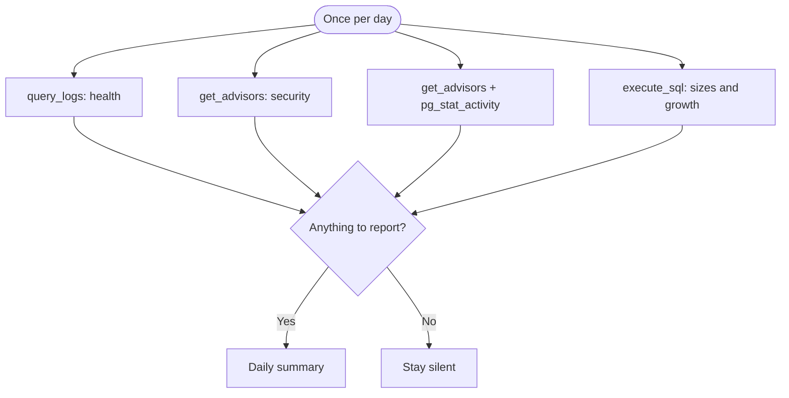

## What it watches

- **Health** — API 5xx, Auth failures, error-rate spikes in the last 24 hours
- **Security** — Security Advisor findings, authorization failure spikes
- **Performance** — slow queries, lock waits, Performance Advisor findings
- **Usage** — database size, connection counts, API request growth, approaching limits

It uses `query_logs`, `get_advisors`, and read-only `execute_sql` on project-scoped [Supabase MCP](/docs/guides/ai-tools/mcp). It does not change the project.

## When it watches

<AgentWatchSchedule id="all" />

## What it will output

Generalist reports only checks that turn up a finding. If health is clear, that section is omitted. If all checks are clear, the agent stays silent. When it does report, each section follows the same format as the specialist agent: a grouped finding, a likely cause, and a next step for a person to act on.

<$Partial path="monitoring_agent_output.mdx" />

## Set up the agent

<AgentSetup id="all" />
