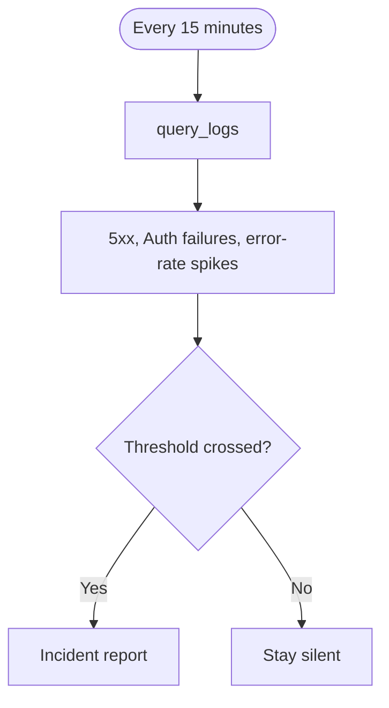

## What it watches

- API and Auth responses with status `>= 500`
- Error-rate spikes against a recent baseline
- Connection pressure when database inspection is available

It uses `query_logs` on project-scoped, read-only [Supabase MCP](/docs/guides/ai-tools/mcp). It can use `get_advisors` for extra context. It does not change the project.

## When it watches

<AgentWatchSchedule id="health" />

## What it will output

When a threshold is crossed, Health monitor reports an incident: grouped errors, a few request IDs, a likely cause, and a troubleshooting link. If nothing crosses the threshold, it stays silent.

<$Partial path="monitoring_agent_output.mdx" />

## Set up the agent

<AgentSetup id="health" />
