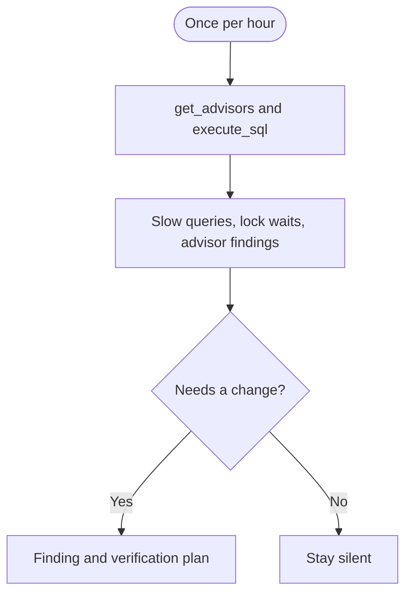

## What it watches

- Slow or regressing queries
- Lock waits and long-running sessions
- Unindexed foreign keys and other Performance Advisor findings

It uses `get_advisors` and read-only `execute_sql` on project-scoped [Supabase MCP](/docs/guides/ai-tools/mcp). It does not create indexes, rewrite queries, or cancel sessions.

## When it watches

<AgentWatchSchedule id="performance" />

## What it will output

Performance monitor reports slow or regressing queries, lock waits, and Performance Advisor findings, with a verification plan. It can recommend that a person cancel a session. It does not cancel the session or create indexes.

<$Partial path="monitoring_agent_output.mdx" />

## Set up the agent

<AgentSetup id="performance" />
