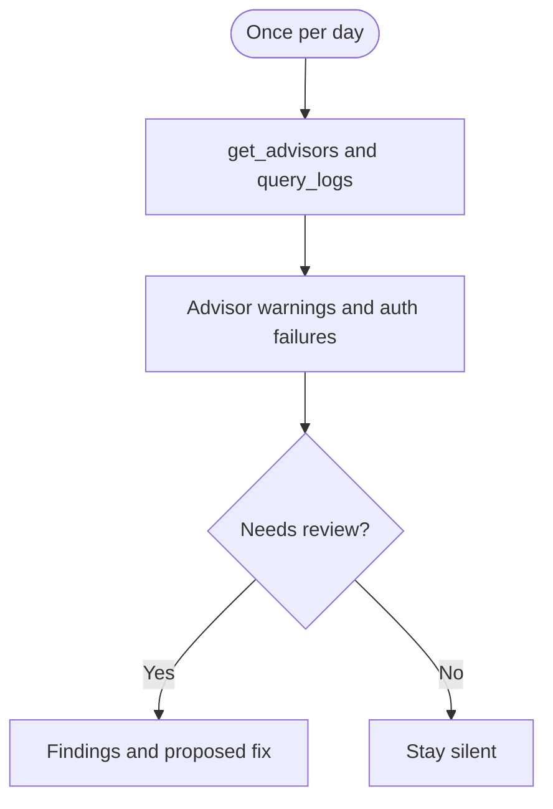

## What it watches

- Security Advisor findings at warning and error level
- Authentication and authorization failure spikes
- RLS or privilege issues that advisors already name

It uses `get_advisors` and `query_logs` on project-scoped, read-only [Supabase MCP](/docs/guides/ai-tools/mcp). It does not change policies, grants, API keys, or Auth settings.

## When it watches

<AgentWatchSchedule id="security" />

## What it will output

Security monitor reports warning and error advisor findings, grouped authentication or authorization failures, and the least invasive fix for a person to apply. If nothing needs review, it stays silent.

<$Partial path="monitoring_agent_output.mdx" />

## Set up the agent

<AgentSetup id="security" />
