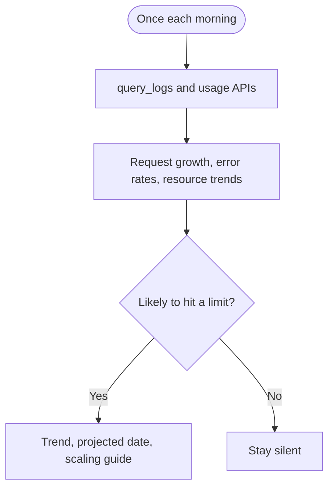

## What it watches

- API request growth against a recent baseline
- Server-error rate increases
- Disk, connection, or table growth when database inspection is available

It uses `query_logs` on project-scoped, read-only [Supabase MCP](/docs/guides/ai-tools/mcp) and the [Management API usage endpoints](/docs/reference/api/v1-get-project-usage-api-count) when those are already authorized. It does not change billing, compute, or plan settings. MCP does not expose organization billing totals.

## When it watches

<AgentWatchSchedule id="usage" />

## What it will output

Accountant reports request growth, error-rate changes, and resource trends. If a metric looks likely to hit a limit within 14 days, it flags the date and the relevant scaling guide.

<$Partial path="monitoring_agent_output.mdx" />

## Set up the agent

<AgentSetup id="usage" />
