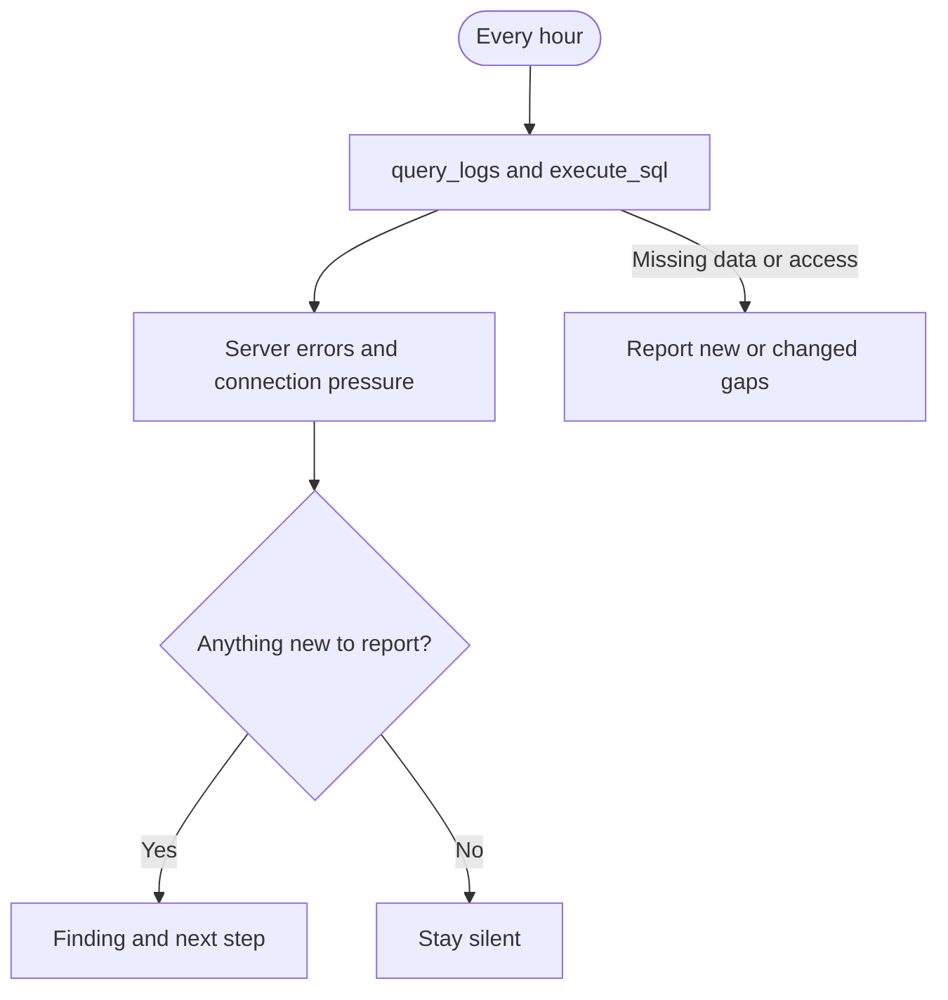

## What it watches

- API and Auth server-error rates in the last complete hour, compared with the preceding hour
- Current Postgres connection pressure

It uses `query_logs` and read-only `execute_sql` on project-scoped [Supabase MCP](/docs/guides/ai-tools/mcp).

## When it watches

<AgentWatchSchedule id="health" />

## What it will output

Health monitor reports new or changed problems with the affected service, measured error rate or connection usage, and a next investigation step. See [what triggers a health report](/docs/guides/observability/detecting#health).

If a check cannot run, the agent tells you what is missing. Clear checks and unchanged findings stay quiet.

<$Partial path="monitoring_agent_output.mdx" />

## Set up the agent

Allow the agent to read the documentation linked in its prompt. Save its alert state between runs so it can avoid repeat reports.

<AgentSetup id="health" />
