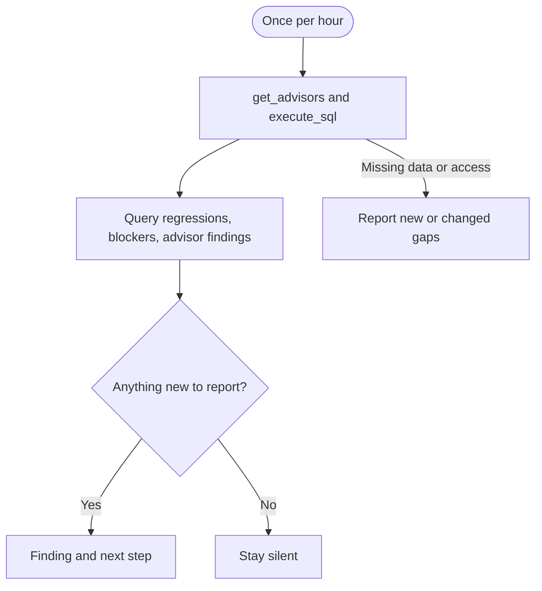

## What it watches

- Long-running sessions and the PIDs blocking other sessions
- Query execution-time regressions across saved hourly measurements
- Performance Advisor findings at warning and error level

It uses `get_advisors` and read-only `execute_sql` on project-scoped [Supabase MCP](/docs/guides/ai-tools/mcp). It does not create indexes, rewrite queries, or cancel sessions.

## When it watches

<AgentWatchSchedule id="performance" />

## What it will output

Performance monitor reports new or changed findings with the affected query, session, or object, plus an investigation and verification step. It does not infer a regression without comparable measurements or recommend cancellation based only on query age. See [what triggers a performance report](/docs/guides/observability/detecting#performance).

If a check cannot run, the agent tells you what is missing. Clear checks and unchanged findings stay quiet.

<$Partial path="monitoring_agent_output.mdx" />

## Set up the agent

Allow the agent to read the documentation linked in its prompt. Configure your harness to save measurements and alert state, then reload them on each run. Query comparisons need three hourly snapshots; the first runs can still report current blockers and advisor findings.

<AgentSetup id="performance" />
