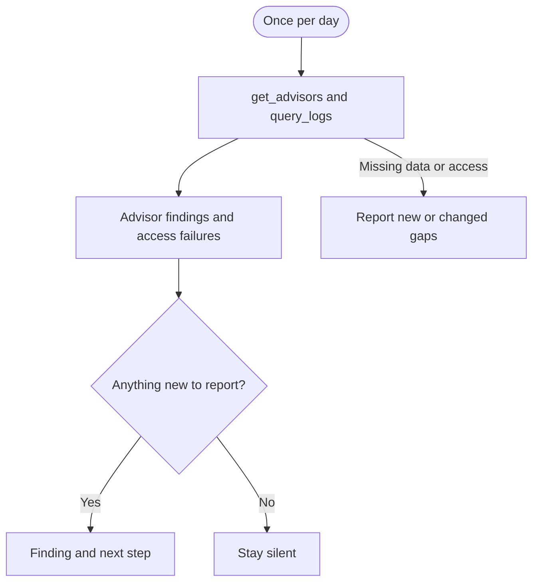

## What it watches

- Security Advisor findings at warning and error level
- API and Auth authentication and authorization failure rates, compared across the last two complete UTC days
- RLS and privilege issues identified by advisors

It uses `get_advisors` and `query_logs` on project-scoped, read-only [Supabase MCP](/docs/guides/ai-tools/mcp).

## When it watches

<AgentWatchSchedule id="security" />

## What it will output

Security monitor reports new or changed advisor findings and access-failure spikes, with the affected object or service and a next investigation step. A spike is a review signal, not proof of an attack. See [what triggers a security report](/docs/guides/observability/detecting#security).

If a check cannot run, the agent tells you what is missing. Clear checks and unchanged findings stay quiet.

<$Partial path="monitoring_agent_output.mdx" />

## Set up the agent

Allow the agent to read the documentation linked in its prompt. Save its alert state between runs so it can avoid repeat reports.

<AgentSetup id="security" />
