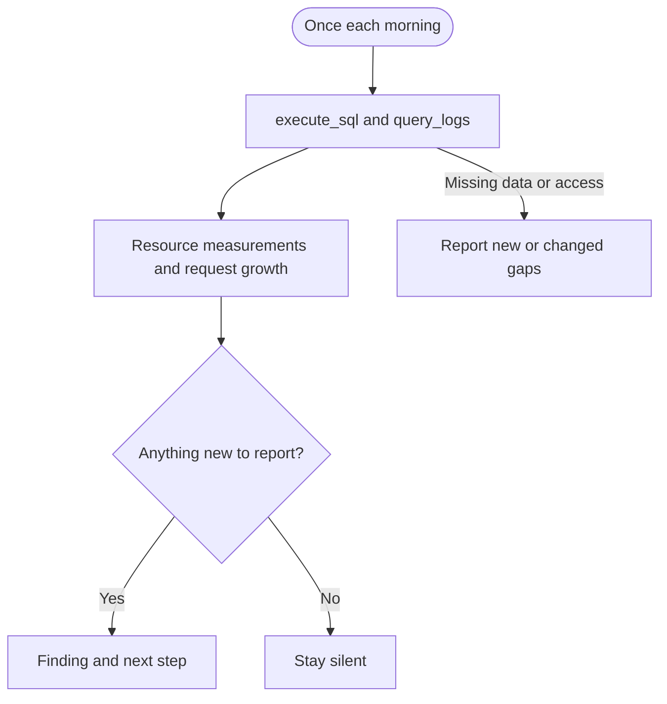

## What it watches

- Database and table sizes, including indexes
- Current connection counts by role and state
- API request growth across the last two complete UTC days
- Resource growth toward a confirmed limit, when enough history is available

It uses read-only `execute_sql` and `query_logs` on project-scoped [Supabase MCP](/docs/guides/ai-tools/mcp). Request counts do not establish billing totals.

## When it watches

<AgentWatchSchedule id="usage" />

## What it will output

Capacity monitor reports new or changed request-growth signals and resource-limit risks. When saved measurements support a forecast within 14 days, it includes the estimated date, calculation, and scaling guide. If history or a matching limit is missing, it explains what it needs instead of inventing a date. See [what triggers a capacity report](/docs/guides/observability/detecting#usage).

If a check cannot run, the agent tells you what is missing. Clear checks and unchanged findings stay quiet.

<$Partial path="monitoring_agent_output.mdx" />

## Set up the agent

Allow the agent to read the documentation linked in its prompt. Configure your harness to save measurements and alert state, then reload them on each run. Forecasts need at least seven daily measurements and a confirmed limit for the same resource and units.

<AgentSetup id="usage" />
