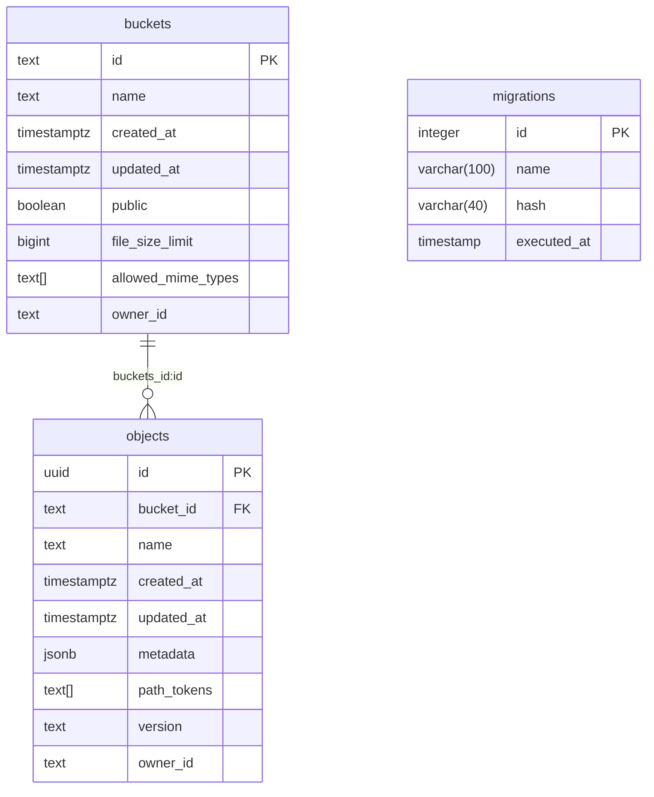

Storage uses Postgres to store metadata regarding your buckets and objects. Users can use RLS (Row-Level Security) policies for access control. This data is stored in a dedicated schema within your project called `storage`.

<Admonition type="note">

When working with SQL, it's crucial to consider all records in Storage tables as read-only. All operations, including uploading, copying, moving, and deleting, should **exclusively go through the API**.

This is important because the storage schema only stores the metadata and the actual objects are stored in a provider like S3. Deleting the metadata doesn't remove the object in the underlying storage provider. This results in your object being inaccessible, but you'll still be billed for it.

</Admonition>

Here is the schema that represents the Storage service:

You have the option to query this table directly to retrieve information about your files in Storage without the need to go through our API.

## Modifying the schema

We strongly recommend refraining from making any alterations to the `storage` schema and treating it as read-only. This approach is important because any modifications to the schema on your end could potentially clash with our future updates, leading to downtime.

However, we encourage you to add custom indexes as they can significantly improve the performance of the RLS policies you create for enforcing access control.
