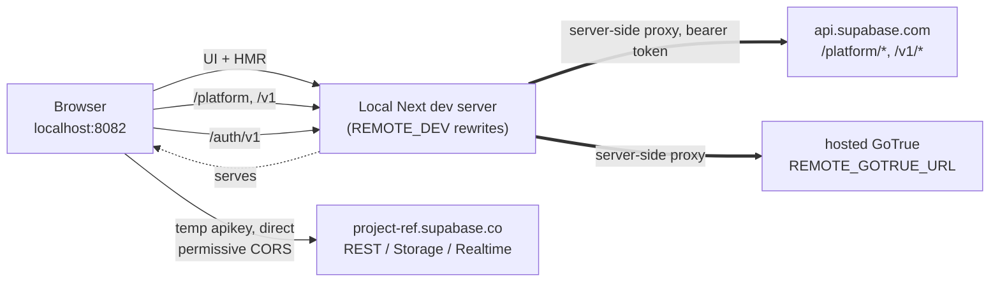
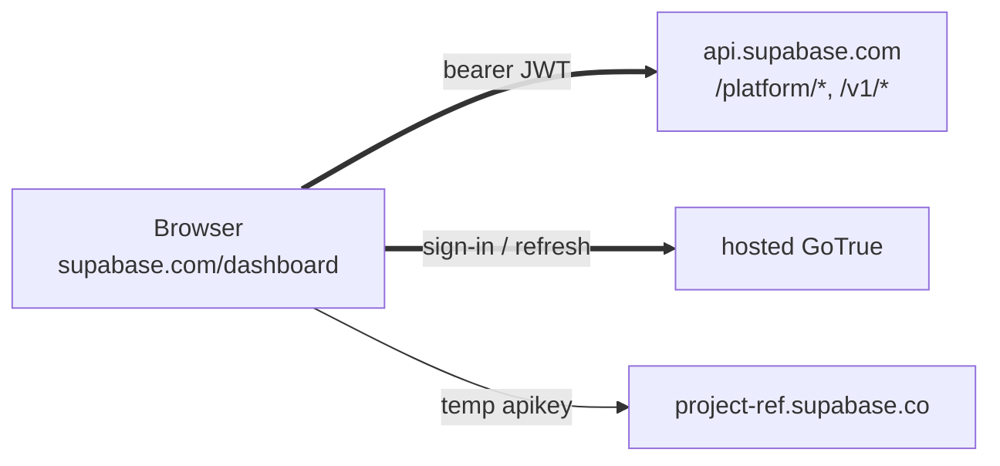

# Remote dev: local Studio against a hosted backend

Run Studio locally with HMR while its control-plane and auth requests go to a
**hosted** Supabase backend (staging or production), so you can work on Studio
without booting the local Docker stack. Inspired by Sentry's frontend-only
`dev-ui` workflow.

> This can point at **production** projects. Treat everything you do as real, and
> prefer a throwaway project while iterating. See [Safety](#safety).

## Quick start

```bash
cp apps/studio/.env.remote.example apps/studio/.env.local   # production defaults
pnpm dev:studio                                             # http://localhost:8082
```

Then get a session (see [Auth](#auth)) and open a real project.

## How it works

Studio already builds in two modes via `NEXT_PUBLIC_IS_PLATFORM`; the hosted
dashboard is this same code with `IS_PLATFORM=true` pointed at `api.supabase.com`.
Remote dev turns that mode on locally and adds a **same-origin dev proxy** so the
browser never makes a cross-origin request:



Every browser request is same-origin (`localhost:8082`); the dev server forwards
`/platform`, `/v1`, and `/auth/v1` to the hosted services **server-side**, so
there's no CORS to satisfy and no allowlist to change. The control-plane API
authenticates purely on the `Authorization: Bearer` token the client already sends
(verified against `mgmt-api` — no cookie, no CSRF). Storage uploads and Realtime
go straight to the project's own domain, which is already CORS/ws-permissive.

For contrast, the hosted dashboard is the same code without the proxy — the
browser calls `api.supabase.com` directly (its origin is on the CORS allowlist):



The proxy is a `REMOTE_DEV`-gated `rewrites()` block in `next.config.ts`.

## Config

`.env.remote.example` sets:

| Var                                                                       | Purpose                                        | Default                           |
| ------------------------------------------------------------------------- | ---------------------------------------------- | --------------------------------- |
| `NEXT_PUBLIC_IS_PLATFORM`                                                 | platform mode                                  | `true`                            |
| `REMOTE_DEV`                                                              | enables the proxy rewrites                     | `true`                            |
| `REMOTE_API_URL`                                                          | hosted control-plane origin                    | `https://api.supabase.com`        |
| `REMOTE_GOTRUE_URL`                                                       | hosted dashboard GoTrue base                   | `https://alt.supabase.io/auth/v1` |
| `NEXT_PUBLIC_API_URL` / `NEXT_PUBLIC_GOTRUE_URL` / `NEXT_PUBLIC_SITE_URL` | same-origin client URLs the rewrites intercept | `http://localhost:8082/...`       |

Point at staging by changing `REMOTE_API_URL` / `REMOTE_GOTRUE_URL`.

## Auth

The dashboard session is a bearer JWT in `localStorage`
(`supabase.dashboard.auth.token`), not an HttpOnly cookie — so authenticating
local Studio just means getting that value onto `localhost:8082`. Two ways:

1. **Extension (recommended).** Load `scripts/remote-dev-auth-extension/`
   unpacked and click **Sync token & reload**. It copies the session from a
   signed-in hosted-dashboard tab into local Studio.
2. **Manual.** Copy the `supabase.dashboard.auth.token` localStorage value from a
   signed-in `supabase.com` tab and set the same key on `localhost:8082`.

Either way, `auth-js` then refreshes the session against `REMOTE_GOTRUE_URL`.

The in-app sign-in **button** does not work for OAuth: the hosted GoTrue redirect
allowlist doesn't include localhost, so GitHub sign-in bounces back to the hosted
dashboard. That's why we copy the session instead.

## Safety

You may be pointed at production. Recommended follow-ups (not yet built):

- A persistent **REMOTE / PRODUCTION** banner while `REMOTE_DEV` is on.
- A read-only toggle / confirm-on-mutation for remote sessions.
- A project allowlist.

The proxy and all of the above are gated on the dev-only `REMOTE_DEV` flag and
must never be enabled in a production Studio build.

## Known limitations

- Only the Next.js dev path is wired; the Vite/TanStack (`STUDIO_FRAMEWORK=tanstack`)
  `server.proxy` equivalent is not done yet.
- OAuth sign-in is unavailable locally (see [Auth](#auth)).
- Enabling remote dev against real projects is pending a product/security decision.
