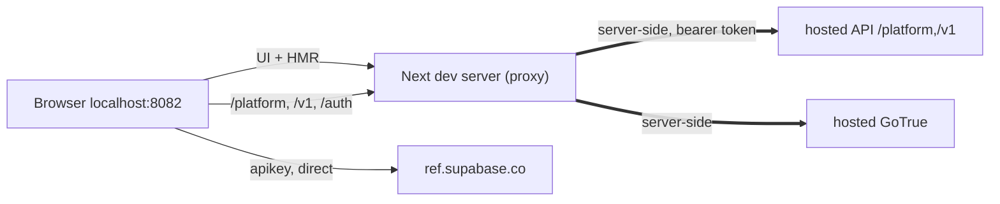

# Supabase Dev Tools

Supabase developer tooling (more to come). Today: run Studio locally (full HMR)
against a hosted Supabase backend, no local Docker stack — the same code the hosted
dashboard runs, pointed at a hosted API through a same-origin dev proxy. For
Supabase devs and OSS contributors.

## Run

| command                          | mode                         |
| -------------------------------- | ---------------------------- |
| `pnpm dev:studio`                | local (default fake project) |
| `pnpm dev:studio:remote`         | hosted production            |
| `pnpm dev:studio:remote:staging` | hosted staging               |

Then [authenticate](#auth) and open a real project. Add `--print` to dry-run.

## How it works

The browser only makes same-origin calls; the dev server forwards them to the
hosted backend server-side, so there's no CORS. Auth is a bearer token in
`localStorage` (not a cookie) — nothing to cookie-sync.

## Auth

Hosted OAuth can't redirect to localhost, so copy your existing session instead of
signing in — that's what this extension does:

1. `chrome://extensions` → Developer mode → **Load unpacked** → this folder.
2. Sign in on `supabase.com` (or `supabase.green`); open local Studio.
3. Click the extension → **Sync**. Green dot = connected.

It copies a live token — dev-only, load unpacked in your own browser.

## Why

Working a bug fix or feature? Verify it against the _real_ backend — same code, same
API — so "works locally" actually means "works in prod." Finally retire "works on my
machine." 🫡

## TODO

- [ ] Screenshot of the popup: <!-- add -->
- [ ] Chrome Web Store (unlisted — see `CHROMEWEBSTORE.md`)
- [ ] Persistent REMOTE/PROD badge in Studio (safety indicator)
- [ ] Fill staging hosts in `scripts/dev-remote.mjs`
- [ ] Self-hosted support (untested — self-hosted stacks don't serve `/platform`)
- [ ] Wire the Vite/TanStack proxy path
