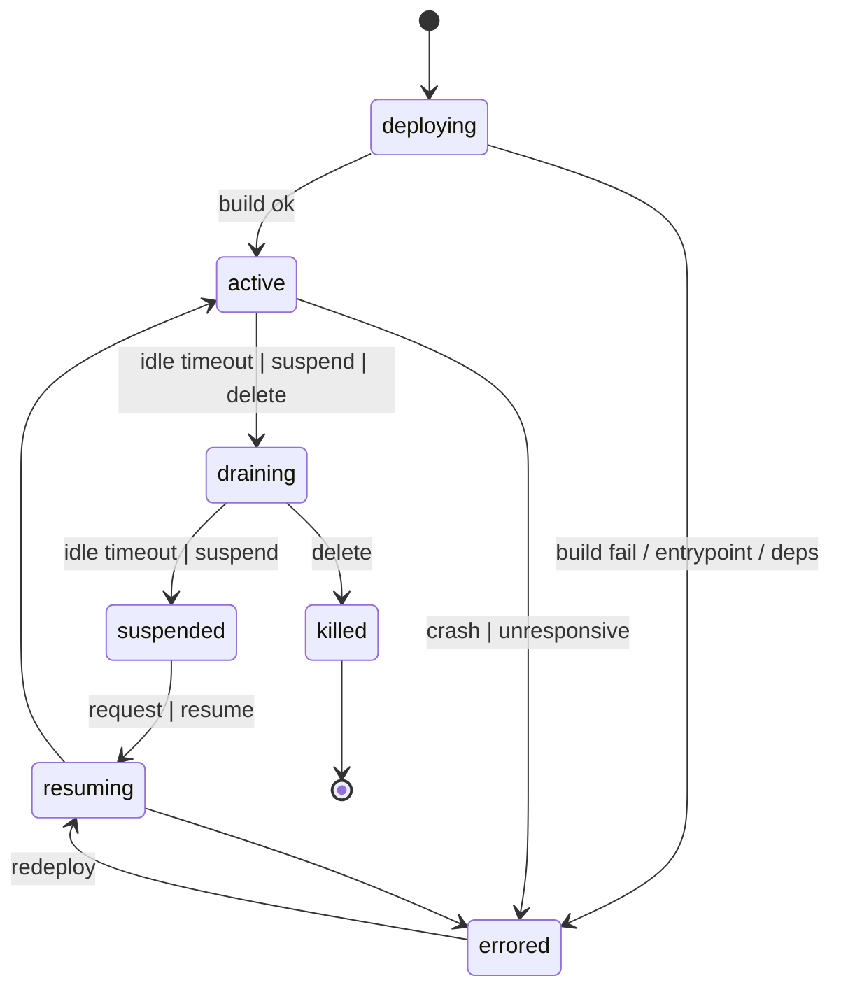
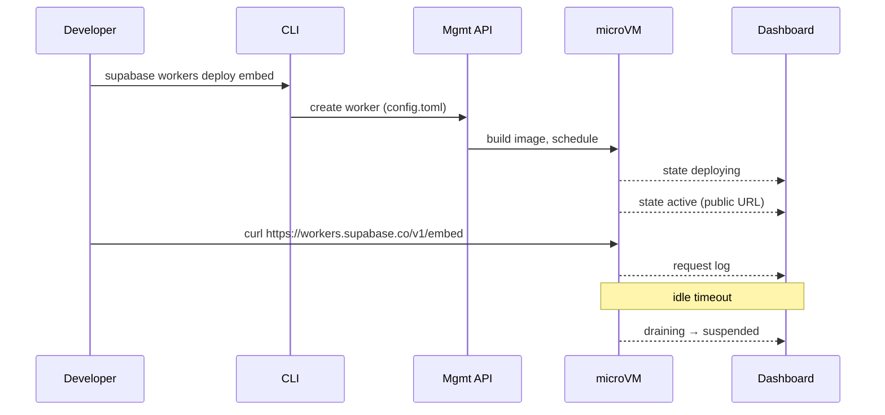

# Worker lifecycle

Two views of the same model: a state diagram (the anchor artifact) and surface swim-lanes (what each surface sees at each transition). Both render with the `ui-patterns/Mermaid` component and are exportable to PNG for the design hand-off.

`unresponsive` is not a separate state — a health-check failure is modeled as `errored` with `errorReason = 'unresponsive'`, which keeps the machine minimal and matches how infra reports it.

## View 1 — State diagram

## View 2 — Surface swim-lane (happy path: `embed`)

## Unhappy paths

| Class                   | Trigger                                             | Transition                        | Where visible                           |
| ----------------------- | --------------------------------------------------- | --------------------------------- | --------------------------------------- |
| Deploy build failure    | invalid Dockerfile / missing entrypoint / deps fail | `deploying → errored`             | CLI stream, Overview error alert        |
| Deploy cap hit          | project at 100 instances                            | rejected before `deploying`       | CLI error, create-dialog inline error   |
| Runtime crash           | uncaught exception / non-zero exit                  | `active → errored (crash)`        | state pill, Overview alert, log feed    |
| Unresponsive            | health check / no `$PORT` answer                    | `active → errored (unresponsive)` | log event "did not respond on $PORT"    |
| Suspend during traffic  | drain-idle while request in flight                  | `active → draining → suspended`   | log stream shows drain → suspend        |
| Delete during in-flight | `workers delete` while live                         | `active → draining → killed`      | deleted placeholder; last logs viewable |
| Agent burst             | 101st worker created                                | mgmt-api rejects                  | CLI error verbatim; dashboard toast     |
