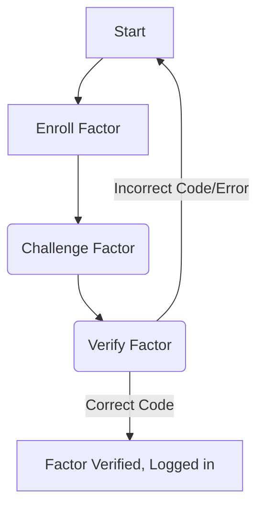
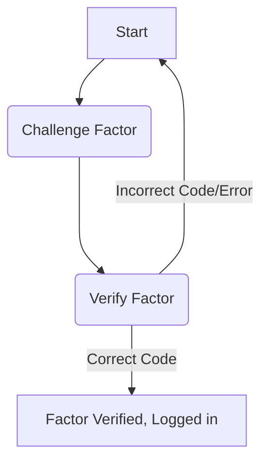

# Multi-factor Authentication via Row Level Security Enforcement


## Background

Today, we’re releasing Multi Factor Authentication for everyone. We are also excited to commence the dogfooding of SAML support via the introduction of Single Sign On (SSO) on our dashboard - you can contact us at [growth@supabase.com](mailto:growth@supabase.com) if you want to enable this in your Enterprise or Pro plan.

## What is MFA?

Multi-factor authentication (MFA), sometimes called two-factor authentication (2FA), adds an additional layer of security to your application by letting you verify users’ identity through extra steps. This typically consists of something you know, like a password, and something you have, like an authenticator application. We built MFA in response to customer requests - developers wanted enhanced security - be it for compliance, client requirements, or simply for peace of mind. As such, we started by building MFA support for Time-Based One Time Passwords (TOTP).


## An Overview of TOTP

[TOTP](https://www.rfc-editor.org/rfc/rfc6238) works by generating a unique, one-time password that is valid for a limited amount of time, usually 30 seconds or less. This password is generated using a shared secret key that is known only to the device and Supabase Auth, along with the current time. To exchange the shared secret key, a user scans a QR code generated by the server in order to establish a connection. The QR code can be represented by a URI which conforms to the [Google Authenticator Key URI format](https://github.com/google/google-authenticator/wiki/Key-Uri-Format):

```jsx
otpauth://totp/supabase.io:j@supacats.io?algorithm=SHA1&digits=6&issuer=supabase.io&period=30&secret=BFSXQHFB2BGAZIOQWCDBJUF7B54A52JQ
```

The first portion of  `otpauth://totp/supabase.io` describes the protocol and issuer while `j@supacats.io` refers to the user. The remaining parameters refer to specifics around OTP generation. In this case, the OTP code is generated using a SHA1 hash of the secret combined with the timestamp and the OTP code is valid for `30s`

In the event that the user faces difficulties entering a QR code the user can also opt to manually type the secret into the authenticator device.

## MFA Flows: Enrolment and Verification

An MFA flow can be broken into two key steps: Enrollment and Verification. During the *Enrollment* process Supabase Auth exchanges a randomly generated secret with the user’s authenticator application. During the *Verification* process, the device makes use of the timestamp together with the secret to produce a six digit code that the server can verify.


**Enrollment**

To generate a QR code, call the `/enroll` endpoint which returns an SVG encoded QR and the secret. Thereafter, create a challenge by calling the `/challenge` endpoint. Once the user has entered the six digit TOTP code generated by their authenticator app, call the`/verify`  endpoint with the corresponding factor and challenge details.

You might wonder: why the need for the challenge step? The challenge step is designed to create an interval between MFA initiation and the action of making a verification. This is useful in cases like Yubikey authentication where a user might need to request a challenge before placing their finger on the device.



**Verification**

On subsequent logins attempts, redirect a user to an MFA verification after they have completed the conventional sign in process. On the verification page, wait for the user to enter the six digit OTP code from the authenticator application and then call  the`/challenge` endpoint followed by the `/verify` endpoint. If a correct code is submitted, a JWT will be created with a few additional fields.



## Enforcement via Row Level Security

Adding MFA to your project and not enforcing it is like buying an expensive door and never locking it. We love Postgres RLS at Supabase and we believe it plays a key role in facilitating custom checks for a spread of use cases. To support RLS integration, JWTs issued by Supabase Auth now contain two additional pieces of information:

1. An Authenticator Assurance Level (AAL) claim. Use this to quickly identify the level of identity checks the user has performed. `aal1` is reserved for conventional sign in, while `aal2` is issued only after the user has verified with an additional factor.
2. An Authenticator Method Reference (AMR) claim. Use this to identify all of the authentication methods used by the user. This is also useful if you wish to implement step-up login scenarios.

```jsx
{
  "sub": "8802c1d6-c555-46e3-aacd-b61198b058d9",
  "email": "j0@supacats.io",
  "aud": "authenticated",
  "exp": 1670929371,
  "aal": "aal2",
  "amr": [
    {
      "method": "password",
      "timestamp": 1670924394
    },
    {
      "method": "totp",
      "timestamp": 1670925771
    }
  ],
  // ...
}
````

The information encoded in these claims can be used for both full enforcement and partial enforcement across database queries.

```sql
create policy "Enforce MFA for all end users."
  on table_name
  as restrictive
  to authenticated
  using ( auth.jwt()->>'aal' = 'aal2' );
```

*Caption: Enforce MFA for all end users*

```sql
create policy "Allow access on table only if user has gone through MFA"
  on table_name
  as restrictive -- very important!
  to authenticated
  using (
    array[auth.jwt()->>'aal'] <@ (
      select
          case
            when count(id) > 0 then array['aal2']
            else array['aal1', 'aal2']
          end as aal
        from auth.mfa_factors
        where auth.uid() = user_id and status = 'verified'
    ));
```

*Caption: Enforce MFA for selected users*

Note that both RLS policies are restrictive. By default, overlapping policies in PostgreSQL are permissive rather than restrictive. This means that RLS policies are combined with an OR clause and only one policy needs to pass in order for a row to be operated on. Therefore, we set RLS policies as restrictive in order to allow for enforcement based on checks from multiple policies.

Be mindful of your user’s preference, though. If a user has enabled MFA, they are expecting a higher level of security for their account. Consequently, we recommend that developers enforce MFA across all operations if a user has MFA enabled.


## What's Next

For starters, we are looking to support WebAuthn and FIDO2 compliant devices such as Yubikeys. Further, we will also be looking to facilitate easier configuration of MFA via email triggers on key actions.  If you have MFA requirements which are not covered here feel free to write to us at support[at]supabase.io .

We are grateful to our early MFA users for the support and feedback provided throughout this period. In particular, we would like to thank [Fabian Beer](https://madebyfabian.com), [Cogram](https://www.cogram.com), and [Happl](https://happl.com) whose detailed feedback helped to shape our implementation. We would also like to specially thank the community behind [otp](https://github.com/pquerna/otp) and [svgo](https://github.com/ajstarks/svgo) libraries - their work is indispensable to this implementation.
