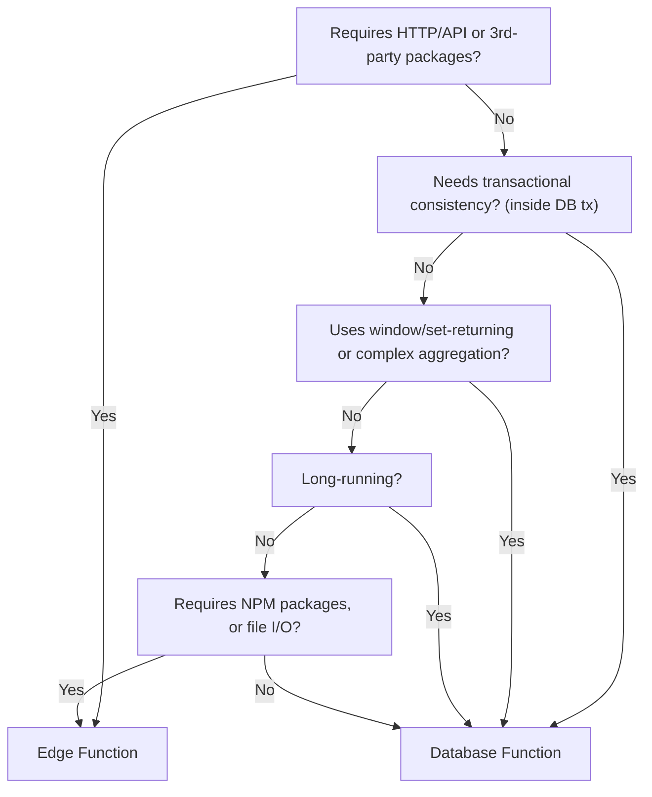

Functions. Quite a simple word that can mean different things to different people. Ask me and I will think database functions, ask Lakshan and he will think edge functions. Ask a hotel manager and they will think about the wedding they have booked that weekend.

Let's stay on topic, though. Functions are custom logic that you can run on inputs provided. A relatively simple definition yet, in Supabase, this can still refer to a database function, an edge function or a function within our SDK. Within Postgres, this can be a function written in SQL, PLpgSQL, Perl or Python.

Flexibility and choice are great things, it opens up accessibility to people from different backgrounds and with different skill sets. It can, however, be a source of confusion and make it harder to decide where to store your custom logic.

PLV8 is an extension that allows you to write database functions in JavaScript, a language that many are familiar with and helps to abstract away more complex data operations when compared with SQL.

However, a PLV8 database function is not the same as an edge function; with no access to node packages or the file system, PLV8 is excellent for performing operations on data but less so when you need to do things you are used to doing with Javascript; using packages or making API calls to other services.

With the release of Postgres 17, we have removed PLV8 as an extension (while it remains supported in Postgres 15 until EOL). In this blog post, we will cover an overview of how to move your PLV8 logic and how to decide where to move them to.

So, when should you use a database function and when should you use an edge function? The answer is a blurry line that is as wide as it is long. Database functions run within your database and can use all of the resources available on your instance while edge functions run separate to your instance, autoscale and are globally distributed; but they do need to make a network call to your database.

The more customers we work with, the more we have seen that many use cases for functions using PLV8 can be best served by an edge function. For the remaining use cases, SQL (or PLpgSQL) functions are a good fit.

Deciding where to put your business logic in Supabase comes down to a few key factors:

- **Proximity to data**: Database functions run inside Postgres so they are great for operations that occur solely within your database. 
- **External dependencies**: If you need NPM packages, HTTP calls, or filesystem access, edge functions are a better fit.
- **Scalability**: Database functions run on your database instance and are subject to the same limits as your database. Edge functions run on separate compute resources and can scale automatically.
- **Security & roles**: Database functions run with the caller's or definer's privileges inside a transaction. Edge functions run with your service role, anon key (or user) on separate compute resources.
- **Maintainability**: Edge functions live in your `supabase/functions` directory within your repository whereas database functions are in your `supabase/schema` or `supabase/migrations` directories. 

Put another way, this could be shown as a decision tree:



Using this information, let's go through 2 example PLV8 functions to determine where they are best suited and how to migrate them.

## Example 1: Rolling average

You may have a function to calculate a rolling average on your user's scores. This is performing operations on your data exclusively and does not use external services. This is a perfect candidate for a database function.

### PLV8 database function
```sql
create or replace function avg_recent_score(
  user_id bigint,
  days integer
)
returns numeric as $$
  // Compute average over the past N days
  var res = plv8.execute(
    'select avg(value)::numeric as avg from scores where user_id = $1 and created_at > now() - $2 * interval \'1 day\'',
    [user_id, days]
  );
  return res[0].avg;
$$ language plv8;
```

### SQL database function
```sql
create or replace function avg_recent_score(user_id bigint, days integer)
returns numeric as
$$
  select avg(value)::numeric
  from scores
  where user_id = $1
    and created_at > now() - $2 * interval '1 day'
$$ language sql;
```


## Example 2: Removing PII from user data

Here we have a PLV8 function that scans rows in our `profiles` table, strips PII, and returns cleaned JSONB records based on filter or limit.

### PLV8 database function
```sql
create or replace function clean_profiles(
  limit_count integer default 10,
  search text default null
) returns setof jsonb as $$
  var sql = 'select data from profiles';
  var args = [];
  if (search) {
    args.push('%' + search + '%');
    sql += ' where data->>''name'' ilike $' + args.length;
  }
  sql += ' limit ' + limit_count;
  var rows = plv8.execute(sql, args);
  rows.forEach(function(r) {
    var obj = plv8.clone(r.data);
    delete obj.ssn;
    delete obj.credit_card;
    if (obj.phone) obj.phone = obj.phone.replace(/\D/g, '');
    plv8.return_next(obj);
  });
  return;
$$ language plv8;
```

### Edge function

1. Scaffold with Supabase CLI:
```bash
supabase functions new clean-profiles
```

2. Implement in `supabase/functions/clean-profiles/index.ts`:
```ts
import { serve } from 'https://deno.land/std@0.177.0/http/server.ts';
import { createClient } from '@supabase/supabase-js';

const supabase = createClient(
  Deno.env.get('SUPABASE_URL')!,
  Deno.env.get('SUPABASE_SERVICE_ROLE_KEY')!
);

serve(async (req) => {
  const { limit, search } = await req.json();
  let query = supabase.from('profiles').select('data');
  if (search) query = query.ilike('data->>name', `%${search}%`);
  if (limit) query = query.limit(limit);

  const { data, error } = await query;
  if (error) return new Response(error.message, { status: 400 });

  const cleaned = data.map(r => {
    const obj = { ...r.data };
    delete obj.ssn;
    delete obj.credit_card;
    if (obj.phone) obj.phone = obj.phone.replace(/\D/g, '');
    return obj;
  });

  return new Response(JSON.stringify(cleaned), {
    headers: { 'Content-Type': 'application/json' },
  });
});
```

3. Deploy:
```bash
supabase functions deploy clean-profiles
```

4. Invoke with filter/limit:
```js
const { data, error } = await supabase.functions.invoke('clean-profiles', {
  body: { limit: 5, search: 'Alice' }
});
```  

### Summary

Your PLV8 functions may be infinitely more complex than this but, hopefully, this post provides a starting point to determine the best way to run your custom logic and the steps involved to migrate to a database function in SQL or an edge function.

If you have specific questions about your functions or need help migrating, please reach out to our Success team at success@supabase.io.