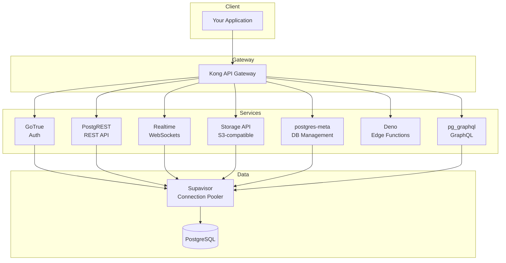
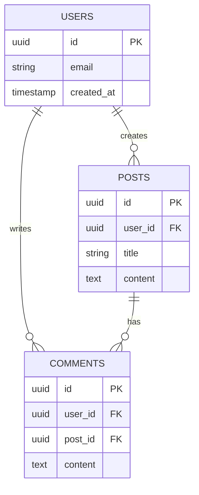
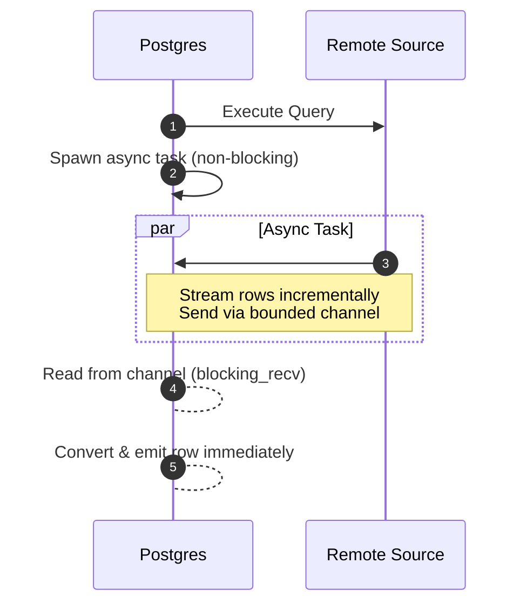
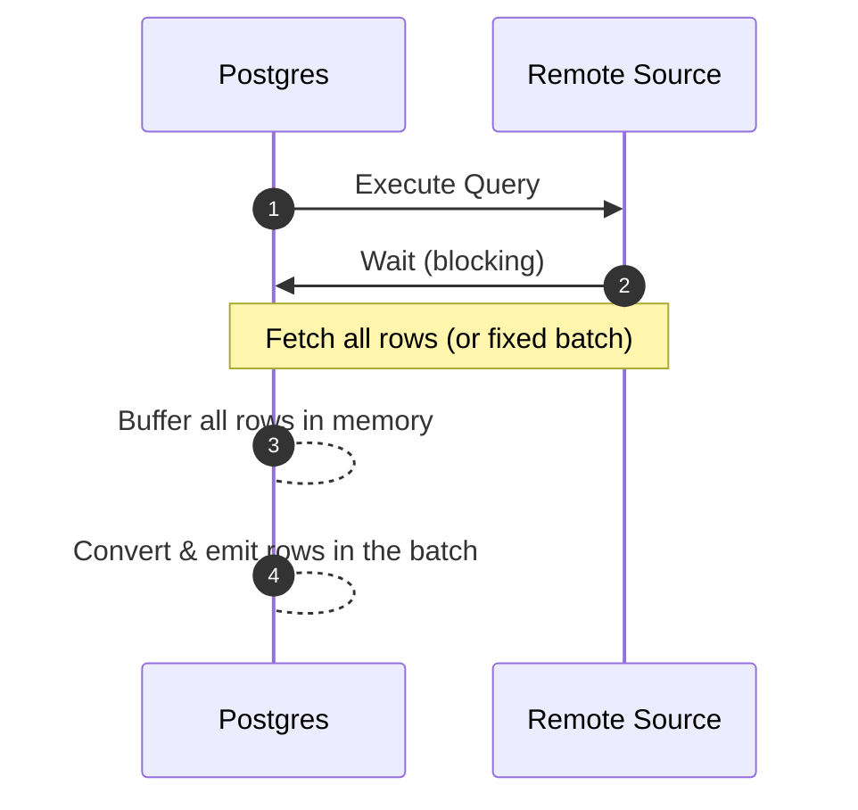
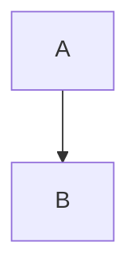

This post demonstrates how to use Mermaid diagrams in blog posts.

## Supabase Architecture

Here's the Supabase platform architecture:



## Entity Relationship Diagram

A typical blog database schema:



## Sequence Diagrams

### Async Streaming (FDW)



### Sync Blocking



## Usage

Simply use a fenced code block with the `mermaid` language:

````md

````

Or use the explicit component:

```jsx
<Mermaid
  chart={`
graph TD
    A --> B
`}
/>
```
