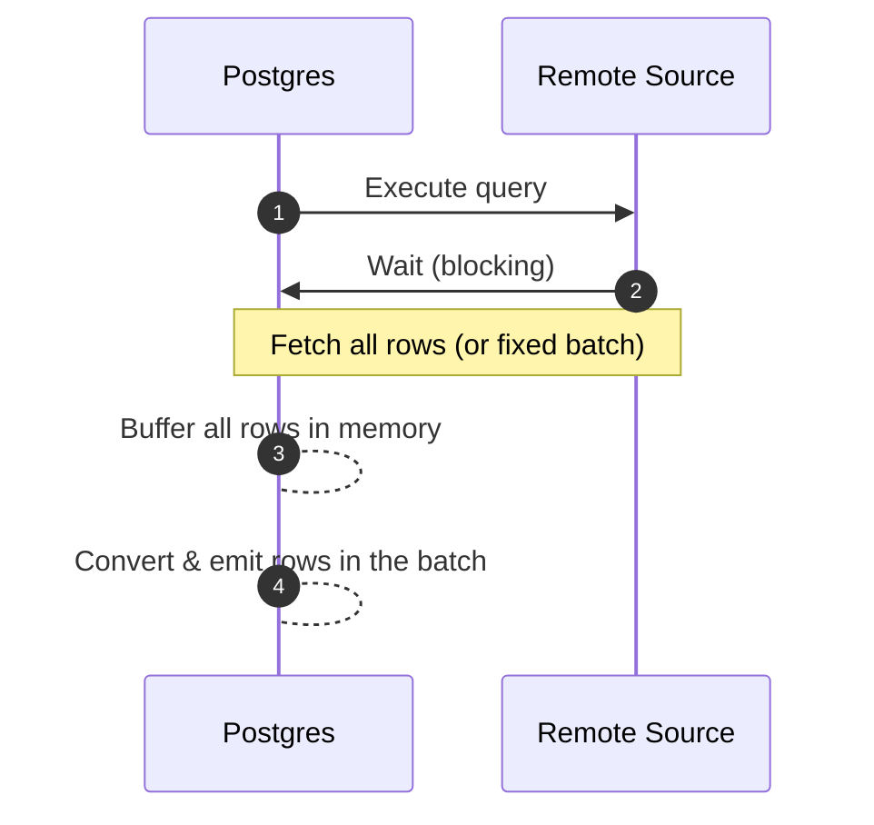
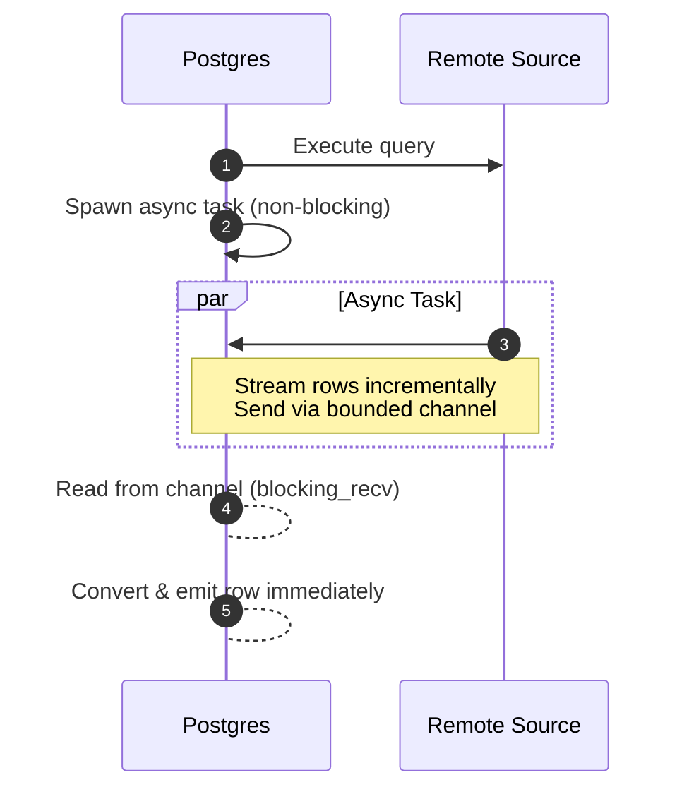

Postgres can query external databases through Foreign Data Wrappers (FDWs). But FDWs have long shared one limitation: they tend to fetch all results, or fixed-size batches, using a **synchronous** approach.

With [Supabase Wrappers](https://github.com/supabase/wrappers), we’ve been exploring how to bring Postgres FDWs into the modern era with Rust. The latest release introduces something new to the Postgres world: **asynchronous streaming between databases**.

## How traditional FDWs work

Most FDWs, including `postgres_fdw`, `mysql_fdw` and many others, operate in a **synchronous, pull-based model**:

1. Execute a query on the remote source.

2. Fetch rows either **all at once** or in **fixed-size batches** (e.g., using cursors).

3. Block the Postgres backend while waiting for each batch to arrive.

4. Convert the fetched rows into Postgres tuples before continuing.



While batched fetching avoids loading all data into memory upfront, Postgres still blocks during I/O, and the executor can’t proceed until each batch is fully received and processed. For analytical workloads against systems like ClickHouse, designed to scan billions of rows, this leads to:

- High memory pressure - especially if batch sizes are large or unbounded

- Poor interactivity - users wait for the first row until the first batch returns

- Inefficient resource usage - the backend is idle during network waits

In short, traditional FDWs were designed for **batch-oriented integration**, not **streaming data pipelines**. They lack true non-blocking I/O and can’t start returning results until remote data begins flowing—and even then, they stall between batches.

## What we built: async streaming in Rust

The latest version of our ClickHouse FDW introduces **asynchronous streaming**, enabling efficient, memory-safe queries, even over massive result sets.

Here’s how it works:

1. A background async task fetches rows from ClickHouse incrementally, as they arrive over the network.

2. These rows are passed to the Postgres backend through a **bounded, size-limited channel** (default capacity: 1024 rows).

3. The FDW consumes rows from this channel one at a time, converting and emitting them to Postgres **without buffering the full result set in memory**.



This means Postgres can start returning results **as soon as the first rows are available**, dramatically reducing memory pressure and improving query responsiveness, even for massive analytical workloads.

By combining Rust’s memory safety and async runtime capabilities with Postgres’s FDW interface, Wrappers delivers true streaming semantics while respecting Postgres’s synchronous execution model.

## Why it’s unique in the Postgres ecosystem

This streaming capability isn’t just a ClickHouse feature, it’s the first implementation of a reusable pattern built into Wrappers.

Unlike traditional C-based FDWs that operate within Postgres’s synchronous model—often loading full result sets or blocking during batched fetches—Wrappers enables FDWs to stream data incrementally from remote sources. By offloading I/O to Rust’s async runtime and feeding rows to Postgres through a bounded channel, it delivers:

- Predictable, bounded memory usage—even for billion-row scans,

- Faster time-to-first-result,

- Consistent performance across diverse backends like BigQuery, Snowflake, S3, and REST APIs.

With Wrappers, FDWs can safely and efficiently bridge Postgres to the modern data stack without compromising stability or scalability.

## How it works

Previously, the FDW fetched the entire result set or fixed batches upfront:

```rust
// Old approach: load all rows into memory
let rows = client.query(query).fetch_all()?;
for row in rows {
    writer.write_row(row)?;
}
```

Now, data is streamed incrementally using an async task and a bounded channel:

```rust
// New approach: stream rows with bounded buffering
let (sender, receiver) = bounded_channel(1024);

spawn_async_task(async move {
    let mut stream = client.query(query).stream().await?;
    while let Some(row) = stream.next().await {
        let _ = sender.send(row).await;
    }
});

// Postgres consumes rows as they arrive
while let Some(row) = receiver.blocking_recv() {
    writer.write_row(row)?;
}
```

<Admonition>
  This is simplified pseudocode. The actual implementation uses Wrappers’ internal async runtime and
  error handling.
</Admonition>

The FDW spawns an async task that pulls rows from the remote source as they become available and sends them through a **size-limited channel**. The main Postgres backend then reads from this channel **synchronously but incrementally**, ensuring memory usage stays bounded and the first results arrive quickly—even for massive scans.

This hybrid model respects Postgres’s synchronous execution model while unlocking efficient, streaming data access through Rust’s async capabilities.

## What this means for developers

If you’re building with Supabase Wrappers, you can:

- Create FDWs that stream massive result sets with bounded memory,

- Safely connect Postgres to analytical systems (like ClickHouse, BigQuery, Snowflake), cloud storage (S3), and APIs (Stripe, Airtable, Notion, and more),

- Leverage Rust’s async ecosystem to build fast, safe, and maintainable integrations—without writing C or manual memory management.

This streaming pattern turns FDWs into true data pipeline components, letting Postgres participate in modern analytics workflows—while keeping everything in SQL.

## What’s next

We’re rolling out async streaming across the Wrappers ecosystem. Connectors for BigQuery, Snowflake, S3, Stripe, and more will adopt the same streaming architecture—enabling Postgres to query remote data sources at scale, with low latency and bounded memory usage.

With Wrappers, Postgres becomes a true universal data gateway: one SQL interface to analytical warehouses, cloud storage, SaaS APIs, and real-time databases. And now, thanks to async streaming, it can do it efficiently—even when the data runs into billions of rows.

- **Explore Wrappers:** [github.com/supabase/wrappers](https://github.com/supabase/wrappers)

- **Build your own FDW:** [fdw.dev](https://fdw.dev/)
