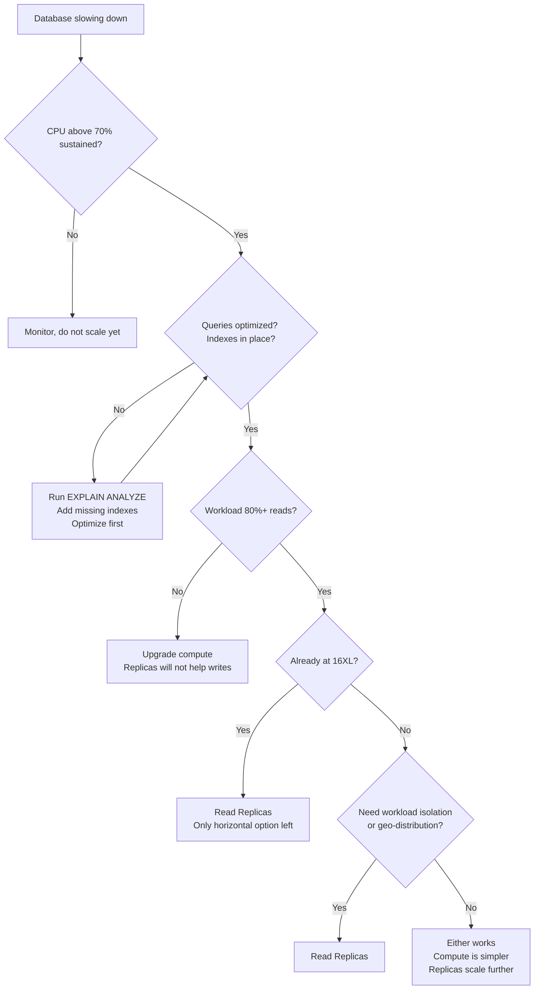

# When to use Read Replicas vs. bigger compute

When your database starts slowing down, you face a choice: make your existing database bigger, or spread the load across multiple databases. Both approaches work. Neither is universally correct. The right answer depends on your workload, your budget, and where the bottleneck actually is.

This post walks through how to diagnose what is causing your database to slow down, when vertical scaling (bigger compute) makes sense, when horizontal read scaling (Read Replicas) is the better path, and how to make the decision with real numbers.

## The scaling decision every growing database faces

Your Supabase project starts on a Small compute instance. It handles your MVP, your beta users, and your first paying customers. Then, traffic grows and response times creep up. You need to scale.

Here is the quick version:

| If this is you...                                                   | Do this                                    |
| ------------------------------------------------------------------- | ------------------------------------------ |
| Database is slow and CPU (user processes) is consistently above 70% | Upgrade compute                            |
| Analytics queries are hurting production                            | Add a Read Replica                         |
| Users in Europe or Asia have high latency                           | Add a Read Replica in their region         |
| I am maxed out at 16XL and need more read capacity                  | Add Read Replicas                          |
| My workload is mostly writes                                        | Upgrade compute (replicas only help reads) |
| I want the simplest solution with no code changes                   | Upgrade compute                            |

The rest of this post explains how to diagnose your specific situation and make the right call with real numbers.

## First, diagnose the actual problem

Before choosing a scaling strategy, figure out what is actually causing the slowdown. Throwing hardware at the wrong problem wastes money. The [database performance guide](https://supabase.com/docs/guides/database/debugging-performance) covers diagnostics in depth. Here are the essentials.

### Check your query patterns

Run this query to see what is consuming the most time in your database:

```sql
select
  calls,
  mean_exec_time::numeric(10,2) as avg_ms,
  total_exec_time::numeric(10,2) as total_ms,
  query
from pg_stat_statements
order by total_exec_time desc
limit 20;
```

This tells you where time is actually going. You might discover:

- A few slow queries dominating execution time (optimize those queries first)
- Many fast queries adding up (you need more capacity)
- Analytics queries competing with production traffic (you need workload isolation)

### Check your read/write ratio

Read Replicas only help with read traffic. If your workload is write-heavy, replicas will not help. Check your ratio:

```sql
select
  sum(seq_tup_read + idx_tup_fetch) as reads,
  sum(n_tup_ins + n_tup_upd + n_tup_del) as writes,
  round(
    100.0 * sum(seq_tup_read + idx_tup_fetch) / nullif(
      sum(seq_tup_read + idx_tup_fetch + n_tup_ins + n_tup_upd + n_tup_del),
      0
    ),
    1
  ) as read_percentage
from pg_stat_user_tables;
```

If reads are 80% or more of your traffic, Read Replicas can distribute that load. If writes dominate, you need bigger compute (or query optimization, or Supabase Queues for background processing).

### Check CPU and memory utilization

In the Supabase Dashboard, go to **Reports > Database**. Look at:

- **CPU utilization:** Sustained above 70% means you are running hot
- **Connection count:** Approaching limits causes connection errors

These metrics tell you whether you are hitting hardware limits or software limits.

## When bigger compute is the right choice

Vertical scaling is the simpler path. One click in the dashboard, a brief restart, and your database has more resources. Choose bigger compute when:

### Your workload is write-heavy

Read Replicas cannot help with writes. All INSERT, UPDATE, and DELETE operations go to the primary database. If writes are your bottleneck, you need a bigger primary.

### You have headroom in the compute tiers

Supabase offers [compute tiers](https://supabase.com/docs/guides/platform/compute-and-disk) from Micro ($10/month) to 16XL ($3,730/month). If you are on Medium and experiencing slowdowns, upgrading to Large or XL is straightforward and immediate.

| Current tier | Next tier    | Monthly cost increase | What you get          |
| ------------ | ------------ | --------------------- | --------------------- |
| Small ($15)  | Medium ($60) | +$45                  | 2x RAM (2GB to 4GB)   |
| Medium ($60) | Large ($110) | +$50                  | 2x RAM, dedicated CPU |
| Large ($110) | XL ($210)    | +$100                 | 2x CPU cores, 2x RAM  |
| XL ($210)    | 2XL ($410)   | +$200                 | 2x CPU cores, 2x RAM  |

### Your queries are already optimized

Before scaling hardware, check that your queries use indexes effectively. An index is like the index at the back of a book. Instead of reading every page to find a topic, you look it up in the index and jump straight to the right page. Postgres works the same way. Without an index, Postgres reads every row in a table to find matching data. This is called a sequential scan. With an index, Postgres looks up which rows match and jumps directly to them. The difference can be dramatic: a query that takes 30 seconds without an index might take 30 milliseconds with one.

Run `EXPLAIN ANALYZE` on slow queries to see if Postgres is using indexes or doing sequential scans. If you see "Seq Scan" on a large table, you probably need an index. The [Database Advisor](https://supabase.com/docs/guides/database/database-advisors) in your Supabase Dashboard can also identify missing indexes and other performance issues automatically.

**Quick index guidelines:**

- Add indexes on columns used in WHERE clauses
- Add indexes on columns used in JOIN conditions
- Add indexes on columns used in ORDER BY
- Compound indexes work for queries that filter on multiple columns
- Do not add indexes on every column. Each index slows down writes and uses disk space.

Sometimes a $0 index beats a $200/month compute upgrade.

**Analyze your queries with Claude Code:**

If you use [Claude Code](https://claude.ai/claude-code) with the [Supabase MCP Server](https://github.com/supabase-community/supabase-mcp), you can ask Claude to analyze your database and suggest indexes:

```
Analyze my Supabase database for missing indexes:

1. Query pg_stat_statements to find the 20 slowest queries by total execution time
2. For each slow query, run EXPLAIN ANALYZE and check for sequential scans on tables with more than 10,000 rows
3. Suggest CREATE INDEX statements for any missing indexes
4. Estimate the performance improvement for each suggested index

Show me the slow queries, what is causing them to be slow, and the exact CREATE INDEX statements I should run.
```

Claude will connect to your database, run the diagnostics, and give you specific index recommendations.

### You need the simplest solution

Vertical scaling requires no code changes. No connection string updates. No routing logic. If you need immediate relief and simplicity matters, upgrade compute first.

## When Read Replicas are the right choice

[Read Replicas](https://supabase.com/blog/introducing-read-replicas) add complexity but unlock capabilities that vertical scaling cannot provide. Choose Read Replicas when:

### Analytics queries are hurting production

This is the most common reason teams adopt Read Replicas. The pattern is familiar: your data team connects Metabase or Looker to your production database. They write a query that joins three tables and scans six months of orders. The query runs for 45 seconds. During those 45 seconds, your production database is working hard on that analytical query instead of serving your application. API response times spike and your users notice.

**Moving analytical queries to Read Replicas**

The problem is that Postgres is optimized for transactional workloads: small, fast queries that touch a few rows at a time. Analytical queries do the opposite. They scan millions of rows, aggregate data, and compute statistics. These two workload types compete for the same CPU, memory, and I/O.

Read Replicas solve this by isolation. Point your analytics tools at a replica. The replica handles the heavy queries. Production stays fast.

```
Production traffic -> Primary database
Analytics traffic  -> Read Replica
```

Your data team gets the access they need without risking production stability. The replica might slow down during a heavy report, but your customers never notice because production is untouched.

**Configuring replicas for long-running queries**

By default, Postgres may cancel long-running queries on a replica if they conflict with incoming replication data. A 10-minute analytics report can get terminated when the primary updates rows the query is reading.

Two settings control this behavior:

- `max_standby_streaming_delay`: How long the replica waits before canceling conflicting queries (default: 30 seconds). Increase this for longer analytics queries. The trade-off is more replication lag during heavy queries.
- `max_standby_archive_delay`: Same concept for WAL archive replay.

If queries still get canceled, enable `hot_standby_feedback`. This tells the primary not to vacuum rows the replica is reading. Use this as a last resort because it causes table bloat on the primary. Dead rows accumulate, increasing disk usage and potentially slowing primary queries.

Start with the delay settings. Only enable `hot_standby_feedback` if you are still seeing query cancellations.

### You have hit the 16XL ceiling

Once you reach 16XL (64 CPU cores, 256GB RAM), vertical scaling stops. The only way to add read capacity is horizontal: spread reads across replicas.

### You have users in multiple regions

A database in `us-east-1` serves US users with low latency. European users experience 100-150ms of network latency on every query. That adds up.

Deploy a Read Replica in `eu-west-1`. Supabase's API load balancer automatically routes GET requests to the nearest replica. European users hit the European replica. Latency drops.

### You need cost-effective read scaling

Compare the cost of adding read capacity:

| Approach        | Starting point | Monthly cost   | Read capacity added     |
| --------------- | -------------- | -------------- | ----------------------- |
| Upgrade compute | XL ($210)      | $410 (+$200)   | ~2x on same instance    |
| Add replica     | XL ($210)      | $420 (+$210)   | 2x across two instances |
| Upgrade compute | 4XL ($960)     | $1,870 (+$910) | ~2x on same instance    |
| Add replica     | 4XL ($960)     | $1,920 (+$960) | 2x across two instances |

At lower tiers, the costs are similar. At higher tiers, replicas become more cost-effective for read scaling because you can add a smaller replica instead of doubling your primary.

A 4XL primary with a 2XL replica ($960 + $410 = $1,370) costs less than an 8XL primary ($1,870) and may handle more read traffic.

### You want redundancy

Read Replicas provide a warm standby. If your primary has issues, your replica has a recent copy of your data. This is not automatic failover (that is coming with [Multigres](https://supabase.com/blog/multigres-vitess-for-postgres)), but it reduces your blast radius.

## The decision framework

Use this flowchart to decide:



## Real-world scenarios

### Scenario 1: SaaS application with growing traffic

**Situation:** B2B SaaS on Large compute ($110/month). CPU at 75%. Workload is 85% reads. Users in US only. No analytics workload.

**Recommendation:** Upgrade to XL ($210/month). Simpler path, no code changes, and you have headroom to grow. Consider replicas later when you add analytics or international users.

### Scenario 2: E-commerce with analytics team

**Situation:** E-commerce platform on 2XL ($410/month). Production is fine until the analytics team runs reports. Then checkout slows down. Workload is 90% reads.

**Recommendation:** Add a Read Replica ($410/month for matching 2XL). Point analytics tools at the replica. Total cost $820/month, but production and analytics are isolated. The analytics team can run any query they want without paging the on-call engineer.

### Scenario 3: Global consumer app

**Situation:** Consumer app on XL ($210/month). Primary in `us-east-1`. Growing user base in Europe complaining about latency. Workload is 95% reads.

**Recommendation:** Add a Read Replica in `eu-west-1` ($210/month). API requests from Europe automatically route to the European replica. Total cost $420/month. European latency drops from 150ms to 20ms.

### Scenario 4: High-write IoT platform

**Situation:** IoT platform on 4XL ($960/month). Devices send telemetry every second. CPU at 80%. Workload is 60% writes.

**Recommendation:** Upgrade to 8XL ($1,870/month). Write-heavy workloads need a bigger primary. Read Replicas would only help with the 40% that is reads. Consider [Supabase Queues](https://supabase.com/docs/guides/queues) to batch and process writes asynchronously.

## What about other scaling options?

Read Replicas and compute upgrades are not the only tools:

### Connection pooling (Supavisor)

If you are hitting connection limits but CPU is fine, enable connection pooling. Supavisor multiplexes many client connections across fewer database connections. This is free and built into every Supabase project.

### Supabase ETL and Analytics Buckets

Read Replicas isolate analytics from production, but the replica is still Postgres. It still uses row-based storage optimized for transactions. If your analytics queries scan tens of millions of rows, even a dedicated replica will feel slow.

This is where [Supabase ETL](https://supabase.com/blog/introducing-supabase-etl) and [Analytics Buckets](https://supabase.com/blog/introducing-analytics-buckets) come in. They solve a different problem: not just isolating analytics, but running analytics on infrastructure designed for analytical workloads.

**How it works:**

1. Supabase ETL captures changes from your Postgres tables using change-data-capture (CDC)
2. Changes stream in near real-time to Analytics Buckets (or BigQuery)
3. Analytics Buckets store your data in columnar Parquet format on S3, built on Apache Iceberg
4. You query the data with tools like DuckDB, PyIceberg, or Apache Spark

Columnar storage is dramatically faster for analytical queries. A query that scans a single column across 100 million rows only reads that column, not the entire row. Compression ratios are higher. Query times drop from minutes to seconds.

**When to use ETL and Analytics Buckets instead of Read Replicas:**

- Your analytical queries scan millions of rows regularly
- You need to retain historical data for years without bloating your database
- You want 30-90% storage cost savings on large datasets
- You need a complete audit trail with time-travel capabilities
- Your data team wants to use specialized analytics tools (Spark, DuckDB, Python notebooks)

**When Read Replicas are still the right choice:**

- Your analytics queries are moderately heavy but not massive
- You want your data team to use the same SQL they already know
- You need the simplest possible setup with no new tools
- You also need geo-distribution, which ETL does not provide

**A common pattern: use both.** Keep 90 days of data in Postgres for fast operational queries. Stream everything to Analytics Buckets for long-term retention and heavy analytics. Your application queries Postgres. Your data team queries Analytics Buckets for historical trends. You get speed where you need it and cost efficiency where you need that.

### Multigres: the future of horizontal write scaling

Read Replicas scale reads. Bigger compute scales everything, but only so far. What happens when you max out the largest compute tier and your workload is write-heavy?

This is the problem [Multigres](https://supabase.com/blog/multigres-vitess-for-postgres) is designed to solve. Multigres is a database proxy layer that brings Vitess-style horizontal scaling to Postgres. Vitess powers some of the largest MySQL deployments in the world (YouTube, Slack, GitHub). Multigres adapts that architecture for Postgres.

**What Multigres enables:**

- Sharding: distribute data across multiple Postgres instances
- Query routing: direct queries to the right shard automatically
- Failover: automatic high availability without manual intervention
- Gradual scaling: start with connection pooling, grow into sharding as needed

Multigres is still early (open source under Apache 2.0, currently seeking design partners). But it represents Supabase's long-term answer to the question: what do I do when vertical scaling runs out and Read Replicas are not enough?

For most workloads today, the answer is still bigger compute or Read Replicas. But if you are building something that will eventually need true horizontal write scaling, Multigres is worth watching.

## Getting started

If you have decided Read Replicas are right for your workload:

1. Go to **Project Settings > Infrastructure** in your Supabase Dashboard
2. Click **Add Read Replica**
3. Select a region (same region for analytics isolation, different region for geo-distribution)
4. Choose a compute size (can match primary or be smaller for analytics-only workloads)

The replica provisions in a few minutes. You will get a dedicated connection string. For analytics tools, use that connection string directly. For application traffic, the API load balancer handles routing automatically.

Read the full setup guide in [the documentation](https://supabase.com/docs/guides/platform/read-replicas).

## Summary

| Factor               | Choose bigger compute   | Choose Read Replicas                       |
| -------------------- | ----------------------- | ------------------------------------------ |
| Workload             | Write-heavy or balanced | Read-heavy (80%+)                          |
| Current tier         | Below 16XL              | At or approaching 16XL                     |
| Complexity tolerance | Want simplicity         | Can handle routing                         |
| Use case             | General scaling         | Analytics isolation, geo-distribution      |
| Code changes         | None required           | Minimal (connection strings for analytics) |

Both paths work. The right choice depends on where your bottleneck actually is. Diagnose first, then scale appropriately.
