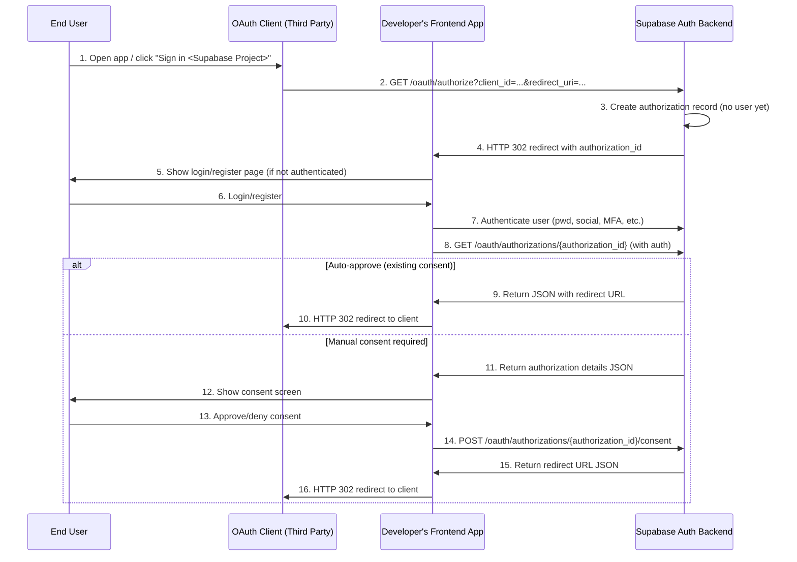

# OAuth 2.1 Server Capabilities for Supabase Auth

- **number:** 38022
- **published:** 2025-08-19
- **discussion:** https://github.com/orgs/supabase/discussions/38022
- **labels:** auth
- **page:** https://supabase.com/changelog/38022

---

> **📢 UPDATE [November 26, 2025]: Public beta is live now!**
> 
> - See the [latest comment below](https://github.com/orgs/supabase/discussions/38022#discussioncomment-15087788) for full details
> 
> ---

Hey Supabase community! 👋

We're excited to share that we're adding OAuth 2.1 server capabilities to Supabase Auth, turning your Supabase project into a full OAuth authorization server. This means your project can act as an identity provider for third-party applications, similar to how you might use "Sign in with Google" today.

**Current Status:** Public Beta

**Target Date:**

- Generally available: Q4 2025

## What We're Building

We're implementing OAuth 2.1 authorization server capabilities that will allow your Supabase project to:

- Act as an identity provider for third-party applications
- Enable "Login with [Your App]" functionality
- Eventually support OpenID Connect (OIDC) for full SSO capabilities

## Exciting Use Cases

### MCP (Model Context Protocol) Auth

Use your Supabase project as the auth provider for AI agents and LLM tools that support MCP.

### "Login with Supabase Project"

Enable third-party applications to offer "Sign in with [Your App]" - turning your Supabase project into an identity provider like Google or GitHub.

### Enterprise SSO (via OIDC - coming next)

Act as a single sign-on provider for your organization's internal tools.

### API Access for Partner Integrations

Securely grant scoped access to your API for third-party developers and partners.

## How It Works

Here's the authorization flow we're implementing:

### Key Design Decision: Flexible Authorization UI

Traditional OAuth servers host your application's UI. Instead, we're giving you complete control over the authorization and consent screens. After the initial `/authorize` call the user is taken to your app's frontend to be presented with the consent screen. This provides the freedom to build your app how you want, while Supabase Auth takes care of the protocol specifics:

- Design custom login/registration flows (can use your existing login as it is)
- Implement your own consent screens
- Handle authentication however you prefer (password, social login, MFA, etc.)

This gives you maximum flexibility to match your application's design and user experience.

## What Supabase Provides

- **OAuth 2.1 Protocol Handling**: Full implementation of authorization code flow with PKCE
- **Token Management**: JWT access tokens and refresh tokens
- **Client Registration**:
    - Dashboard UI for manual client registration
    - Dynamic client registration API (perfect for MCP auth!)
- **Token Validation**: JWKS endpoint for third-party token validation, thanks to asymmetric JWTs
- **APIs for Authorization Flow**: Endpoints to handle approval/denial decisions
- **Client Libraries**: SDK updates for easy integration (coming soon)
- **UI Components**: Consent screen components via Supabase [ui.supabase.com](http://ui.supabase.com/) (planned)

## What You Need to Implement

- **Authorization/Consent UI**: Create your own login and consent screens
- **User Authentication Logic**: Handle how users prove their identity
- **Consent Management**: Present scope information (tbd) and capture user approval

## Access Token Structure

Access tokens will be JWTs (like current Supabase tokens) with:

- All standard Supabase claims (user_id, role, etc.)
- Additional `client_id` claim for OAuth client identification
- Compatible with existing Row Level Security(RLS) policies (same `role` claim structure)

### Balancing RLS Power with OAuth Scopes

We want to preserve the power and flexibility of RLS policies while also enabling developers to "scope down" access tokens based on OAuth scopes. This is a challenging balance - RLS gives you fine-grained, row-level control, while OAuth scopes traditionally work at a higher level.

**Our current thinking** includes exploring these approaches:

1. **Custom Access Token Hook**: Extend the [existing hook system](https://supabase.com/docs/guides/auth/auth-hooks/custom-access-token-hook) to modify token claims based on OAuth context
2. **OAuth-specific Access Token Hook**: A new dedicated hook that runs only for OAuth token generation
3. **JWT Template System**: Define templates that control token structure based on client/scope combinations

## Initial Limitations & Future Roadmap

**Phase 1:**

- Authorization code flow with PKCE
- Refresh tokens
- No scope management initially (tokens have full user privileges, rely on RLS for authorization)

**Phase 2:**

- OpenID Connect support
- Scope management system & customization of tokens generated by OAuth flows

## We Need Your Feedback!

We'd love to hear your thoughts on:

### 1. **Scope Management & Token Customization**

Currently, we're starting without a scope system: OAuth tokens will work like regular session tokens with full user privileges. Authorization happens via RLS policies. We're exploring ways to "scope down" OAuth tokens while preserving RLS:

- Would you prefer Custom Access Token Hooks, OAuth-specific hooks, or JWT templates?
- How should OAuth scopes translate to token restrictions?
- Would you need granular scopes immediately or is basic token customization enough to start?

### 2. **OpenID Connect Features**

As we plan OIDC support, which features are most critical for you?

- Userinfo endpoint
- ID tokens
- Specific claims in ID tokens
- Session management
- Other OIDC features?

### 3. **Dashboard UI for OAuth Client Management**

What would you need in the dashboard?

- Client registration and management
- Consent history and revocation
- Token analytics
- Scope configuration (when available)
- Testing tools?

### 4. **Your Use Cases**

What would you build with this? We're especially interested in:

- Use cases we haven't considered
- Integration scenarios with existing systems
- Security or compliance requirements
- Performance or scaling considerations

## Questions?

Drop your questions, feedback, and use cases below! We're actively working on this and your input will directly influence the implementation.
