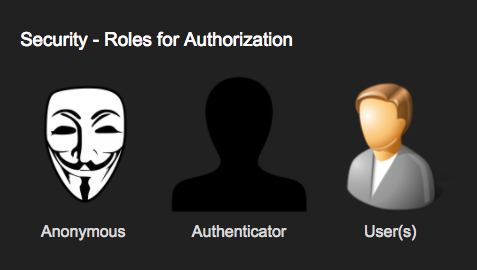
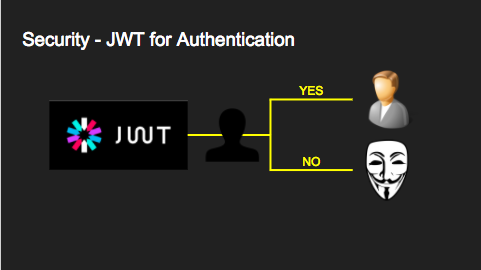

.. _authn:

Authentication
==============

PostgREST is designed to keep the database at the center of API security. All :ref:`authorization happens in the database <db_authz>` . It is PostgREST's job to **authenticate** requests -- i.e. verify that a client is who they say they are -- and then let the database **authorize** client actions.

.. _roles:

Overview of role system
-----------------------

There are three types of roles used by PostgREST, the **authenticator**, **anonymous** and **user** roles. The database administrator creates these roles and configures PostgREST to use them.

The authenticator role is used for connecting to the database and should be configured to have very limited access. It is a chameleon whose job is to "become" other users to service authenticated HTTP requests.

.. code:: sql

  CREATE ROLE authenticator LOGIN NOINHERIT NOCREATEDB NOCREATEROLE NOSUPERUSER;
  CREATE ROLE anonymous NOLOGIN;
  CREATE ROLE webuser NOLOGIN;

.. note::

  The names "authenticator" and "anon" names are configurable and not sacred, we simply choose them for clarity. See :ref:`db-uri` and :ref:`db-anon-role`.

.. _user_impersonation:

User Impersonation
~~~~~~~~~~~~~~~~~~

The picture below shows how the server handles authentication. If auth succeeds, it switches into the user role specified by the request, otherwise it switches into the anonymous role (if it's set in :ref:`db-anon-role`).

This role switching mechanism is called **user impersonation**. In PostgreSQL it's done with the ``SET ROLE`` statement.

.. note::

  The impersonated roles will have their settings applied. See :ref:`impersonated_settings`.

.. _jwt_auth:

JWT Authentication
------------------

We use `JSON Web Tokens <https://datatracker.ietf.org/doc/html/rfc7519/>`_ to authenticate API requests, this allows us to be stateless and not require database lookups for verification.
As you'll recall a JWT contains a list of cryptographically signed claims. All claims are allowed but PostgREST cares specifically about a claim called role (configurable with :ref:`jwt_role_extract`).

.. code:: json

  {
    "role": "user123"
  }

When a request contains a valid JWT with a role claim PostgREST will switch to the database role with that name for the duration of the HTTP request.

.. code:: sql

  SET LOCAL ROLE user123;

Note that the database administrator must allow the authenticator role to switch into this user by previously executing

.. code:: sql

  GRANT user123 TO authenticator;
  -- similarly for the anonymous role
  -- GRANT anonymous TO authenticator;

If the client included no JWT (or one without a role claim) then PostgREST switches into the anonymous role. The database administrator must set the anonymous role permissions correctly to prevent anonymous users from seeing or changing things they shouldn't.

.. _bearer_auth:

Bearer Authentication
~~~~~~~~~~~~~~~~~~~~~

To make an authenticated request the client must include an :code:`Authorization` HTTP header with the value :code:`Bearer <jwt>`. For instance:

.. code-block:: bash

  curl "http://localhost:3000/foo" \
    -H "Authorization: Bearer TEST_JWT_REDACTED"

The ``Bearer`` header value can be used with or without capitalization(``bearer``).

.. _jwt_generation:

JWT Generation
~~~~~~~~~~~~~~

You can create a valid JWT either from inside your database (see :ref:`sql_user_management`) or via an external service (see :ref:`external_auth`).

.. _jwt_signature:

JWT Signature Verification
--------------------------

PostgREST supports both symmetric and asymmetric keys for verifying the signature of the token.

Symmetric Keys
~~~~~~~~~~~~~~

In the case of symmetric cryptography the signer and verifier share the same secret passphrase, which can be configured with :ref:`jwt-secret`.
If it is set to a simple string then PostgREST interprets it as an HMAC-SHA256 passphrase.

.. code-block:: ini

  jwt-secret = "reallyreallyreallyreallyverysafe"

.. _asym_keys:

Asymmetric Keys
~~~~~~~~~~~~~~~

In asymmetric cryptography the signer uses the private key and the verifier the public key.

As described in the :ref:`configuration` section, PostgREST accepts a ``jwt-secret`` config file parameter. However you can also specify a literal JSON Web Key (JWK) or set. For example, you can use an RSA-256 public key encoded as a JWK:

.. code-block:: json

  {
    "alg":"RS256",
    "e":"AQAB",
    "key_ops":["verify"],
    "kty":"RSA",
    "n":"9zKNYTaYGfGm1tBMpRT6FxOYrM720GhXdettc02uyakYSEHU2IJz90G_MLlEl4-WWWYoS_QKFupw3s7aPYlaAjamG22rAnvWu-rRkP5sSSkKvud_IgKL4iE6Y2WJx2Bkl1XUFkdZ8wlEUR6O1ft3TS4uA-qKifSZ43CahzAJyUezOH9shI--tirC028lNg767ldEki3WnVr3zokSujC9YJ_9XXjw2hFBfmJUrNb0-wldvxQbFU8RPXip-GQ_JPTrCTZhrzGFeWPvhA6Rqmc3b1PhM9jY7Dur1sjYWYVyXlFNCK3c-6feo5WlRfe1aCWmwZQh6O18eTmLeT4nWYkDzQ"
  }

.. note::

  This could also be a JSON Web Key Set (JWKS) if it was contained within an array assigned to a `keys` member, e.g. ``{ keys: [jwk1, jwk2] }``.

Just pass it in as a single line string, escaping the quotes:

.. code-block:: ini

  jwt-secret = "{ \"alg\":\"RS256\", … }"

To generate such a public/private key pair use a utility like `latchset/jose <https://github.com/latchset/jose>`_.

.. code-block:: bash

  jose jwk gen -i '{"alg": "RS256"}' -o rsa.jwk
  jose jwk pub -i rsa.jwk -o rsa.jwk.pub

  # now rsa.jwk.pub contains the desired JSON object

You can specify the literal value as we saw earlier, or reference a filename to load the JWK from a file:

.. code-block:: ini

  jwt-secret = "@rsa.jwk.pub"

``kid`` verification
^^^^^^^^^^^^^^^^^^^^

PostgREST has built-in verification of the `key ID parameter <https://www.rfc-editor.org/rfc/rfc7517#section-4.5>`_, useful when working with a JSON Web Key Set.
It goes as follows:

- If the JWT contains a ``kid`` parameter, then PostgREST will look for the JSON Web Key in the :ref:`jwt-secret`.

  + If no key has a matching ``kid`` (or if they don't have one defined), the token will be rejected with a :ref:`401 Unauthorized <pgrst301>` error.
  + If a key matches the ``kid`` value then it will validate the token against that key accordingly.

- If the JWT doesn't have a ``kid``, PostgREST  will try each key in the :ref:`jwt-secret` one by one until it finds one that works.

.. _jwt_claims_validation:

JWT Claims Validation
---------------------

Time-Based claims validation
~~~~~~~~~~~~~~~~~~~~~~~~~~~~

The time-based JWT claims specified in `RFC 7519 <https://datatracker.ietf.org/doc/html/rfc7519#section-4.1.4>`_ are validated:

- ``exp`` Expiration Time
- ``iat`` Issued At
- ``nbf`` Not Before

We allow a 30-second clock skew when validating the above claims. In other words, we give an extra 30 seconds before the JWT is rejected if there is a slight discrepancy in the timestamps.

.. _jwt_aud:

``aud`` validation
~~~~~~~~~~~~~~~~~~

PostgREST has built-in validation of the `JWT audience claim <https://datatracker.ietf.org/doc/html/rfc7519#section-4.1.3>`_.
It works this way:

- If :ref:`jwt-aud` is not set (the default), PostgREST identifies with all audiences and allows the JWT for any ``aud`` claim.
- If :ref:`jwt-aud` is set to a specific audience, PostgREST will check if this audience is present in the ``aud`` claim:

  + If the ``aud`` value is a JSON string, it will match it to the :ref:`jwt-aud`.
  + If the ``aud`` value is a JSON array of strings, it will search every element for a match.
  + If the match fails or if the ``aud`` value is not a string or array of strings, then the token will be rejected with a :ref:`401 Unauthorized <pgrst303>` error.
  + If the ``aud`` key **is not present** or if its value is ``null`` or ``[]``, PostgREST will interpret this token as allowed for all audiences and will complete the request.

.. _jwt_caching:

JWT Cache
---------

JWT signature validation (specially :ref:`asym_keys` such as RSA) is slow, we can cache ``JWT`` validation results to avoid this performance overhead.

The JWT cache is bounded and uses the `SIEVE algorithm <https://cachemon.github.io/SIEVE-website>`_ for efficient eviction. The cache is enabled by default and can be configured with :ref:`jwt-cache-max-entries`.

It's recommended to leave the JWT cache enabled as our load tests indicate ~20% more throughput for simple GET requests when using it. This while reducing CPU utilization in exchange for a bit more memory.

:ref:`jwt_cache_metrics` are available.

.. note::

  - If the ``jwt-secret`` is changed and the config is reloaded, the JWT cache will reset.
  - JWTs that pass :ref:`jwt_signature` are cached, regardless if they pass :ref:`jwt_claims_validation`. We do this to ensure responses stays fast under common failure cases (such as expired JWTs).
  - You can use the :ref:`server-timing_header` to see the performance benefit of JWT caching.

.. _jwt_role_extract:

JWT Role Extraction
-------------------

A JSON Path (`RFC 9535 <https://www.rfc-editor.org/rfc/rfc9535.html>`_) can be specified for the location of the :code:`role` key in the JWT claims. It's configured by :ref:`jwt-role-claim-key`. This can be used to consume a JWT provided by a third party service like Auth0, Okta, Microsoft Entra or Keycloak.

You can quickly try out JSON Path by visiting https://serdejsonpath.live.

Usage examples:

  .. code:: bash

    # {"postgrest":{"roles": ["other", "author"]}}
    jwt-role-claim-key = "$$.postgrest.roles[1]"

    # {"https://www.example.com/role": { "key": "author" }}
    # non-alphanumerical characters can go inside single quotes
    jwt-role-claim-key = "$$['https://www.example.com/role'].key"

    # {"postgrest":{"roles": ["other", "author"]}}
    # filter based on equality or regular expression
    jwt-role-claim-key = "$$.postgrest.roles[?(@ == 'author')]"
    jwt-role-claim-key = "$$.postgrest.roles[?search(@, '^au')]"

.. note::

  - If JSON Path query returns multiple values, the first one gets selected.
  - Only when using the :ref:`file_config`, all ``$`` characters in the value must be escaped with an additional ``$`` char. For :ref:`env_variables_config` and :ref:`in_db_config`, only use a single ``$`` char.
  - In our implementation, only the `search()` function from `JSON Path Functions <https://www.rfc-editor.org/rfc/rfc9535.html#name-function-extensions>`_ is available for filtering.

JWT Security
------------

There are at least three types of common critiques against using JWT: 1) against the standard itself, 2) against using libraries with known security vulnerabilities, and 3) against using JWT for web sessions. We'll briefly explain each critique, how PostgREST deals with it, and give recommendations for appropriate user action.

The critique against the `JWT standard <https://datatracker.ietf.org/doc/html/rfc7519>`_ is voiced in detail `elsewhere on the web <https://web.archive.org/web/20230123041631/https://paragonie.com/blog/2017/03/jwt-json-web-tokens-is-bad-standard-that-everyone-should-avoid>`_. The most relevant part for PostgREST is the so-called :code:`alg=none` issue. Some servers implementing JWT allow clients to choose the algorithm used to sign the JWT. In this case, an attacker could set the algorithm to :code:`none`, remove the need for any signature at all and gain unauthorized access. The current implementation of PostgREST, however, does not allow clients to set the signature algorithm in the HTTP request, making this attack irrelevant. The critique against the standard is that it requires the implementation of the :code:`alg=none` at all.

Another type of critique focuses on the misuse of JWT for maintaining web sessions. The basic recommendation is to `stop using JWT for sessions <http://cryto.net/~joepie91/blog/2016/06/13/stop-using-jwt-for-sessions/>`_ because most, if not all, solutions to the problems that arise when you do, `do not work <http://cryto.net/~joepie91/blog/2016/06/19/stop-using-jwt-for-sessions-part-2-why-your-solution-doesnt-work/>`_. The linked articles discuss the problems in depth but the essence of the problem is that JWT is not designed to be secure and stateful units for client-side storage and therefore not suited to session management.

PostgREST uses JWT mainly for authentication and authorization purposes and encourages users to do the same. For web sessions, using cookies over HTTPS is good enough and well catered for by standard web frameworks.

.. _custom_validation:

Custom Validation
-----------------

PostgREST does not enforce any extra constraints besides JWT validation. An example of an extra constraint would be to immediately revoke access for a certain user. Using :ref:`db-pre-request` you can specify a function to call immediately after :ref:`user_impersonation` and before the main query itself runs.

.. code:: ini

  db-pre-request = "public.check_user"

In the function you can run arbitrary code to check the request and raise an exception(see :ref:`raise_error`) to block it if desired. Here you can take advantage of :ref:`guc_req_headers_cookies_claims` for
doing custom logic based on the web user info.

.. code-block:: postgres

  CREATE OR REPLACE FUNCTION check_user() RETURNS void AS $$
  DECLARE
    email text := current_setting('request.jwt.claims', true)::json->>'email';
  BEGIN
    IF email = 'evil.user@malicious.com' THEN
      RAISE EXCEPTION 'No, you are evil'
        USING HINT = 'Stop being so evil and maybe you can log in';
    END IF;
  END
  $$ LANGUAGE plpgsql;

.. raw:: html

  
