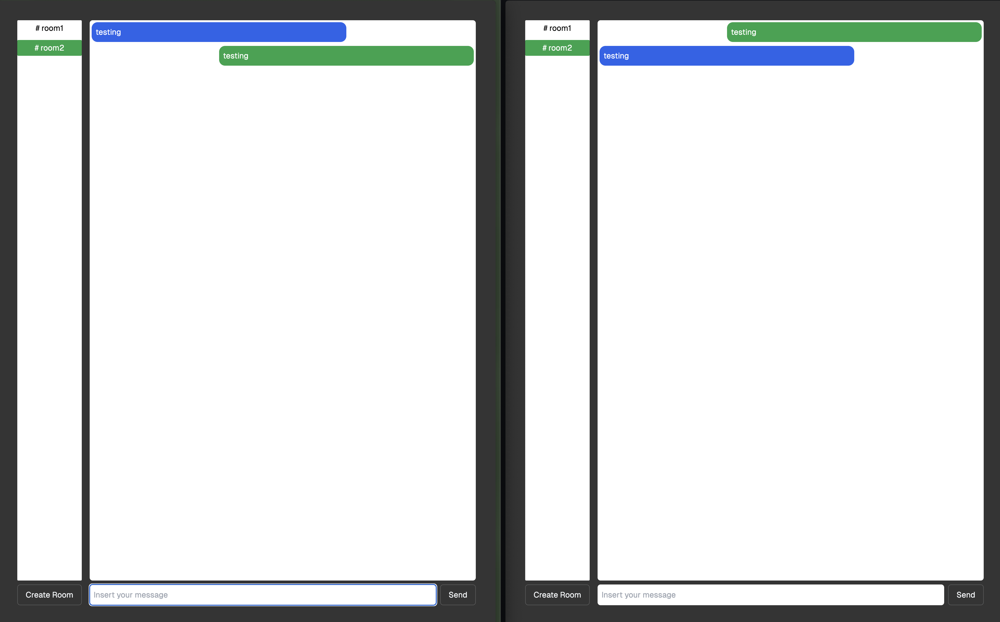
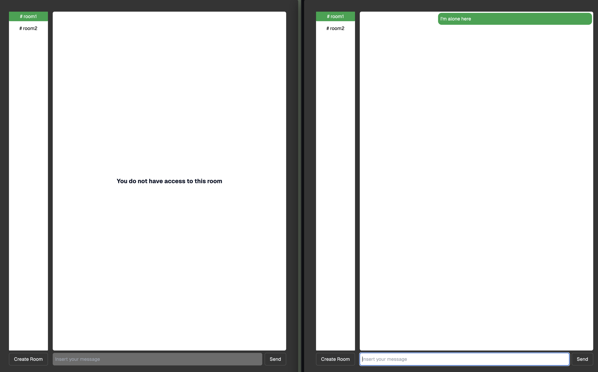
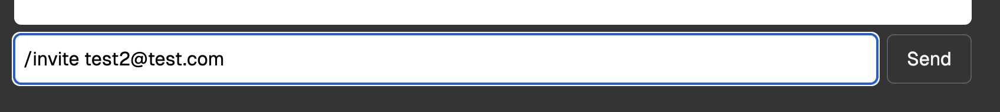

# SupaSecureSlack

Example application on how you can use Realtime Authorization to limit access to Realtime [Channels](https://supabase.com/docs/guides/realtime/concepts#channels) and [Broadcast](https://supabase.com/docs/guides/realtime/broadcast) and [Presence](https://supabase.com/docs/guides/realtime/presence) extensions.

You can provide feedback on our [Github Discussion](https://github.com/orgs/supabase/discussions/22484).

## Objective

Build a chat system using Realtime Broadcast with Authorized Channels where users can create rooms, invite each other to rooms, and send each other ephemeral messages.

Each room restricts the number of users authorized by applying RLS Policies applied to `public` schema tables you'll be creating and the auto-generated `realtime` schema tables.

## Run It

1. Create a `.env.local` file with the required variables by running `cp .env.example .env.local`.
2. [Create a new Supabase project](https://supabase.com/dashboard/new/_).
3. Refer to the [Database Setup](#database-setup) section to create the necessary tables and policies.
4. Copy the project's `URL` and `anon` API key from your project's [API Settings](https://supabase.com/dashboard/project/_/settings/api), and paste them into your `.env.local`.
5. `npm install`
6. `npm run dev`

## How It Looks

In this scenario both users are able to access it:

And here one of the user does not have access because their RLS policies made the user be denied access


## Schema

We'll be using:

- `public.profiles` - table that will be automatically updated using a trigger when new users are created
- `public.rooms` - a list of all unique rooms created
- `public.rooms_users` - the table responsible for the association between rooms and users

## Database Setup

### Create Tables

```sql
CREATE TABLE public.rooms (
    id bigint GENERATED BY default AS IDENTITY PRIMARY KEY,
    topic text NOT NULL UNIQUE
);
ALTER TABLE public.rooms ENABLE ROW LEVEL SECURITY;

CREATE TABLE public.profiles (
  id uuid NOT NULL REFERENCES auth.users ON DELETE CASCADE,
  email text NOT NULL,

  PRIMARY KEY (id)
);
ALTER TABLE public.profiles ENABLE ROW LEVEL SECURITY;

CREATE TABLE public.rooms_users (
  user_id uuid REFERENCES auth.users (id),
  room_topic text REFERENCES public.rooms (topic),
  created_at timestamptz DEFAULT CURRENT_TIMESTAMP
);
ALTER TABLE public.rooms_users ENABLE ROW LEVEL SECURITY;
```

### Create RLS Policies

We have to set up RLS policies for the `public` schema tables we created in the previous step as well as for the `realtime.messages` table. The policies created on this Realtime table will authorize user access to rooms and Broadcast/Presence by checking if an entry for a given room name and user id exists in the `public.rooms_users` table.

> ⚠️ All the RLS policies here are meant for this demo. You may refer to them but make sure that your policies are tailored to your use case and secure your application.

```sql
CREATE POLICY "authenticated can view all profiles"
ON "public"."profiles"
AS PERMISSIVE FOR SELECT
TO authenticated
USING (true);

CREATE POLICY "supabase_auth_admin can insert profile"
ON "public"."profiles"
AS PERMISSIVE FOR INSERT
TO supabase_auth_admin
WITH CHECK (true);

CREATE POLICY "authenticated can read rooms"
ON "public"."rooms"
AS PERMISSIVE FOR SELECT
TO authenticated
USING (TRUE);

CREATE POLICY "authenticated can add rooms"
ON "public"."rooms"
AS PERMISSIVE FOR INSERT
TO authenticated
WITH CHECK (TRUE);

CREATE POLICY "authenticated can read rooms_users"
ON "public"."rooms_users"
AS PERMISSIVE FOR SELECT
TO authenticated
USING (TRUE);

CREATE POLICY "authenticated can add rooms_users"
ON "public"."rooms_users"
AS PERMISSIVE FOR INSERT
TO authenticated
WITH CHECK (TRUE);

CREATE POLICY "authenticated can read broadcast and presence state"
ON "realtime"."messages"
AS PERMISSIVE FOR SELECT
TO authenticated
USING (
  EXISTS (
    SELECT 1
    FROM public.rooms_users
    WHERE user_id = (select auth.uid())
    AND room_topic = realtime.topic()
    AND realtime.messages.extension in ('broadcast', 'presence')
  )
);

CREATE POLICY "authenticated can send broadcast and track presence"
ON "realtime"."messages"
AS PERMISSIVE FOR INSERT
TO authenticated
WITH CHECK (
  EXISTS (
    SELECT 1
    FROM public.rooms_users
    WHERE user_id = (select auth.uid())
    AND room_topic = realtime.topic()
    AND realtime.messages.extension in ('broadcast', 'presence')
  )
);
```

### Create Database Function and Trigger

We need to create a database function and trigger to add an entry to `public.profiles` whenever a new user is created:

```sql
CREATE OR REPLACE FUNCTION insert_user() RETURNS TRIGGER AS
$$
  BEGIN
    INSERT INTO public.profiles (id, email) VALUES (NEW.id, NEW.email); RETURN NEW;
  END;
$$ LANGUAGE plpgsql
   SECURITY DEFINER
   SET search_path = public;

CREATE OR REPLACE TRIGGER "on_new_auth_create_profile"
AFTER INSERT ON auth.users FOR EACH ROW
EXECUTE FUNCTION insert_user();

GRANT EXECUTE ON FUNCTION insert_user () TO supabase_auth_admin;
GRANT INSERT ON TABLE public.profiles TO supabase_auth_admin;
```

## Coding Concerns

* Check that you're using `@supabase/realtime-js` v2.44.0 or later. 
* You need to define that the channel is private using the new configuration field during channel creation:

```typescript
  const channel = supabase.channel('room-1', {
    config: { private: true },
  })
```

You can check `app/protected/page.tsx` to see how we've set it up in the demo.

## Adding user to channel

Type `/invite <email>` of an existing user and they will be added to the channel.


