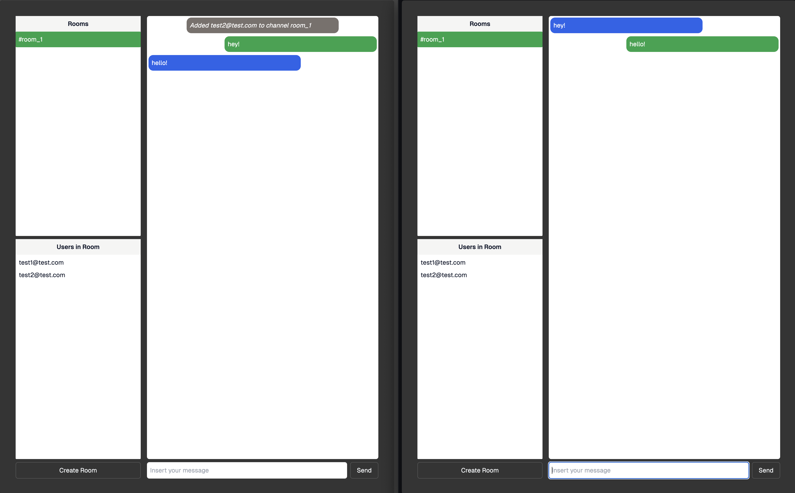

# Supaslack

Example application on how you can use Realtime Authorization feature to limit access to Realtime [Channels](https://supabase.com/docs/guides/realtime/concepts#channels) and limit access to the [Broadcast](https://supabase.com/docs/guides/realtime/broadcast) feature.

Read more and provide feedback at our [Github Discussion](https://github.com/orgs/supabase/discussions/22484)

## Objective

Build a chat system using Realtime Broadcast with Authorizated Channels where users can create rooms and invite existing users to a room.

Each room restricts the number of users authorized by applying RLS policies applied to `public` schema tables you'll be creating and the auto-generated `realtime` schema tables.

## Run it

```sh
npm i
npm run dev
```

> Please do note that currently we're overriding the dependecy for realtime to use the `next` version.

## How it looks
In this scenario both users are able to access it:

And here one of the user does not have access because their RLS rules made the user be denied access


## Schema

We're taking advantage of protected schemas to feed data to our application, namely realtime.channels and auth.users so we can easily have cascading changes if a channel / user is deleted.

We also need public.profiles with a trigger so we have a way to offer a public email to be used to invite people to the chat room.


## Database Setup


### RLS Rules
We do have a lot of rules setup so we will detail them with schema.table in the section below.

The most noteworthy one will be the realtime.broadcast as it will be the one used to limit access to rooms by checking if an entry for a given room name and user id exists in the table public.rooms_users.

> ⚠️ All the rules here are not the most secure, you should check your use case and refine them!
#### public.profiles
```sql
create table public.profiles (
  email text not null,
  user_id bigint references auth.users (id)
);
create table public.rooms_users (
  name bigint references auth.channels (name),
  user_id bigint references auth.users (id),
  created_at timestamp with time zone default current_timestamp
);

create policy "authenticated users can view all profiles"
on "public"."profiles"
as PERMISSIVE for SELECT
to authenticated
using ( true );

create policy "supabase_auth_admin user can insert profile"
on "public"."profiles"
as PERMISSIVE for INSERT
to supabase_auth_admin
with check ( true );

```
#### public.rooms_users
```sql
create policy "authenticated users can read rooms_users"
on "public"."rooms_users"
as PERMISSIVE for SELECT
to authenticated
using ( true );

create policy "authenticated can add rooms_users"
on "public"."rooms_users"
as PERMISSIVE for INSERT
to authenticated
with check ( true );
```
#### realtime.channels
```sql
create policy "authenticated users can see all channels"
on "realtime"."channels"
as PERMISSIVE for SELECT
to authenticated
using ( true );

create policy "authenticated can create channel"
on "realtime"."channels"
as PERMISSIVE for INSERT
to authenticated
with check ( true );
```

#### realtime.presence
```sql
create policy "authenticated users can see all presences"
on "realtime"."presences"
as PERMISSIVE for SELECT
to authenticated
using ( true );

create policy "authenticated can track presences"
on "realtime"."presences"
as PERMISSIVE for UPDATE
to authenticated
using ( true );
```
#### realtime.broadcasts
```sql
create policy "authenticated user in room can access"
on "realtime"."broadcasts"
as PERMISSIVE for SELECT
to authenticated
using (
  EXISTS (
    SELECT ru.user_id
    FROM rooms_users ru
    WHERE ru.user_id = auth.uid()
    AND ru.name = realtime.channel_name()
  )
);

create policy "authenticated user in room can broadcast"
on "realtime"."broadcasts"
as PERMISSIVE for UPDATE
to authenticated
using (
  EXISTS (
    SELECT ru.user_id
    FROM rooms_users ru
    WHERE ru.user_id = auth.uid()
    AND ru.name = realtime.channel_name()
  )
);
```

### Trigger
To actually add entries to our profile table we setup a function and a trigger to add an entry whenever a new user is created:

```sql
create or replace function insert_user () returns trigger as
$$
  BEGIN
    INSERT INTO public.profiles (user_id, email) VALUES (NEW.id, NEW.email); RETURN NEW;
  END;
$$ language plpgsql;

create or replace trigger "on_new_auth_create_profile"
after insert on auth.users for each row
execute function insert_user ();

grant execute on function insert_user () to supabase_auth_admin;
```

## Coding concerns
### Need to create channels
At the moment Realtime Channels are public and anyone with an Anon token and a valid JWT would be able to listen to any Channel.
If you want your channel to respect the RLS rules setup above you will need to preemptively create the channel that will be used before connecting.

> ⚠️ This will also impact access to `postgres_changes` channels on connect.

This can be done with a quick API call:
```ts
await supabase.realtime.createChannel(name)
```
You can check this code at the [create-room-modal.tsx](components/create-room-modal.tsx) component.

Also we're using the `next` version which we need to override in our [package.json](package.json):
```js
// ...
"overrides": {
    "@supabase/supabase-js": {
      "@supabase/realtime-js": "^2.10.0-next.6"
    }
  },
// ...
```

Or you could use a curl command:
```sh
curl -v -X POST 'https://<project_ref>.supabase.co/realtime/v1/api/channels'\
 --header 'apikey: <anon_token>'\
 --header 'authorization: Bearer <access_token>' \
 --header 'Content-Type: application/json'\
 --data-raw '{ "name": "<channel name>" }'
```
### Connecting to broadcast is essentially the same
The biggest difference from the previous way of work was really the requirement of creating the channel mentioned above, other than that you can connect as usual to your Realtime channel which will run the new check and either succeed or fail to connect.

You can check this code at the [protected/page.tsx](app/protected/page.tsx).