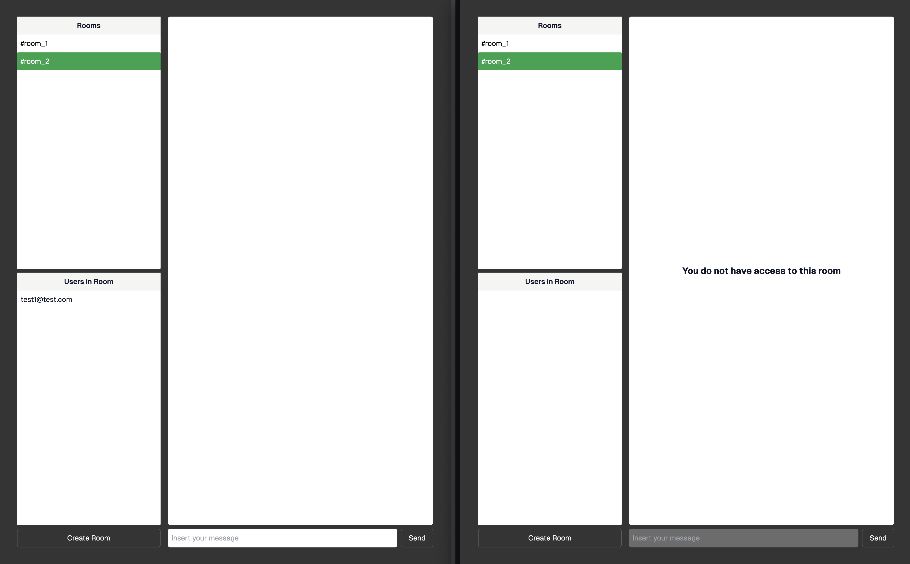

# SupaSecureSlack

Example application on how you can use Realtime Authorization feature to limit access to Realtime [Channels](https://supabase.com/docs/guides/realtime/concepts#channels) and limit access to the [Broadcast](https://supabase.com/docs/guides/realtime/broadcast) feature.

You can provide feedback on our [Github Discussion](https://github.com/orgs/supabase/discussions/22484).

## Objective

Build a chat system using Realtime Broadcast with Authorized Channels where users can create rooms and invite existing users to a room.

Each room restricts the number of users authorized by applying RLS policies applied to `public` schema tables you'll be creating and the auto-generated `realtime` schema tables.

## Run It

1. Create a `.env.local` file with the required variables by running `cp .env.example .env.local`.
2. [Create a new Supabase project](https://supabase.com/dashboard/new/_).
3. Refer to the [Database Setup](#database-setup) section to create the necessary tables and policies.
4. Copy the project's `URL` and `anon` API key from your project's [API Settings](https://supabase.com/dashboard/project/_/settings/api), and paste them into your `.env.local`.
5. `npm install`
6. `npm run dev`

## How It Looks

In this scenario both users are able to access it:

And here one of the user does not have access because their RLS rules made the user be denied access


## Schema

We're taking advantage of Supabase's protected schemas to feed data to our application, namely `realtime.channels` and `auth.users`, so we can easily have cascading changes if a Channel / user is deleted.

We also need `public.profiles` with a trigger so we have a way to offer a public email to be used to invite people to the chat room.

Here's an overview of the two `public` tables we'll be creating for this demo:


## Database Setup

### Create Tables

#### `public.profiles`

```sql
CREATE TABLE public.profiles (
  email text NOT NULL,
  user_id uuid REFERENCES auth.users (id)
);
```

#### `public.rooms_users`

```sql
CREATE TABLE public.rooms_users (
  name text REFERENCES realtime.channels (name),
  user_id uuid REFERENCES auth.users (id),
  created_at timestamptz DEFAULT CURRENT_TIMESTAMP
);
```

### Create RLS Policies

We do have a lot of RLS policies to set up so we will group them by `schema.table` below.

The most noteworthy ones are the policies created for `realtime.broadcasts` table as they will limit access to rooms by checking if an entry for a given room name and user id exists in the `public.rooms_users` table.

> ⚠️ All the RLS policies here are meant for this demo. You may refer to them but make sure that your policies are tailored to your use case and secure your application.

#### `public.profiles`

```sql
CREATE POLICY "authenticated users can view all profiles"
ON "public"."profiles"
AS PERMISSIVE FOR SELECT
TO authenticated
USING (true);

CREATE POLICY "supabase_auth_admin user can insert profile"
ON "public"."profiles"
AS PERMISSIVE FOR INSERT
TO supabase_auth_admin
WITH CHECK (true);
```

#### `public.rooms_users`

```sql
CREATE POLICY "authenticated users can read rooms_users"
ON "public"."rooms_users"
AS PERMISSIVE FOR SELECT
TO authenticated
USING (TRUE);

CREATE POLICY "authenticated can add rooms_users"
ON "public"."rooms_users"
AS PERMISSIVE FOR INSERT
TO authenticated
WITH CHECK (TRUE);
```

#### `realtime.channels`

```sql
CREATE POLICY "authenticated users can see all channels"
ON "realtime"."channels"
AS PERMISSIVE FOR SELECT
TO authenticated
USING (TRUE);

CREATE POLICY "authenticated can create channel"
ON "realtime"."channels"
AS PERMISSIVE FOR INSERT
TO authenticated
WITH CHECK (TRUE);
```

#### `realtime.presences`

```sql
CREATE POLICY "authenticated users can see all presences"
ON "realtime"."presences"
AS PERMISSIVE FOR SELECT
TO authenticated
USING (TRUE);

CREATE POLICY "authenticated can track presences"
ON "realtime"."presences"
AS PERMISSIVE FOR UPDATE
TO authenticated
USING (TRUE);
```

#### `realtime.broadcasts`

```sql
CREATE POLICY "authenticated user can enter room"
ON "realtime"."broadcasts"
AS PERMISSIVE FOR SELECT
TO authenticated
USING (
  EXISTS (
    SELECT
      ru.user_id
    FROM
      rooms_users ru
    WHERE
      ru.user_id = auth.uid()
      AND ru.name = realtime.channel_name()
  )
);

CREATE POLICY "authenticated user can broadcast in room"
ON "realtime"."broadcasts"
AS PERMISSIVE FOR UPDATE
TO authenticated
USING (
  EXISTS (
    SELECT
      ru.user_id
    FROM
      rooms_users ru
    WHERE
      ru.user_id = auth.uid()
      AND ru.name = realtime.channel_name()
  )
);
```

### Create Database Function and Trigger

We need to create a database function and trigger to add an entry to `public.profiles` whenever a new user is created:

```sql
CREATE OR REPLACE FUNCTION insert_user () RETURNS TRIGGER AS
$$
  BEGIN
    INSERT INTO public.profiles (user_id, email) VALUES (NEW.id, NEW.email); RETURN NEW;
  END;
$$ LANGUAGE plpgsql;

CREATE OR REPLACE TRIGGER "on_new_auth_create_profile"
AFTER INSERT ON auth.users FOR EACH ROW
EXECUTE FUNCTION insert_user ();

GRANT EXECUTE ON FUNCTION insert_user () TO supabase_auth_admin;
```

## Coding Concerns

### Create Channels Requirement

Before Realtime Authorization, Realtime Broadcast and Presence Channels were exposed to any client with a valid JWT, such as `anon` token.

If you want your Channel secured and adhere to RLS policies then you will need to create the Channel before allowing your clients to connect to the Channel.

> ⚠️ This will also impact access to `postgres_changes` Channels on connect.

You can create a Channel by making the following method call:

```ts
await supabase.realtime.createChannel(name)
```

You can check this code at the [create-room-modal.tsx](components/create-room-modal.tsx) component.

Also we're using the `next` version of `@supabase/realtime-js` which we need to override in `@supabase/supabase-js` in our [package.json](package.json):

```js
// ...
"overrides": {
    "@supabase/supabase-js": {
      "@supabase/realtime-js": "^2.10.0-next.6"
    }
  },
// ...
```

Or you can make a `POST` request to your project's `/realtime/v1/api/channels` endpoint:

```sh
curl -v -X POST 'https://<project_ref>.supabase.co/realtime/v1/api/channels'\
 --header 'apikey: <anon_token>'\
 --header 'Authorization: Bearer <access_token>' \
 --header 'Content-Type: application/json'\
 --data-raw '{ "name": "<channel name>" }'
```

### Connecting to Broadcast is Essentially the Same

The biggest difference between Broadcast and Broadcast Authorization is the latter's requirement of creating the Channel before clients subscribe to the Channel. Other than that, your clients can connect to Realtime Channel as they normally would and Realtime server will check RLS policies on client connect.

You can check this code at the [protected/page.tsx](app/protected/page.tsx).
