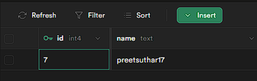

# Supabase Project Documentation

This documentation provides an overview of a JavaScript project that utilizes Supabase for the database. The project allows users to enter their username.

## Prerequisites
> Setup your Supabase SQL before continuing this work.
>For more information about using Supabase, refer to the official Supabase documentation: [Supabase Documentation](https://supabase.io/docs).


Before running the project, please make sure you have Node.js installed on your machine. If you don't have Node.js, you can download and install it from the official website: [Node.js Website](https://nodejs.org).

## Installation

To get started with the project, follow these steps:

1. Clone the repository from GitHub:
   ```
   git clone <repo/examples/link>
   ```
2. Navigate to the project directory:
   ```
   cd your-project
   ```
3. Install project dependencies using npm:
   ```
   npm install
   ```

## Configuration

### Creating table in database

1. Go to the Supabase dashboard and log in yourself.

2. Go to SQL editor

3. Create a new blank query and paste the below code in there,

```SQL
CREATE TABLE usernames (
  id SERIAL PRIMARY KEY,
  name TEXT
);
```

Before running the project, you need to configure the Supabase URL and key in the `index.js file. Open the `index.js` file and locate the following lines:

```javascript
const supabaseUrl = "{your_supabase_url}";
const supabaseKey = "{your_supabase_key}";
```


## Usage

Once the project is set up, you can run it using the following command:

```shell
node index.js
```

<video controls width="250">
    <source src="./demo-vid.mp4" type="video/mp4">
</video>

 


When executed, the code will prompt you to enter your username. Please provide your username as instructed, and it will be saved in the Supabase database table named "usernames".


## Contribution Guide

This project is open-source, and contributions are welcome. If you want to contribute to the project, follow these steps:

1. Fork the repository on GitHub.
2. Clone your forked repository to your local machine.
3. Create a new branch for your changes.
4. Make the necessary modifications and additions.
5. Commit and push your changes to your forked repository.
6. Submit a pull request to the original repository.

## License

This project is licensed under the [MIT License](LICENSE).
