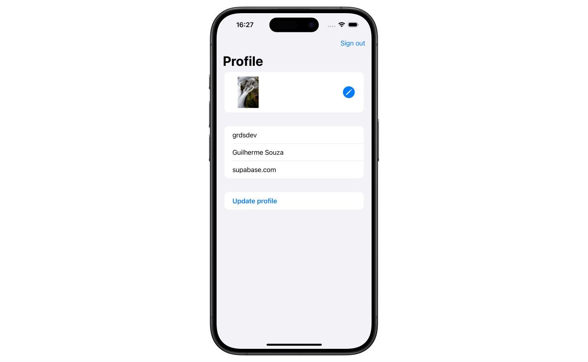

# Supabase Swift User Management

This repo is a quick sample of how you can get started building apps using Swift and Supabase. You can find a step by step guide of how to build out this app in the [Quickstart: Swift guide](https://supabase.io/docs/guides/with-swift).

This repo will demonstrate how to:

- Sign users in with Supabase Auth using [magic link](https://supabase.io/docs/reference/dart/auth-signin#sign-in-with-magic-link)
- Store and retrieve data with [Supabase database](https://supabase.io/docs/guides/database)
- Store image files in [Supabase storage](https://supabase.io/docs/guides/storage)



## Getting Started

Run `cp .env.example .env` and fill in [your credentials](https://supabase.io/docs/guides/with-flutter#get-the-api-keys).

Run the application in a device or simulator using Xcode.

## Database Schema

```sql
-- Create a table for public "profiles"
create table profiles (
  id uuid references auth.users not null,
  updated_at timestamp with time zone,
  username text unique,
  avatar_url text,
  website text,

  primary key (id),
  unique(username),
  constraint username_length check (char_length(username) >= 3)
);

alter table profiles enable row level security;

create policy "Public profiles are viewable by everyone."
  on profiles for select
  using ( true );

create policy "Users can insert their own profile."
  on profiles for insert
  with check ( (select auth.uid()) = id );

create policy "Users can update own profile."
  on profiles for update
  using ( (select auth.uid()) = id );

-- Set up Realtime!
begin;
  drop publication if exists supabase_realtime;
  create publication supabase_realtime;
commit;
alter publication supabase_realtime add table profiles;

-- Set up Storage!
insert into storage.buckets (id, name)
values ('avatars', 'avatars');

create policy "Avatar images are publicly accessible."
  on storage.objects for select
  using ( bucket_id = 'avatars' );

create policy "Anyone can upload an avatar."
  on storage.objects for insert
  with check ( bucket_id = 'avatars' );
```
