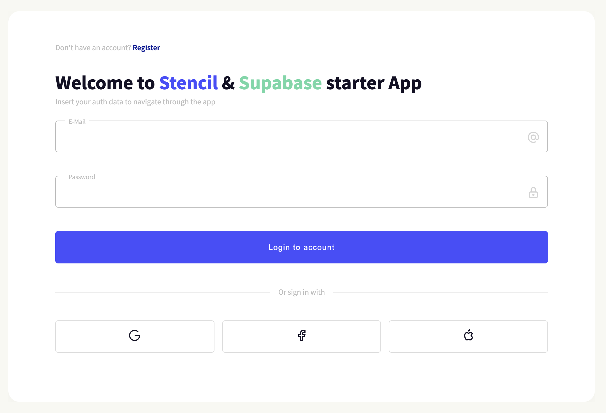

# Stencil & Supabase Starter

This is a boilerplate for creating a WebApp using [Stencil](https://github.com/ionic-team/stencil) + [Supabase](https://supabase.io/) + [Stencil Store](https://stenciljs.com/docs/stencil-store).



## Features 📋

- Supabase setup
- Stencil Store setup
- Login / Register / Logout functionality (Basic one)
- Protecting routes (router-guard) that are accessed after login

## Getting Started 🚀

To start using this boilerplate, clone this repo to a new directory:

```sh
git clone git@github.com:supabase/supabase.git
```

access the repository:

```sh
cd supabase/examples/with-stencil
```

and run:

```sh
npm install
```

## Usage 🚊

Setup Supabase configuration

Please setup _Supabase_ configuration in the file `src/config/config.ts`:

```js
const supabaseConfig = {
  supabaseUrl: '',
  supabaseKey: '',
};
```

You can find more about _Supabase Client_ config [on the official documentation page](https://supabase.io/docs/reference/javascript/initializing).

To start a project, run:

```sh
npm run start
```

To build the app for production, run:

```sh
npm run build
```

To run the unit tests once, run:

```sh
npm run test
```

To run the unit tests and watch for file changes during development, run:

```sh
npm run test.watch
```

## Project structure 🗄️

You can check the details of the [structure of our project through this file](./STRUCTURE.md)

## Contributing 👏

- [Pull requests](https://github.com/supabase/supabase/pulls) and 🌟 stars are always welcome.

## License

[MIT &copy;](LICENSE)
