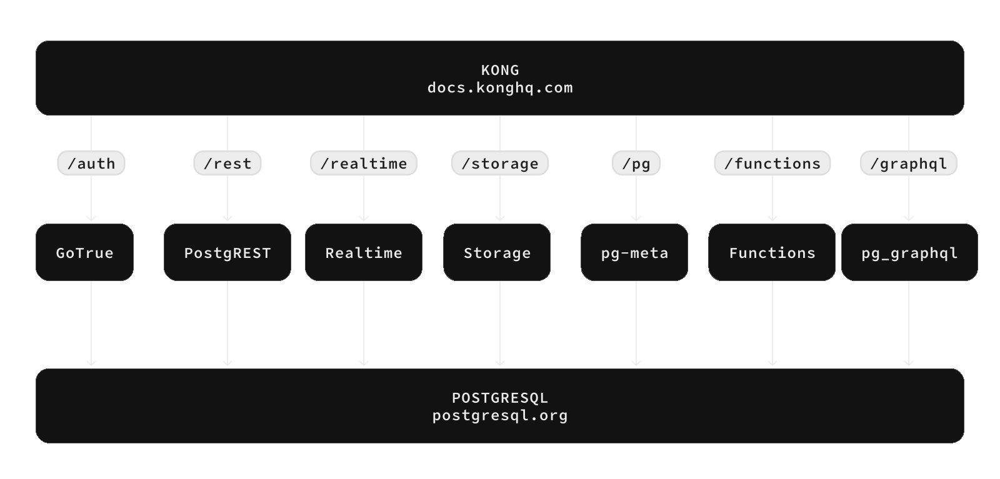

<p align="center">


</p>

---

# Supabase

[Supabase](https://supabase.com) یک جایگزین متن‌باز برای Firebase است. ما قابلیت‌های Firebase را با استفاده از ابزارهای متن‌باز در سطح سازمانی ایجاد می‌کنیم.

**ویژگی‌های کلیدی:**

- [x] **پایگاه داده Postgres مدیریت شده:** [مستندات](https://supabase.com/docs/guides/database)
- [x] **احراز هویت و مجوز:** [مستندات](https://supabase.com/docs/guides/auth)
- [x] **APIهای تولید شده خودکار:**
    - [x] REST: [مستندات](https://supabase.com/docs/guides/api)
    - [x] GraphQL: [مستندات](https://supabase.com/docs/guides/graphql)
    - [x] اشتراک‌های بی‌درنگ: [مستندات](https://supabase.com/docs/guides/realtime)
- [x] **توابع:**
    - [x] توابع پایگاه داده: [مستندات](https://supabase.com/docs/guides/database/functions)
    - [x] توابع Edge (توابع در لبه شبکه): [مستندات](https://supabase.com/docs/guides/functions)
- [x] **ذخیره‌سازی فایل:** [مستندات](https://supabase.com/docs/guides/storage)
- [x] **ابزارهای هوش مصنوعی، بردارها و جاسازی‌ها (Embeddings):** [مستندات](https://supabase.com/docs/guides/ai)
- [x] **داشبورد**


برای دریافت اعلان‌های مربوط به به‌روزرسانی‌های مهم، در "releases" این مخزن مشترک شوید. این به شما امکان می‌دهد از آخرین تغییرات و بهبودها مطلع شوید.

<kbd></kbd>

## مستندات

مستندات کامل در [supabase.com/docs](https://supabase.com/docs) در دسترس است. در آنجا تمام راهنماها و مطالب مرجع لازم را خواهید یافت.

اگر می‌خواهید در توسعه پروژه مشارکت کنید، به بخش [شروع به کار](./../DEVELOPERS.md) مراجعه کنید.

## جامعه و پشتیبانی

*   **انجمن:** [https://github.com/supabase/supabase/discussions](https://github.com/supabase/supabase/discussions). ایده آل برای دریافت کمک در توسعه و بحث در مورد بهترین روش‌های کار با پایگاه‌های داده.
*   **مشکلات GitHub:** [https://github.com/supabase/supabase/issues](https://github.com/supabase/supabase/issues). برای گزارش اشکالات و مشکلاتی که هنگام استفاده از Supabase با آن‌ها مواجه می‌شوید، استفاده کنید.
*   **پشتیبانی ایمیل:** [https://supabase.com/docs/support#business-support](https://supabase.com/docs/support#business-support). بهترین گزینه برای حل مشکلات پایگاه داده یا زیرساخت شما.
*   **Discord:** [https://discord.supabase.com](https://discord.supabase.com). مکانی عالی برای به اشتراک گذاشتن برنامه‌های خود و ارتباط با جامعه.

## نحوه عملکرد

Supabase چندین ابزار متن‌باز را ترکیب می‌کند. ما ویژگی‌هایی شبیه به Firebase را با استفاده از محصولات اثبات شده در سطح سازمانی ایجاد می‌کنیم. اگر ابزار یا جامعه‌ای وجود داشته باشد و دارای مجوز MIT، Apache 2 یا مجوز باز مشابه باشد، ما از آن ابزار استفاده و پشتیبانی خواهیم کرد. اگر چنین ابزاری وجود نداشته باشد، ما خودمان آن را می‌سازیم و کد آن را باز می‌کنیم. Supabase یک کپی دقیق از Firebase نیست. هدف ما ارائه تجربه‌ای راحت به توسعه‌دهندگان است که با Firebase قابل مقایسه باشد، اما با استفاده از ابزارهای متن‌باز.

**معماری**

Supabase یک [پلتفرم مدیریت شده](https://supabase.com/dashboard) است. می‌توانید ثبت نام کنید و بلافاصله استفاده از Supabase را بدون نیاز به نصب چیزی شروع کنید. همچنین می‌توانید [زیرساخت خود را مستقر کنید](https://supabase.com/docs/guides/hosting/overview) و [به صورت محلی توسعه دهید](https://supabase.com/docs/guides/local-development).



*   **PostgreSQL:** یک سیستم مدیریت پایگاه داده رابطه‌ای شی‌گرا با بیش از 30 سال سابقه توسعه فعال. این سیستم به دلیل قابلیت اطمینان، عملکرد و کارایی شناخته شده است.
*   **Realtime:** یک سرور Elixir که به شما امکان می‌دهد تغییرات PostgreSQL (درج، به‌روزرسانی و حذف) را از طریق وب‌سوکت‌ها گوش دهید. Realtime از قابلیت تکثیر داخلی Postgres استفاده می‌کند، تغییرات را به JSON تبدیل می‌کند و آن‌ها را به مشتریان مجاز منتقل می‌کند.
*   **PostgREST:** یک وب سرور که پایگاه داده PostgreSQL شما را به یک API RESTful تبدیل می‌کند.
*   **GoTrue:** یک API مبتنی بر JWT برای مدیریت کاربران و صدور توکن‌های JWT.
*   **Storage:** یک رابط RESTful برای مدیریت فایل‌های ذخیره شده در S3 فراهم می‌کند، با استفاده از Postgres برای مدیریت مجوزها.
*   **pg_graphql:** یک افزونه PostgreSQL که یک API GraphQL را ارائه می‌دهد.
*   **postgres-meta:** یک API RESTful برای مدیریت Postgres شما، که به شما امکان می‌دهد جداول را دریافت کنید، نقش اضافه کنید، کوئری‌ها را اجرا کنید و غیره.
*   **Kong:** یک دروازه API بومی ابری.

#### کتابخانه‌های کلاینت

ما از یک رویکرد ماژولار برای کتابخانه‌های کلاینت استفاده می‌کنیم. هر کتابخانه فرعی برای کار با یک سیستم خارجی واحد طراحی شده است. این یکی از راه‌های پشتیبانی از ابزارهای موجود است.

(جدول با کتابخانه‌های کلاینت، مانند جدول اصلی، اما با نام‌های فارسی و توضیحات، در صورت نیاز).

| زبان                       | کلاینت Supabase                                                     | [PostgREST](https://www.postgresql.org/)                                                                         | [GoTrue](https://github.com/supabase/gotrue)                                                                                | [Realtime](https://github.com/supabase/realtime)                                                                              | [Storage](https://github.com/supabase/storage-api)                                                                                 | Functions                                                                               |
| :-------------------------- | :------------------------------------------------------------------ | :-------------------------------------------------------------------------------- | :------------------------------------------------------------------------------------ | :----------------------------------------------------------------------------------- | :-------------------------------------------------------------------------------------- | :----------------------------------------------------------------------------------- |
| **⚡️رسمی⚡️**      |                                                                     |                                                                                   |                                                                                      |                                                                                     |                                                                                        |                                                                                      |
| JavaScript (TypeScript)     | [supabase-js](https://github.com/supabase/supabase-js)               | [postgrest-js](https://github.com/supabase/postgrest-js)                             | [gotrue-js](https://github.com/supabase/gotrue-js)                                     | [realtime-js](https://github.com/supabase/realtime-js)                                 | [storage-js](https://github.com/supabase/storage-js)                                   | [functions-js](https://github.com/supabase/functions-js)                             |
| Flutter                     | [supabase-flutter](https://github.com/supabase/supabase-flutter)     | [postgrest-dart](https://github.com/supabase/postgrest-dart)                         | [gotrue-dart](https://github.com/supabase/gotrue-dart)                                 | [realtime-dart](https://github.com/supabase/realtime-dart)                             | [storage-dart](https://github.com/supabase/storage-dart)                               | [functions-dart](https://github.com/supabase/functions-dart)                         |
| Swift                      | [supabase-swift](https://github.com/supabase/supabase-swift)          | [postgrest-swift](https://github.com/supabase/supabase-swift/tree/main/Sources/PostgREST) | [auth-swift](https://github.com/supabase/supabase-swift/tree/main/Sources/Auth)     | [realtime-swift](https://github.com/supabase/supabase-swift/tree/main/Sources/Realtime) | [storage-swift](https://github.com/supabase/supabase-swift/tree/main/Sources/Storage) | [functions-swift](https://github.com/supabase/supabase-swift/tree/main/Sources/Functions) |
| Python                      | [supabase-py](https://github.com/supabase/supabase-py)               | [postgrest-py](https://github.com/supabase/postgrest-py)                             | [gotrue-py](https://github.com/supabase/gotrue-py)                                     | [realtime-py](https://github.com/supabase/realtime-py)                                 | [storage-py](https://github.com/supabase/storage-py)                                   | [functions-py](https://github.com/supabase/functions-py)                             |
| **💚پشتیبانی شده توسط جامعه💚** |                                                                     |                                                                                   |                                                                                      |                                                                                     |                                                                                        |                                                                                      |
| C#                          | [supabase-csharp](https://github.com/supabase-community/supabase-csharp) | [postgrest-csharp](https://github.com/supabase-community/postgrest-csharp)           | [gotrue-csharp](https://github.com/supabase-community/gotrue-csharp)                 | [realtime-csharp](https://github.com/supabase-community/realtime-csharp)             | [storage-csharp](https://github.com/supabase-community/storage-csharp)                 | [functions-csharp](https://github.com/supabase-community/functions-csharp)           |
| Go                          | -                                                                   | [postgrest-go](https://github.com/supabase-community/postgrest-go)                     | [gotrue-go](https://github.com/supabase-community/gotrue-go)                           | -                                                                                   | [storage-go](https://github.com/supabase-community/storage-go)                       | [functions-go](https://github.com/supabase-community/functions-go)                   |
| Java                        | -                                                                   | -                                                                                   | [gotrue-java](https://github.com/supabase-community/gotrue-java)                       | -                                                                                   | [storage-java](https://github.com/supabase-community/storage-java)                   | -                                                                                   |
| Kotlin                      | [supabase-kt](https://github.com/supabase-community/supabase-kt)       | [postgrest-kt](https://github.com/supabase-community/supabase-kt/tree/master/Postgrest) | [auth-kt](https://github.com/supabase-community/supabase-kt/tree/master/Auth)         | [realtime-kt](https://github.com/supabase-community/supabase-kt/tree/master/Realtime)   | [storage-kt](https://github.com/supabase-community/supabase-kt/tree/master/Storage)   | [functions-kt](https://github.com/supabase-community/supabase-kt/tree/master/Functions) |
| Ruby                      | [supabase-rb](https://github.com/supabase-community/supabase-rb)      |      [postgrest-rb](https://github.com/supabase-community/postgrest-rb)                                                                             |    -                                                                                  |        -                                                                            |     -                                                                                 |          -                                                                          |
| Rust                      |      -                                                                 |       [postgrest-rs](https://github.com/supabase-community/postgrest-rs)                                                                            |      -                                                                                 |       -                                                                             |       -                                                                                |         -                                                                           |
| Godot Engine (GDScript)      |   [supabase-gdscript](https://github.com/supabase-community/godot-engine.supabase)                                                                  |        [postgrest-gdscript](https://github.com/supabase-community/postgrest-gdscript)                                                                            |        [gotrue-gdscript](https://github.com/supabase-community/gotrue-gdscript)                                                                                |    [realtime-gdscript](https://github.com/supabase-community/realtime-gdscript)                                                                                  |         [storage-gdscript](https://github.com/supabase-community/storage-gdscript)                                                                                 |  [functions-gdscript](https://github.com/supabase-community/functions-gdscript)                                                                                       |

## نشان‌ها (Badges)

می‌توانید از این نشان‌ها استفاده کنید تا نشان دهید برنامه شما با Supabase ساخته شده است:

**روشن:**


```md
[](https://supabase.com)
```

```html
<a href="https://supabase.com">
  
</a>
```

**تاریک:**


```md
[](https://supabase.com)
```

```html
<a href="https://supabase.com">
  
</a>
```

## ترجمه‌ها

[لیست ترجمه‌ها](./languages.md)
