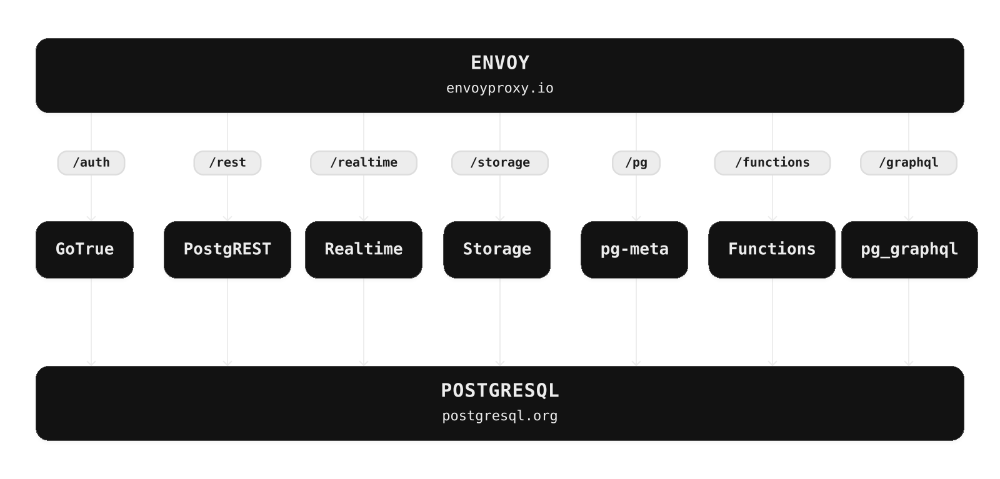

<p align="center">


</p>

# Supabase

[Supabase (सुपाबेस)](https://supabase.com) हे Postgres (पोस्टग्रेस) साठीचे विकास व्यासपीठ (डेव्हलपमेंट प्लॅटफॉर्म) आहे. आम्ही मोठ्या संस्थांच्या गरजांना अनुरूप अशा मुक्त स्रोत (ओपन सोर्स) साधनांचा वापर करून Firebase (फायरबेस) ची वैशिष्ट्ये (फीचर्स) तयार करत आहोत.

- [x] होस्ट केलेला Postgres (पोस्टग्रेस) डेटाबेस. [दस्तऐवज (डॉक्युमेंटेशन)](https://supabase.com/docs/guides/database)
- [x] प्रमाणीकरण (ऑथेंटिकेशन) आणि प्रवेशाधिकार व्यवस्थापन (ऑथरायझेशन). [दस्तऐवज (डॉक्युमेंटेशन)](https://supabase.com/docs/guides/auth)
- [x] आपोआप तयार होणारे API (एपीआय).
  - [x] REST (रेस्ट). [दस्तऐवज (डॉक्युमेंटेशन)](https://supabase.com/docs/guides/api)
  - [x] GraphQL (ग्राफक्यूएल). [दस्तऐवज (डॉक्युमेंटेशन)](https://supabase.com/docs/guides/graphql)
  - [x] रिअलटाइम सबस्क्रिप्शन. [दस्तऐवज (डॉक्युमेंटेशन)](https://supabase.com/docs/guides/realtime)
- [x] फंक्शन्स.
  - [x] डेटाबेस फंक्शन्स. [दस्तऐवज (डॉक्युमेंटेशन)](https://supabase.com/docs/guides/database/functions)
  - [x] Edge Functions (एज फंक्शन्स). [दस्तऐवज (डॉक्युमेंटेशन)](https://supabase.com/docs/guides/functions)
- [x] फाइल संचयन (फाइल स्टोरेज). [दस्तऐवज (डॉक्युमेंटेशन)](https://supabase.com/docs/guides/storage)
- [x] AI (एआय) + व्हेक्टर/एम्बेडिंग्स साधनसंच (टूलकिट). [दस्तऐवज (डॉक्युमेंटेशन)](https://supabase.com/docs/guides/ai)
- [x] डॅशबोर्ड


महत्त्वाच्या अद्यतनांच्या (अपडेट्स) सूचना (नोटिफिकेशन्स) मिळवण्यासाठी या रिपॉझिटरीच्या “Watch (वॉच)” पर्यायात “releases (रिलीजेस)” निवडा.

<kbd></kbd>

## दस्तऐवज (डॉक्युमेंटेशन)

संपूर्ण दस्तऐवजांसाठी (डॉक्युमेंटेशन) [supabase.com/docs](https://supabase.com/docs) या संकेतस्थळाला भेट द्या.

योगदान कसे द्यावे हे जाणून घेण्यासाठी [Getting Started (सुरुवात करा)](../DEVELOPERS.md) हे मार्गदर्शक वाचा.

## समुदाय (कम्युनिटी) आणि मदत (सपोर्ट)

- [समुदाय मंच (कम्युनिटी फोरम)](https://github.com/supabase/supabase/discussions). ॲप्लिकेशन तयार करताना मदत मिळवण्यासाठी आणि डेटाबेसच्या सर्वोत्तम पद्धतींवर (बेस्ट प्रॅक्टिसेस) चर्चा करण्यासाठी.
- [GitHub Issues (गिटहब इश्यूज)](https://github.com/supabase/supabase/issues). Supabase (सुपाबेस) वापरताना आढळणारे बग आणि त्रुटी (एरर्स) नोंदवण्यासाठी.
- [ईमेलद्वारे मदत](https://supabase.com/docs/support#business-support). तुमच्या डेटाबेस किंवा पायाभूत सुविधांशी (इन्फ्रास्ट्रक्चर) संबंधित समस्यांसाठी.
- [Discord (डिस्कॉर्ड)](https://discord.supabase.com). तुमची ॲप्लिकेशन्स इतरांना दाखवण्यासाठी आणि समुदायाशी गप्पा मारण्यासाठी.

## हे कसे काम करते

Supabase (सुपाबेस) हे मुक्त स्रोत (ओपन सोर्स) साधनांचे एकत्रीकरण (कॉम्बिनेशन) आहे. आम्ही मोठ्या संस्थांच्या गरजांना अनुरूप अशा मुक्त स्रोत (ओपन सोर्स) उत्पादनांचा वापर करून Firebase (फायरबेस) ची वैशिष्ट्ये (फीचर्स) तयार करत आहोत. MIT (एमआयटी), Apache 2 (अपाचे २) किंवा समतुल्य मुक्त परवान्याअंतर्गत (ओपन लायसन्स) साधने आणि त्यांचे समुदाय आधीपासून उपलब्ध असतील, तर आम्ही ती साधने वापरतो आणि त्यांना पाठिंबा देतो. एखादे साधन उपलब्ध नसेल, तर आम्ही ते स्वतः तयार करून मुक्त स्रोत (ओपन सोर्स) म्हणून उपलब्ध करतो. Supabase (सुपाबेस) ही Firebase (फायरबेस) ची तंतोतंत प्रतिकृती नाही. मुक्त स्रोत (ओपन सोर्स) साधनांच्या मदतीने विकासकांना (डेव्हलपर्स) Firebase (फायरबेस) सारखा विकास अनुभव (डेव्हलपर एक्सपीरियन्स) देणे हे आमचे उद्दिष्ट आहे.

**प्रणालीची रचना (आर्किटेक्चर)**

Supabase (सुपाबेस) हे एक [होस्ट केलेले व्यासपीठ (होस्टेड प्लॅटफॉर्म)](https://supabase.com/dashboard) आहे. काहीही इन्स्टॉल न करता तुम्ही नोंदणी (साइन अप) करून Supabase (सुपाबेस) वापरण्यास सुरुवात करू शकता.
तुम्ही ते [स्वतःच्या सर्व्हरवर होस्ट (सेल्फ-होस्ट)](https://supabase.com/docs/guides/hosting/overview) करू शकता आणि [स्थानिक संगणकावर विकास (लोकल डेव्हलपमेंट)](https://supabase.com/docs/guides/local-development) करू शकता.



- [Postgres (पोस्टग्रेस)](https://www.postgresql.org/) ही ऑब्जेक्ट-रिलेशनल डेटाबेस प्रणाली (डेटाबेस सिस्टिम) आहे. ३० वर्षांहून अधिक काळ सुरू असलेल्या सक्रिय विकासामुळे तिने विश्वासार्हता (रिलायबिलिटी), भक्कम वैशिष्ट्ये (फीचर्स) आणि कार्यक्षमता (परफॉर्मन्स) यांसाठी चांगली प्रतिष्ठा मिळवली आहे.
- [Realtime (रिअलटाइम)](https://github.com/supabase/realtime) हा Elixir (एलिक्सिर) सर्व्हर आहे. तो WebSocket (वेबसॉकेट) द्वारे PostgreSQL (पोस्टग्रेएसक्यूएल) मधील नोंदी जोडणे (इन्सर्ट), अद्यतनित करणे (अपडेट) आणि हटवणे (डिलीट) यांविषयी सूचना (नोटिफिकेशन्स) मिळवू देतो. डेटाबेसमधील बदल शोधण्यासाठी Realtime (रिअलटाइम) नियमितपणे Postgres (पोस्टग्रेस) मधील अंगभूत प्रतिकृतीकरण यंत्रणा (बिल्ट-इन रेप्लिकेशन) तपासतो, बदलांचे JSON (जेसन) मध्ये रूपांतर करतो आणि हे JSON (जेसन) WebSocket (वेबसॉकेट) द्वारे अधिकृत क्लायंटना (ऑथराइज्ड क्लायंट्स) प्रसारित (ब्रॉडकास्ट) करतो.
- [PostgREST (पोस्टग्रेस्ट)](http://postgrest.org/) हा वेब सर्व्हर तुमच्या PostgreSQL (पोस्टग्रेएसक्यूएल) डेटाबेसचे थेट RESTful (रेस्टफुल) API (एपीआय) मध्ये रूपांतर करतो.
- [GoTrue (गो ट्रू)](https://github.com/supabase/gotrue) हा JWT (जेडब्ल्यूटी) वर आधारित प्रमाणीकरण (ऑथेंटिकेशन) API (एपीआय) आहे. तो तुमच्या ॲप्लिकेशन्समधील वापरकर्ता नोंदणी (यूजर साइन अप), साइन इन आणि सत्र व्यवस्थापन (सेशन मॅनेजमेंट) सुलभ करतो.
- [Storage (स्टोरेज)](https://github.com/supabase/storage-api) हा S3 (एस३) मधील फाइल्स व्यवस्थापित करण्यासाठीचा RESTful (रेस्टफुल) API (एपीआय) आहे. यात प्रवेश परवानग्या (परमिशन्स) Postgres (पोस्टग्रेस) द्वारे हाताळल्या जातात.
- [pg_graphql (पीजी ग्राफक्यूएल)](http://github.com/supabase/pg_graphql/) हा GraphQL (ग्राफक्यूएल) API (एपीआय) उपलब्ध करून देणारा PostgreSQL (पोस्टग्रेएसक्यूएल) विस्तार (एक्स्टेंशन) आहे.
- [postgres-meta (पोस्टग्रेस मेटा)](https://github.com/supabase/postgres-meta) हा तुमचे Postgres (पोस्टग्रेस) व्यवस्थापित करण्यासाठीचा RESTful (रेस्टफुल) API (एपीआय) आहे. तो टेबल्सची माहिती मिळवणे, भूमिका (रोल्स) जोडणे आणि क्वेरी चालवणे यांसारखी कामे करू देतो.
- [Envoy (एन्व्हॉय)](https://github.com/envoyproxy/envoy) हा क्लाउडसाठी तयार केलेला, उच्च कार्यक्षमतेचा (हाय-परफॉर्मन्स) एज आणि सर्व्हिस प्रॉक्सी आहे.

#### क्लायंट लायब्ररी

आमच्या क्लायंट लायब्ररींची रचना स्वतंत्र घटकांवर आधारित (मॉड्युलर) आहे. प्रत्येक उपलायब्ररी (सब-लायब्ररी) एका बाह्य प्रणालीसाठी (एक्स्टर्नल सिस्टिम) स्वतंत्रपणे काम करते. विद्यमान साधनांना पाठिंबा देण्याचा हा आमचा एक मार्ग आहे.

<table style="table-layout:fixed; white-space: nowrap;">
  <tr>
    <th>भाषा</th>
    <th>क्लायंट</th>
    <th colspan="5">वैशिष्ट्यांसाठीचे क्लायंट (फीचर क्लायंट्स) (Supabase (सुपाबेस) क्लायंटमध्ये समाविष्ट)</th>
  </tr>
  <!-- notranslate -->
  <tr>
    <th></th>
    <th>Supabase (सुपाबेस)</th>
    <th><a href="https://github.com/postgrest/postgrest" target="_blank" rel="noopener noreferrer">PostgREST (पोस्टग्रेस्ट)</a></th>
    <th><a href="https://github.com/supabase/gotrue" target="_blank" rel="noopener noreferrer">GoTrue (गो ट्रू)</a></th>
    <th><a href="https://github.com/supabase/realtime" target="_blank" rel="noopener noreferrer">Realtime (रिअलटाइम)</a></th>
    <th><a href="https://github.com/supabase/storage-api" target="_blank" rel="noopener noreferrer">Storage (स्टोरेज)</a></th>
    <th>Functions (फंक्शन्स)</th>
  </tr>
  <!-- TEMPLATE FOR NEW ROW -->
  <!-- START ROW
  <tr>
    <td>lang</td>
    <td><a href="https://github.com/supabase-community/supabase-lang" target="_blank" rel="noopener noreferrer">supabase-lang</a></td>
    <td><a href="https://github.com/supabase-community/postgrest-lang" target="_blank" rel="noopener noreferrer">postgrest-lang</a></td>
    <td><a href="https://github.com/supabase-community/gotrue-lang" target="_blank" rel="noopener noreferrer">gotrue-lang</a></td>
    <td><a href="https://github.com/supabase-community/realtime-lang" target="_blank" rel="noopener noreferrer">realtime-lang</a></td>
    <td><a href="https://github.com/supabase-community/storage-lang" target="_blank" rel="noopener noreferrer">storage-lang</a></td>
  </tr>
  END ROW -->
  <!-- /notranslate -->
  <th colspan="7">⚡️ अधिकृत (ऑफिशियल) ⚡️</th>
  <!-- notranslate -->
  <tr>
    <td>JavaScript (जावास्क्रिप्ट) (TypeScript (टाइपस्क्रिप्ट))</td>
    <td><a href="https://github.com/supabase/supabase-js" target="_blank" rel="noopener noreferrer">supabase-js (सुपाबेस जेएस)</a></td>
    <td><a href="https://github.com/supabase/supabase-js/tree/master/packages/core/postgrest-js" target="_blank" rel="noopener noreferrer">postgrest-js (पोस्टग्रेस्ट जेएस)</a></td>
    <td><a href="https://github.com/supabase/supabase-js/tree/master/packages/core/auth-js" target="_blank" rel="noopener noreferrer">auth-js (ऑथ जेएस)</a></td>
    <td><a href="https://github.com/supabase/supabase-js/tree/master/packages/core/realtime-js" target="_blank" rel="noopener noreferrer">realtime-js (रिअलटाइम जेएस)</a></td>
    <td><a href="https://github.com/supabase/supabase-js/tree/master/packages/core/storage-js" target="_blank" rel="noopener noreferrer">storage-js (स्टोरेज जेएस)</a></td>
    <td><a href="https://github.com/supabase/supabase-js/tree/master/packages/core/functions-js" target="_blank" rel="noopener noreferrer">functions-js (फंक्शन्स जेएस)</a></td>
  </tr>
    <tr>
    <td>Flutter (फ्लटर)</td>
    <td><a href="https://github.com/supabase/supabase-flutter" target="_blank" rel="noopener noreferrer">supabase-flutter (सुपाबेस फ्लटर)</a></td>
    <td><a href="https://github.com/supabase/supabase-flutter/tree/main/packages/postgrest" target="_blank" rel="noopener noreferrer">postgrest (पोस्टग्रेस्ट)</a></td>
    <td><a href="https://github.com/supabase/supabase-flutter/tree/main/packages/supabase_auth" target="_blank" rel="noopener noreferrer">supabase_auth (सुपाबेस ऑथ)</a></td>
    <td><a href="https://github.com/supabase/supabase-flutter/tree/main/packages/supabase_realtime" target="_blank" rel="noopener noreferrer">supabase_realtime (सुपाबेस रिअलटाइम)</a></td>
    <td><a href="https://github.com/supabase/supabase-flutter/tree/main/packages/supabase_storage" target="_blank" rel="noopener noreferrer">supabase_storage (सुपाबेस स्टोरेज)</a></td>
    <td><a href="https://github.com/supabase/supabase-flutter/tree/main/packages/supabase_functions" target="_blank" rel="noopener noreferrer">supabase_functions (सुपाबेस फंक्शन्स)</a></td>
  </tr>
  <tr>
    <td>Swift (स्विफ्ट)</td>
    <td><a href="https://github.com/supabase/supabase-swift" target="_blank" rel="noopener noreferrer">supabase-swift (सुपाबेस स्विफ्ट)</a></td>
    <td><a href="https://github.com/supabase/supabase-swift/tree/main/Sources/PostgREST" target="_blank" rel="noopener noreferrer">postgrest-swift (पोस्टग्रेस्ट स्विफ्ट)</a></td>
    <td><a href="https://github.com/supabase/supabase-swift/tree/main/Sources/Auth" target="_blank" rel="noopener noreferrer">auth-swift (ऑथ स्विफ्ट)</a></td>
    <td><a href="https://github.com/supabase/supabase-swift/tree/main/Sources/Realtime" target="_blank" rel="noopener noreferrer">realtime-swift (रिअलटाइम स्विफ्ट)</a></td>
    <td><a href="https://github.com/supabase/supabase-swift/tree/main/Sources/Storage" target="_blank" rel="noopener noreferrer">storage-swift (स्टोरेज स्विफ्ट)</a></td>
    <td><a href="https://github.com/supabase/supabase-swift/tree/main/Sources/Functions" target="_blank" rel="noopener noreferrer">functions-swift (फंक्शन्स स्विफ्ट)</a></td>
  </tr>
  <tr>
    <td>Python (पायथन)</td>
    <td><a href="https://github.com/supabase/supabase-py" target="_blank" rel="noopener noreferrer">supabase-py (सुपाबेस पाय)</a></td>
    <td><a href="https://github.com/supabase/postgrest-py" target="_blank" rel="noopener noreferrer">postgrest-py (पोस्टग्रेस्ट पाय)</a></td>
    <td><a href="https://github.com/supabase/gotrue-py" target="_blank" rel="noopener noreferrer">gotrue-py (गो ट्रू पाय)</a></td>
    <td><a href="https://github.com/supabase/realtime-py" target="_blank" rel="noopener noreferrer">realtime-py (रिअलटाइम पाय)</a></td>
    <td><a href="https://github.com/supabase/storage-py" target="_blank" rel="noopener noreferrer">storage-py (स्टोरेज पाय)</a></td>
    <td><a href="https://github.com/supabase/functions-py" target="_blank" rel="noopener noreferrer">functions-py (फंक्शन्स पाय)</a></td>
  </tr>
  <!-- /notranslate -->
  <th colspan="7">💚 समुदाय (कम्युनिटी) 💚</th>
  <!-- notranslate -->
  <tr>
    <td>C# (सी शार्प)</td>
    <td><a href="https://github.com/supabase-community/supabase-csharp" target="_blank" rel="noopener noreferrer">supabase-csharp (सुपाबेस सी शार्प)</a></td>
    <td><a href="https://github.com/supabase-community/postgrest-csharp" target="_blank" rel="noopener noreferrer">postgrest-csharp (पोस्टग्रेस्ट सी शार्प)</a></td>
    <td><a href="https://github.com/supabase-community/gotrue-csharp" target="_blank" rel="noopener noreferrer">gotrue-csharp (गो ट्रू सी शार्प)</a></td>
    <td><a href="https://github.com/supabase-community/realtime-csharp" target="_blank" rel="noopener noreferrer">realtime-csharp (रिअलटाइम सी शार्प)</a></td>
    <td><a href="https://github.com/supabase-community/storage-csharp" target="_blank" rel="noopener noreferrer">storage-csharp (स्टोरेज सी शार्प)</a></td>
    <td><a href="https://github.com/supabase-community/functions-csharp" target="_blank" rel="noopener noreferrer">functions-csharp (फंक्शन्स सी शार्प)</a></td>
  </tr>
  <tr>
    <td>Go (गो)</td>
    <td>-</td>
    <td><a href="https://github.com/supabase-community/postgrest-go" target="_blank" rel="noopener noreferrer">postgrest-go (पोस्टग्रेस्ट गो)</a></td>
    <td><a href="https://github.com/supabase-community/gotrue-go" target="_blank" rel="noopener noreferrer">gotrue-go (गो ट्रू गो)</a></td>
    <td>-</td>
    <td><a href="https://github.com/supabase-community/storage-go" target="_blank" rel="noopener noreferrer">storage-go (स्टोरेज गो)</a></td>
    <td><a href="https://github.com/supabase-community/functions-go" target="_blank" rel="noopener noreferrer">functions-go (फंक्शन्स गो)</a></td>
  </tr>
  <tr>
    <td>Java (जावा)</td>
    <td>-</td>
    <td>-</td>
    <td><a href="https://github.com/supabase-community/gotrue-java" target="_blank" rel="noopener noreferrer">gotrue-java (गो ट्रू जावा)</a></td>
    <td>-</td>
    <td><a href="https://github.com/supabase-community/storage-java" target="_blank" rel="noopener noreferrer">storage-java (स्टोरेज जावा)</a></td>
    <td>-</td>
  </tr>
  <tr>
    <td>Kotlin (कोटलिन)</td>
    <td><a href="https://github.com/supabase-community/supabase-kt" target="_blank" rel="noopener noreferrer">supabase-kt (सुपाबेस केटी)</a></td>
    <td><a href="https://github.com/supabase-community/supabase-kt/tree/master/Postgrest" target="_blank" rel="noopener noreferrer">postgrest-kt (पोस्टग्रेस्ट केटी)</a></td>
    <td><a href="https://github.com/supabase-community/supabase-kt/tree/master/Auth" target="_blank" rel="noopener noreferrer">auth-kt (ऑथ केटी)</a></td>
    <td><a href="https://github.com/supabase-community/supabase-kt/tree/master/Realtime" target="_blank" rel="noopener noreferrer">realtime-kt (रिअलटाइम केटी)</a></td>
    <td><a href="https://github.com/supabase-community/supabase-kt/tree/master/Storage" target="_blank" rel="noopener noreferrer">storage-kt (स्टोरेज केटी)</a></td>
    <td><a href="https://github.com/supabase-community/supabase-kt/tree/master/Functions" target="_blank" rel="noopener noreferrer">functions-kt (फंक्शन्स केटी)</a></td>
  </tr>
  <tr>
    <td>Ruby (रुबी)</td>
    <td><a href="https://github.com/supabase-community/supabase-rb" target="_blank" rel="noopener noreferrer">supabase-rb (सुपाबेस आरबी)</a></td>
    <td><a href="https://github.com/supabase-community/postgrest-rb" target="_blank" rel="noopener noreferrer">postgrest-rb (पोस्टग्रेस्ट आरबी)</a></td>
    <td>-</td>
    <td>-</td>
    <td>-</td>
    <td>-</td>
  </tr>
  <tr>
    <td>Rust (रस्ट)</td>
    <td>-</td>
    <td><a href="https://github.com/supabase-community/postgrest-rs" target="_blank" rel="noopener noreferrer">postgrest-rs (पोस्टग्रेस्ट आरएस)</a></td>
    <td>-</td>
    <td>-</td>
    <td>-</td>
    <td>-</td>
  </tr>
  <tr>
    <td>Godot Engine (गोडो इंजिन) (GDScript (जीडीस्क्रिप्ट))</td>
    <td><a href="https://github.com/supabase-community/godot-engine.supabase" target="_blank" rel="noopener noreferrer">supabase-gdscript (सुपाबेस जीडीस्क्रिप्ट)</a></td>
    <td>-</td>
    <td>-</td>
    <td>-</td>
    <td>-</td>
    <td>-</td>
  </tr>
  <!-- /notranslate -->
</table>

## Badges (बॅज)


```md
[](https://supabase.com)
```

```html
<a href="https://supabase.com">
  
</a>
```


```md
[](https://supabase.com)
```

```html
<a href="https://supabase.com">
  
</a>
```

## भाषांतरे

- [भाषांतरांची यादी](/i18n/languages.md)
