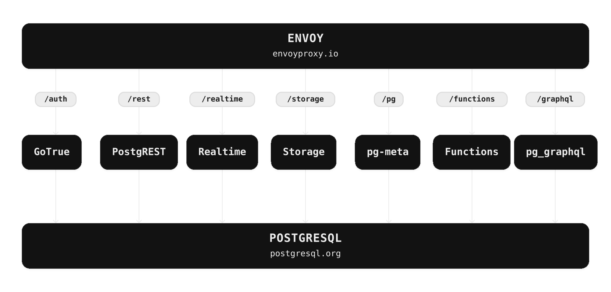

<p align="center">


</p>

# Supabase

[Supabase](https://supabase.com) 是 Postgres 開發平台。我們使用企業級開源工具建構 Firebase 提供的各項功能。

- [x] 託管式 Postgres 資料庫。[文件](https://supabase.com/docs/guides/database)
- [x] 身分驗證與授權。[文件](https://supabase.com/docs/guides/auth)
- [x] 自動產生的 API。
  - [x] REST。[文件](https://supabase.com/docs/guides/api)
  - [x] GraphQL。[文件](https://supabase.com/docs/guides/graphql)
  - [x] 即時訂閱。[文件](https://supabase.com/docs/guides/realtime)
- [x] 函式。
  - [x] 資料庫函式。[文件](https://supabase.com/docs/guides/database/functions)
  - [x] Edge Functions。[文件](https://supabase.com/docs/guides/functions)
- [x] 檔案儲存空間。[文件](https://supabase.com/docs/guides/storage)
- [x] AI、向量及嵌入工具組。[文件](https://supabase.com/docs/guides/ai)
- [x] 儀表板


監看此儲存庫的「Releases」，即可收到重大更新通知。

<kbd></kbd>

## 文件

如需完整文件，請造訪 [supabase.com/docs](https://supabase.com/docs)。

如需瞭解如何貢獻，請參閱[入門指南](../DEVELOPERS.md)。

## 社群與支援

- [社群論壇](https://github.com/supabase/supabase/discussions)。適合尋求開發協助及討論資料庫最佳實務。
- [GitHub Issues](https://github.com/supabase/supabase/issues)。適合回報使用 Supabase 時遇到的錯誤與問題。
- [電子郵件支援](https://supabase.com/docs/support#business-support)。適合處理資料庫或基礎架構問題。
- [Discord](https://discord.supabase.com)。適合分享應用程式及與社群交流。

## 運作方式

Supabase 由多項開源工具組成。我們使用企業級開源產品建構 Firebase 提供的各項功能。如果已有採用 MIT、Apache 2 或同等開放授權的工具與社群，我們就會使用並支援該工具；如果尚不存在，我們則自行建置並開放原始碼。Supabase 並非逐項對應 Firebase，而是以開源工具為開發者提供類似 Firebase 的開發體驗。

**架構**

Supabase 是[託管式平台](https://supabase.com/dashboard)。你不必安裝任何軟體，註冊後即可開始使用 Supabase。
你也可以[自行託管](https://supabase.com/docs/guides/hosting/overview)，或[在本機開發](https://supabase.com/docs/guides/local-development)。



- [PostgreSQL](https://www.postgresql.org/)是一個物件關係型資料庫系統，經過 30 多年的積極開發，它在可靠性、功能穩健性和性能方面赢得了良好的聲譽。
- [Realtime](https://github.com/supabase/realtime)是一個 Elixir 服務器，允許你使用 websockets 監聽 PostgreSQL 的插入、更新和刪除。Realtime 對 Postgres 内置的複製功能進行投票，以了解資料庫的數位化，將變化轉换為 JSON，然后通過 websockets 將 JSON 廣播邊授權客户。
- [PostgREST](http://postgrest.org/)是一個網路服務器，它把你的 PostgreSQL 資料庫直接變成一個 RESTful API。
- [pg_graphql](http://github.com/supabase/pg_graphql/)是一個 PostgreSQL 邊擴展，暴露了一個 GraphQL API。
- [Storage](https://github.com/supabase/storage-api) 提供了一個 RESTful 接口來管理存儲在 S3 中的文件，使用 Postgres 來管理權限。
- [postgres-meta](https://github.com/supabase/postgres-meta) 是一個用於管理你的 Postgres 的 RESTful API，允許你獲取表、添加角色和運行查詢等。
- [GoTrue](https://github.com/netlify/gotrue) 是一個基於 SWT 的 API，用於管理用户和發行 SWT 令牌。
- [Kong](https://github.com/Kong/kong)是一個雲原生 API 網關。

#### 客户端庫

我們以模組化方式設計用戶端程式庫。每個子程式庫都是針對單一外部系統的獨立實作，讓 Supabase 能與既有工具搭配使用。

<table style="table-layout:fixed; white-space: nowrap;">
  <tr>
    <th>語言</th>
    <th>用戶端</th>
    <th colspan="5">功能用戶端（隨 Supabase 用戶端一併提供）</th>
  </tr>
  <!-- notranslate -->
  <tr>
    <th></th>
    <th>Supabase</th>
    <th><a href="https://github.com/postgrest/postgrest" target="_blank" rel="noopener noreferrer">PostgREST</a></th>
    <th><a href="https://github.com/supabase/gotrue" target="_blank" rel="noopener noreferrer">GoTrue</a></th>
    <th><a href="https://github.com/supabase/realtime" target="_blank" rel="noopener noreferrer">Realtime</a></th>
    <th><a href="https://github.com/supabase/storage-api" target="_blank" rel="noopener noreferrer">Storage</a></th>
    <th>Functions</th>
  </tr>
  <!-- TEMPLATE FOR NEW ROW -->
  <!-- START ROW
  <tr>
    <td>lang</td>
    <td><a href="https://github.com/supabase-community/supabase-lang" target="_blank" rel="noopener noreferrer">supabase-lang</a></td>
    <td><a href="https://github.com/supabase-community/postgrest-lang" target="_blank" rel="noopener noreferrer">postgrest-lang</a></td>
    <td><a href="https://github.com/supabase-community/gotrue-lang" target="_blank" rel="noopener noreferrer">gotrue-lang</a></td>
    <td><a href="https://github.com/supabase-community/realtime-lang" target="_blank" rel="noopener noreferrer">realtime-lang</a></td>
    <td><a href="https://github.com/supabase-community/storage-lang" target="_blank" rel="noopener noreferrer">storage-lang</a></td>
  </tr>
  END ROW -->
  <!-- /notranslate -->
  <th colspan="7">⚡️ 官方 ⚡️</th>
  <!-- notranslate -->
  <tr>
    <td>JavaScript (TypeScript)</td>
    <td><a href="https://github.com/supabase/supabase-js" target="_blank" rel="noopener noreferrer">supabase-js</a></td>
    <td><a href="https://github.com/supabase/supabase-js/tree/master/packages/core/postgrest-js" target="_blank" rel="noopener noreferrer">postgrest-js</a></td>
    <td><a href="https://github.com/supabase/supabase-js/tree/master/packages/core/auth-js" target="_blank" rel="noopener noreferrer">auth-js</a></td>
    <td><a href="https://github.com/supabase/supabase-js/tree/master/packages/core/realtime-js" target="_blank" rel="noopener noreferrer">realtime-js</a></td>
    <td><a href="https://github.com/supabase/supabase-js/tree/master/packages/core/storage-js" target="_blank" rel="noopener noreferrer">storage-js</a></td>
    <td><a href="https://github.com/supabase/supabase-js/tree/master/packages/core/functions-js" target="_blank" rel="noopener noreferrer">functions-js</a></td>
  </tr>
    <tr>
    <td>Flutter</td>
    <td><a href="https://github.com/supabase/supabase-flutter" target="_blank" rel="noopener noreferrer">supabase-flutter</a></td>
    <td><a href="https://github.com/supabase/postgrest-dart" target="_blank" rel="noopener noreferrer">postgrest-dart</a></td>
    <td><a href="https://github.com/supabase/gotrue-dart" target="_blank" rel="noopener noreferrer">gotrue-dart</a></td>
    <td><a href="https://github.com/supabase/realtime-dart" target="_blank" rel="noopener noreferrer">realtime-dart</a></td>
    <td><a href="https://github.com/supabase/storage-dart" target="_blank" rel="noopener noreferrer">storage-dart</a></td>
    <td><a href="https://github.com/supabase/functions-dart" target="_blank" rel="noopener noreferrer">functions-dart</a></td>
  </tr>
  <tr>
    <td>Swift</td>
    <td><a href="https://github.com/supabase/supabase-swift" target="_blank" rel="noopener noreferrer">supabase-swift</a></td>
    <td><a href="https://github.com/supabase/supabase-swift/tree/main/Sources/PostgREST" target="_blank" rel="noopener noreferrer">postgrest-swift</a></td>
    <td><a href="https://github.com/supabase/supabase-swift/tree/main/Sources/Auth" target="_blank" rel="noopener noreferrer">auth-swift</a></td>
    <td><a href="https://github.com/supabase/supabase-swift/tree/main/Sources/Realtime" target="_blank" rel="noopener noreferrer">realtime-swift</a></td>
    <td><a href="https://github.com/supabase/supabase-swift/tree/main/Sources/Storage" target="_blank" rel="noopener noreferrer">storage-swift</a></td>
    <td><a href="https://github.com/supabase/supabase-swift/tree/main/Sources/Functions" target="_blank" rel="noopener noreferrer">functions-swift</a></td>
  </tr>
  <tr>
    <td>Python</td>
    <td><a href="https://github.com/supabase/supabase-py" target="_blank" rel="noopener noreferrer">supabase-py</a></td>
    <td><a href="https://github.com/supabase/postgrest-py" target="_blank" rel="noopener noreferrer">postgrest-py</a></td>
    <td><a href="https://github.com/supabase/gotrue-py" target="_blank" rel="noopener noreferrer">gotrue-py</a></td>
    <td><a href="https://github.com/supabase/realtime-py" target="_blank" rel="noopener noreferrer">realtime-py</a></td>
    <td><a href="https://github.com/supabase/storage-py" target="_blank" rel="noopener noreferrer">storage-py</a></td>
    <td><a href="https://github.com/supabase/functions-py" target="_blank" rel="noopener noreferrer">functions-py</a></td>
  </tr>
  <!-- /notranslate -->
  <th colspan="7">💚 社群 💚</th>
  <!-- notranslate -->
  <tr>
    <td>C#</td>
    <td><a href="https://github.com/supabase-community/supabase-csharp" target="_blank" rel="noopener noreferrer">supabase-csharp</a></td>
    <td><a href="https://github.com/supabase-community/postgrest-csharp" target="_blank" rel="noopener noreferrer">postgrest-csharp</a></td>
    <td><a href="https://github.com/supabase-community/gotrue-csharp" target="_blank" rel="noopener noreferrer">gotrue-csharp</a></td>
    <td><a href="https://github.com/supabase-community/realtime-csharp" target="_blank" rel="noopener noreferrer">realtime-csharp</a></td>
    <td><a href="https://github.com/supabase-community/storage-csharp" target="_blank" rel="noopener noreferrer">storage-csharp</a></td>
    <td><a href="https://github.com/supabase-community/functions-csharp" target="_blank" rel="noopener noreferrer">functions-csharp</a></td>
  </tr>
  <tr>
    <td>Go</td>
    <td>-</td>
    <td><a href="https://github.com/supabase-community/postgrest-go" target="_blank" rel="noopener noreferrer">postgrest-go</a></td>
    <td><a href="https://github.com/supabase-community/gotrue-go" target="_blank" rel="noopener noreferrer">gotrue-go</a></td>
    <td>-</td>
    <td><a href="https://github.com/supabase-community/storage-go" target="_blank" rel="noopener noreferrer">storage-go</a></td>
    <td><a href="https://github.com/supabase-community/functions-go" target="_blank" rel="noopener noreferrer">functions-go</a></td>
  </tr>
  <tr>
    <td>Java</td>
    <td>-</td>
    <td>-</td>
    <td><a href="https://github.com/supabase-community/gotrue-java" target="_blank" rel="noopener noreferrer">gotrue-java</a></td>
    <td>-</td>
    <td><a href="https://github.com/supabase-community/storage-java" target="_blank" rel="noopener noreferrer">storage-java</a></td>
    <td>-</td>
  </tr>
  <tr>
    <td>Kotlin</td>
    <td><a href="https://github.com/supabase-community/supabase-kt" target="_blank" rel="noopener noreferrer">supabase-kt</a></td>
    <td><a href="https://github.com/supabase-community/supabase-kt/tree/master/Postgrest" target="_blank" rel="noopener noreferrer">postgrest-kt</a></td>
    <td><a href="https://github.com/supabase-community/supabase-kt/tree/master/Auth" target="_blank" rel="noopener noreferrer">auth-kt</a></td>
    <td><a href="https://github.com/supabase-community/supabase-kt/tree/master/Realtime" target="_blank" rel="noopener noreferrer">realtime-kt</a></td>
    <td><a href="https://github.com/supabase-community/supabase-kt/tree/master/Storage" target="_blank" rel="noopener noreferrer">storage-kt</a></td>
    <td><a href="https://github.com/supabase-community/supabase-kt/tree/master/Functions" target="_blank" rel="noopener noreferrer">functions-kt</a></td>
  </tr>
  <tr>
    <td>Ruby</td>
    <td><a href="https://github.com/supabase-community/supabase-rb" target="_blank" rel="noopener noreferrer">supabase-rb</a></td>
    <td><a href="https://github.com/supabase-community/postgrest-rb" target="_blank" rel="noopener noreferrer">postgrest-rb</a></td>
    <td>-</td>
    <td>-</td>
    <td>-</td>
    <td>-</td>
  </tr>
  <tr>
    <td>Rust</td>
    <td>-</td>
    <td><a href="https://github.com/supabase-community/postgrest-rs" target="_blank" rel="noopener noreferrer">postgrest-rs</a></td>
    <td>-</td>
    <td>-</td>
    <td>-</td>
    <td>-</td>
  </tr>
  <tr>
    <td>Godot Engine (GDScript)</td>
    <td><a href="https://github.com/supabase-community/godot-engine.supabase" target="_blank" rel="noopener noreferrer">supabase-gdscript</a></td>
    <td>-</td>
    <td>-</td>
    <td>-</td>
    <td>-</td>
    <td>-</td>
  </tr>
  <!-- /notranslate -->
</table>

<!--- Remove this list if you're translating to another language, it's hard to keep updated across multiple files-->
<!--- Keep only the link to the list of translation files-->

## 徽章


```md
[](https://supabase.com)
```

```html
<a href="https://supabase.com">
  
</a>
```


```md
[](https://supabase.com)
```

```html
<a href="https://supabase.com">
  
</a>
```

## 翻譯

- [翻譯列表](/i18n/languages.md) <!--- Keep only this -->
